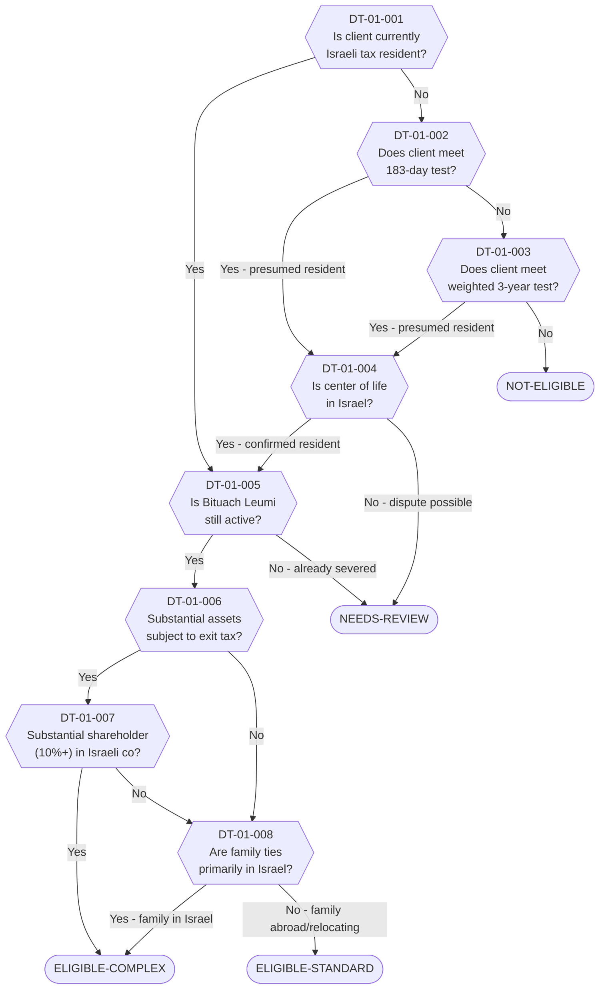

# Decision Tree 01: Residency Severance Eligibility

## Purpose

Determines whether a client is **eligible for Israeli residency severance planning** and classifies the engagement complexity. This is the first decision tree in the advisory flow -- every client engagement begins here.

## Terminal States

| Terminal | Meaning | Next Step |
|----------|---------|-----------|
| `ELIGIBLE-STANDARD` | Client qualifies; standard complexity engagement | Proceed to DT-02 (Process) |
| `ELIGIBLE-COMPLEX` | Client qualifies but has complicating factors (substantial shares, family ties) | Proceed to DT-02 with elevated review |
| `NOT-ELIGIBLE` | Client does not currently meet criteria for severance | Advisory consultation only |
| `NEEDS-REVIEW` | Borderline case; requires senior expert determination | Escalate to senior advisor |

---

## Mermaid Diagram

<!-- EXPERT INPUT REQUIRED: Validate that this flow matches current ITA practice and 2025 amendment thresholds -->

---

## Node Table

<!-- EXPERT INPUT REQUIRED: Verify Data Field references against final DR catalog. Validate risk flags align with RC scoring methodology. -->

| Node ID | Type | Question/Condition | Data Field | Yes Path | No Path | Risk Flag | Legal Source |
|---------|------|--------------------|------------|----------|---------|-----------|-------------|
| DT-01-001 | decision | Is client currently an Israeli tax resident? Self-declaration or prior filing status. | DR-03-001, DR-03-016 | DT-01-005 | DT-01-002 | -- | LTF-01-001 |
| DT-01-002 | decision | Does client meet the 183-day presence test in the current or most recent tax year? Count includes partial days. | DR-03-001 | DT-01-004 | DT-01-003 | -- | LTF-01-003 |
| DT-01-003 | decision | Does client meet the weighted 3-year test? (30+ days current year AND cumulative 425+ days over 3 years) | DR-03-001, DR-03-002, DR-03-003 | DT-01-004 | NOT-ELIGIBLE | MEDIUM | LTF-01-004 |
| DT-01-004 | decision | Is the client's center of life in Israel? Evaluated by: dwelling, family location, economic interests, social ties, children's schooling, community involvement. | DR-03-004, DR-02-005, DR-02-008, DR-04-001, DR-05-001 | DT-01-005 | NEEDS-REVIEW | HIGH | LTF-01-005, LTF-01-006 |
| DT-01-005 | decision | Is the client's Bituach Leumi (National Insurance) status still active/contributing? | DR-03-012 | DT-01-006 | NEEDS-REVIEW | MEDIUM | LTF-08-001 |
| DT-01-006 | decision | Does the client hold substantial assets (real estate, securities, business interests) that would be subject to exit tax under Section 100A? | DR-04-001, DR-04-002, DR-04-003, DR-06-001 | DT-01-007 | DT-01-008 | HIGH | LTF-02-001 |
| DT-01-007 | decision | Is the client a substantial shareholder (10%+ ownership or control) in an Israeli company? Triggers enhanced Section 100A provisions. | DR-06-001, DR-06-004 | ELIGIBLE-COMPLEX | DT-01-008 | HIGH | LTF-02-003 |
| DT-01-008 | decision | Are the client's primary family ties (spouse, dependent children) in Israel? Family relocation planning required if yes. | DR-02-005, DR-02-008, DR-02-010 | ELIGIBLE-COMPLEX | ELIGIBLE-STANDARD | MEDIUM | LTF-01-005 |

### Terminal Nodes

| Terminal ID | Type | Classification | Description | Next Decision Tree |
|-------------|------|----------------|-------------|--------------------|
| ELIGIBLE-STANDARD | terminal | Green | Client is an Israeli tax resident eligible for standard residency severance planning. No complicating factors identified. | DT-02 |
| ELIGIBLE-COMPLEX | terminal | Amber | Client is eligible but has complicating factors: substantial shareholding, family ties in Israel, or significant exit tax exposure. Requires elevated review and specialized advisory. | DT-02 (with RC escalation) |
| NOT-ELIGIBLE | terminal | Grey | Client does not currently meet Israeli tax residency criteria. Severance planning is not applicable. | Advisory consultation |
| NEEDS-REVIEW | terminal | Red | Borderline or ambiguous case. Center-of-life dispute possible, or Bituach Leumi already severed unexpectedly. Requires senior expert determination. | Manual escalation |

---

## Logic Notes

<!-- EXPERT INPUT REQUIRED: Confirm the following logic assumptions with Israeli tax counsel -->

1. **Node DT-01-001 (Self-Declaration):** If the client self-identifies as an Israeli tax resident (or has filed as one), the tree skips the quantitative day-count tests and proceeds directly to Bituach Leumi status. The rationale: if they already acknowledge residency, the question is whether severance is feasible, not whether they are resident.

2. **Node DT-01-002 vs DT-01-003:** The 183-day test takes precedence over the weighted 3-year test. If 183 days are met, the client is presumed resident regardless of the 3-year calculation.

3. **Post-2025 Amendment Impact:** [PLACEHOLDER -- The 2025 amendment to the Israeli Income Tax Ordinance introduced irrebuttable presumptions for certain day-count thresholds. Expert must confirm whether DT-01-002 and DT-01-003 should be updated to reflect irrebuttable vs. rebuttable presumptions.]

4. **Center of Life (DT-01-004):** This is the most subjective node. It draws on multiple data fields across personal, family, economic, and social dimensions. The ITA applies a totality-of-circumstances approach, and courts have ruled inconsistently. Expert guidance on weighting factors is critical.

5. **Bituach Leumi (DT-01-005):** Active Bituach Leumi status is not technically a prerequisite for severance eligibility, but it is a strong indicator of current residency and affects the severance process timeline. If already severed, it may indicate prior action that needs investigation.

---

## Dependencies

| Dependency | Type | Description |
|------------|------|-------------|
| DR-02 (Family/Household) | Data Input | Family composition, spouse residency, children schooling |
| DR-03 (Residence/Presence) | Data Input | Day counts, presence records, residency declarations |
| DR-04 (Financial Assets) | Data Input | Asset inventory for exit tax assessment |
| DR-06 (Corporate Structure) | Data Input | Shareholding percentages, company details |
| LTF-01 (Israeli Tax Residency) | Legal Rule | Residency tests, center-of-life criteria, 2025 amendments |
| LTF-02 (Exit Tax Section 100A) | Legal Rule | Exit tax triggers, substantial shareholder definition |
| LTF-08 (National Insurance) | Legal Rule | Bituach Leumi severance rules |
| DT-02 (Residency Severance Process) | Downstream | Next decision tree for eligible clients |
