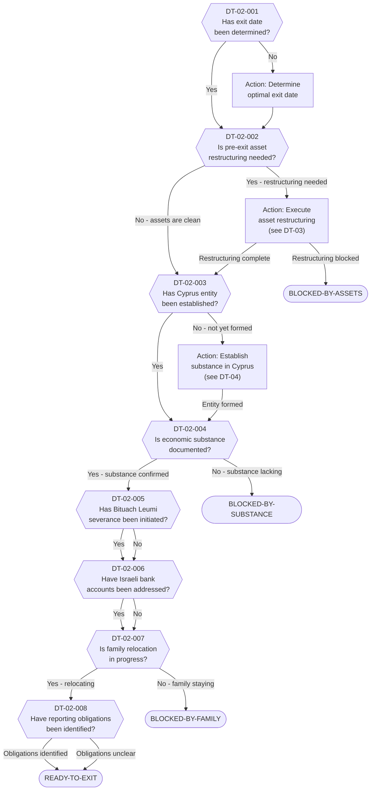

# Decision Tree 02: Residency Severance Process

## Purpose

Maps the **operational process** for executing Israeli residency severance once eligibility has been confirmed via DT-01. This tree identifies blockers, sequences required actions, and determines readiness to proceed with the formal exit.

## Prerequisite

Client must have reached terminal state `ELIGIBLE-STANDARD` or `ELIGIBLE-COMPLEX` in DT-01 (Residency Severance Eligibility).

## Terminal States

| Terminal | Meaning | Next Step |
|----------|---------|-----------|
| `READY-TO-EXIT` | All prerequisites met; client can proceed with formal residency severance | Execute exit plan, file notifications |
| `BLOCKED-BY-ASSETS` | Asset restructuring incomplete; exit tax exposure unresolved | Complete DT-03 (Exit Tax Assessment) |
| `BLOCKED-BY-FAMILY` | Family relocation not in progress; center-of-life argument weakened | Address family logistics |
| `BLOCKED-BY-SUBSTANCE` | Cyprus economic substance not established; destination residency at risk | Complete DT-04 (Cyprus Company) |

---

## Mermaid Diagram

<!-- EXPERT INPUT REQUIRED: Validate sequencing -- some steps may run in parallel in practice. Confirm mandatory vs. recommended ordering. -->

---

## Node Table

<!-- EXPERT INPUT REQUIRED: Confirm whether Bituach Leumi severance must be initiated before or after exit date. Validate bank account handling sequence. -->

| Node ID | Type | Question/Condition | Data Field | Yes Path | No Path | Risk Flag | Legal Source |
|---------|------|--------------------|------------|----------|---------|-----------|-------------|
| DT-02-001 | decision | Has the target exit date (date of residency severance) been determined? This anchors the entire timeline. | DR-03-011 | DT-02-002 | Action: Determine exit date | -- | LTF-01-001 |
| DT-02-002 | decision | Is pre-exit asset restructuring needed? Assets that trigger disproportionate exit tax or are difficult to value may need restructuring before the exit date. | DR-04-001, DR-04-002, DR-04-003 | Action: Restructure (then DT-02-003) | DT-02-003 | HIGH | LTF-02-001, LTF-02-005 |
| DT-02-003 | decision | Has a Cyprus entity (company or other structure) been established for receiving income/assets post-exit? | DR-08-001 | DT-02-004 | Action: Establish entity (then DT-02-004) | MEDIUM | LTF-03-001 |
| DT-02-004 | decision | Is economic substance in Cyprus documented? Includes: local directors, registered office, employees or contractors, management decisions made in Cyprus. | DR-08-002, DR-08-003, DR-08-004, DR-08-005 | DT-02-005 | BLOCKED-BY-SUBSTANCE | HIGH | LTF-03-010 |
| DT-02-005 | decision | Has the Bituach Leumi (National Insurance) severance process been initiated? Separate from tax residency severance; has its own timeline and requirements. | DR-03-012 | DT-02-006 | DT-02-006 | MEDIUM | LTF-08-001, LTF-08-003 |
| DT-02-006 | decision | Have Israeli bank accounts been addressed? Options: close, convert to non-resident status, or maintain with proper reporting. | DR-03-013 | DT-02-007 | DT-02-007 | LOW | LTF-06-005 |
| DT-02-007 | decision | Is family relocation to Cyprus (or outside Israel) in progress? Key center-of-life factor. Spouse and dependent children's location is critical. | DR-02-010, DR-02-005, DR-02-008 | DT-02-008 | BLOCKED-BY-FAMILY | HIGH | LTF-01-005, LTF-01-006 |
| DT-02-008 | decision | Have all reporting obligations been identified? Israeli departure notifications, CRS implications, Cyprus tax registration, ongoing Israeli filing for transition year. | LTF-06-001, LTF-06-003, LTF-06-008 | READY-TO-EXIT | READY-TO-EXIT | MEDIUM | LTF-06-001 |

### Terminal Nodes

| Terminal ID | Type | Classification | Description | Blocker Resolution |
|-------------|------|----------------|-------------|-------------------|
| READY-TO-EXIT | terminal | Green | All process steps complete or in progress. Client may proceed with formal residency severance on the determined exit date. | -- |
| BLOCKED-BY-ASSETS | terminal | Red | Asset restructuring could not be completed. Exit tax liability unacceptable or asset valuation disputed. | Revisit DT-03, consult tax counsel |
| BLOCKED-BY-FAMILY | terminal | Red | Family relocation not initiated. Spouse/children remain in Israel, severely weakening center-of-life severance argument. | Family counseling, phased relocation plan |
| BLOCKED-BY-SUBSTANCE | terminal | Red | Cyprus economic substance insufficient. Risk that Cyprus entity will be treated as Israeli-managed. | Appoint local directors, secure office, hire staff |

---

## Process Notes

<!-- EXPERT INPUT REQUIRED: Confirm the following process assumptions with practitioners -->

1. **Parallel vs. Sequential:** In practice, many of these steps run in parallel (e.g., company formation while family plans relocation). The tree presents a logical dependency order, but the actual project plan may differ. [PLACEHOLDER -- Expert to confirm which steps have hard dependencies.]

2. **Exit Date Selection (DT-02-001):** The optimal exit date considers: tax year boundaries (January 1 preferred for clean breaks), asset restructuring timeline, family logistics, and school year cycles. [PLACEHOLDER -- Expert to provide guidance on optimal timing strategies.]

3. **Asset Restructuring (DT-02-002):** This node triggers a subprocess to DT-03 (Exit Tax Assessment). Common restructuring actions include: transferring shares to family trusts, liquidating positions before exit, or obtaining advance rulings from the ITA on valuations.

4. **Bituach Leumi (DT-02-005):** Note that Bituach Leumi severance and tax residency severance are separate processes with different criteria and timelines. A client can sever tax residency while still being obligated under Bituach Leumi, or vice versa. [PLACEHOLDER -- Expert to confirm current Bituach Leumi severance timeline.]

5. **Bank Accounts (DT-02-006):** This node is marked LOW risk because bank accounts can typically be maintained with non-resident status. However, failure to notify the bank of status change may trigger CRS reporting issues. [PLACEHOLDER -- Expert to confirm bank notification requirements.]

6. **Family Relocation (DT-02-007):** This is the most common blocker in practice. Even if the client personally relocates, the ITA may argue center-of-life remains in Israel if spouse and children stay. The 2025 amendments may have introduced specific family-based presumptions. [PLACEHOLDER -- Expert to confirm 2025 amendment impact on family-based residency arguments.]

---

## Dependencies

| Dependency | Type | Description |
|------------|------|-------------|
| DT-01 (Eligibility) | Upstream | Must be completed first; provides eligibility classification |
| DR-02 (Family/Household) | Data Input | Family relocation status |
| DR-03 (Residence/Presence) | Data Input | Exit date, Bituach Leumi status, bank accounts |
| DR-04 (Financial Assets) | Data Input | Asset inventory for restructuring assessment |
| DR-08 (Cyprus-Specific) | Data Input | Cyprus entity, substance documentation |
| LTF-01 (Israeli Tax Residency) | Legal Rule | Center-of-life criteria, departure rules |
| LTF-02 (Exit Tax) | Legal Rule | Asset restructuring triggers |
| LTF-03 (Cyprus Corporate) | Legal Rule | Substance requirements |
| LTF-06 (Reporting Obligations) | Legal Rule | Filing requirements during transition |
| LTF-08 (National Insurance) | Legal Rule | Bituach Leumi severance process |
| DT-03 (Exit Tax Assessment) | Subprocess | Called when asset restructuring needed |
| DT-04 (Cyprus Company) | Subprocess | Called when entity formation needed |
