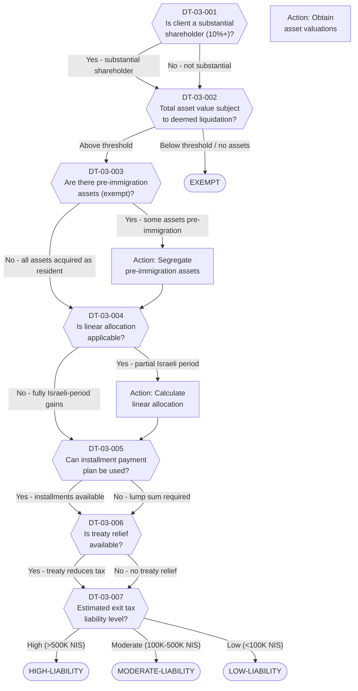

# Decision Tree 03: Exit Tax Assessment (Section 100A)

## Purpose

Assesses the client's **exit tax liability** under Section 100A of the Israeli Income Tax Ordinance. This tree determines whether the deemed-liquidation provision applies, calculates the scope of exposure, evaluates available relief mechanisms, and classifies the overall liability level.

## Prerequisite

Client has been identified as having substantial assets subject to exit tax (DT-01-006 = Yes or DT-02-002 = Yes).

## Terminal States

| Terminal | Meaning | Next Step |
|----------|---------|-----------|
| `HIGH-LIABILITY` | Significant exit tax exposure; requires specialized tax planning | Engage tax counsel, consider advance ruling |
| `MODERATE-LIABILITY` | Material but manageable exit tax; standard mitigation applies | Apply linear allocation and/or treaty relief |
| `LOW-LIABILITY` | Minimal exit tax exposure | Proceed with standard exit process |
| `EXEMPT` | No exit tax applies (pre-immigration assets, treaty exemption) | Document exemption basis; proceed |

---

## Mermaid Diagram

<!-- EXPERT INPUT REQUIRED: Validate Section 100A thresholds against current statute text. Confirm linear allocation formula. -->



---

## Node Table

<!-- EXPERT INPUT REQUIRED: Confirm NIS thresholds for HIGH/MODERATE/LOW classification. Validate installment payment eligibility criteria. -->

| Node ID | Type | Question/Condition | Data Field | Yes Path | No Path | Risk Flag | Legal Source |
|---------|------|--------------------|------------|----------|---------|-----------|-------------|
| DT-03-001 | decision | Is the client a substantial shareholder (10%+ ownership or control) in any company? This determines the scope of Section 100A application and may trigger enhanced deemed-liquidation provisions. | DR-06-001, DR-06-004 | DT-03-002 | DT-03-002 | HIGH | LTF-02-003 |
| DT-03-002 | decision | What is the total fair market value of assets subject to deemed liquidation? Includes: shares in Israeli companies, real estate (excluding primary residence under certain conditions), financial instruments, partnership interests. | DR-04-001, DR-04-002, DR-04-003, DR-04-004 | DT-03-003 | EXEMPT | HIGH | LTF-02-001, LTF-02-002 |
| DT-03-003 | decision | Are there pre-immigration assets? Assets acquired before the client became an Israeli tax resident may be exempt from exit tax on gains accrued prior to immigration. | DR-04-005, DR-04-006 | Action: Segregate (then DT-03-004) | DT-03-004 | MEDIUM | LTF-02-004 |
| DT-03-004 | decision | Is linear allocation applicable? For assets held both during Israeli and non-Israeli residency periods, gains may be allocated proportionally based on time. Reduces taxable gain to Israeli-period portion only. | DR-03-011, DR-04-007 | Action: Calculate (then DT-03-005) | DT-03-005 | MEDIUM | LTF-02-005 |
| DT-03-005 | decision | Can the client use an installment payment plan for exit tax? Section 100A may allow spreading payment over up to [PLACEHOLDER] years, with interest. Requires meeting certain conditions. | DR-04-001, DR-05-001 | DT-03-006 | DT-03-006 | LOW | LTF-02-006 |
| DT-03-006 | decision | Is treaty relief available under the Israel-Cyprus double tax treaty? May reduce or eliminate Israeli tax on certain categories of gains (e.g., capital gains on non-real-estate assets). | DR-08-001, DR-03-004 | DT-03-007 | DT-03-007 | MEDIUM | LTF-05-003, LTF-05-005 |
| DT-03-007 | decision | After applying all exemptions, allocations, and relief mechanisms, what is the estimated net exit tax liability? Classification: High (>500K NIS), Moderate (100K-500K NIS), Low (<100K NIS). | FA-04-001, FA-04-002 | HIGH/MODERATE/LOW-LIABILITY | -- | -- | LTF-02-001 |

### Terminal Nodes

| Terminal ID | Type | Classification | Description | Advisory Action |
|-------------|------|----------------|-------------|-----------------|
| HIGH-LIABILITY | terminal | Red | Estimated exit tax exceeds 500,000 NIS. Requires specialized tax counsel, potential advance ruling from ITA, and consideration of installment/treaty strategies. | Engage senior tax attorney; request advance ruling |
| MODERATE-LIABILITY | terminal | Amber | Estimated exit tax between 100,000-500,000 NIS. Standard mitigation strategies (linear allocation, treaty) should be applied. | Apply standard mitigation; include in financial plan |
| LOW-LIABILITY | terminal | Green | Estimated exit tax below 100,000 NIS. Manageable within standard advisory process. | Include in exit cost projection |
| EXEMPT | terminal | Green | No exit tax applies. Either no substantial assets, or all assets are pre-immigration exempt, or treaty provides full relief. | Document exemption basis for file |

---

## Calculation Framework

<!-- EXPERT INPUT REQUIRED: Validate formulas against current Section 100A text and ITA circulars -->

### Linear Allocation Formula

```
Taxable Gain = Total Gain x (Days as Israeli Resident / Total Days of Asset Holding)
```

[PLACEHOLDER -- Expert to confirm:
1. Whether "days as Israeli resident" uses calendar days or tax-year days
2. How partial years are treated at the boundaries
3. Whether the 2025 amendments changed the allocation methodology]

### Exit Tax Rate

| Asset Type | Tax Rate | Notes |
|------------|----------|-------|
| Shares (substantial shareholder) | [PLACEHOLDER]% | May be 25% or 30% depending on holding and control |
| Shares (non-substantial) | [PLACEHOLDER]% | Standard capital gains rate |
| Real estate | [PLACEHOLDER]% | Subject to separate real estate taxation rules |
| Other financial instruments | [PLACEHOLDER]% | Bonds, options, derivatives |

### NIS Threshold Justification

[PLACEHOLDER -- The 500K/100K NIS thresholds for HIGH/MODERATE/LOW classification are indicative. Expert to validate or adjust based on:
- Typical client profiles in LTA advisory practice
- Materiality thresholds used by Israeli tax counsel
- Whether thresholds should be indexed or fixed]

---

## Dependencies

| Dependency | Type | Description |
|------------|------|-------------|
| DT-01 (Eligibility) | Upstream | Identifies substantial asset holders |
| DT-02 (Process) | Upstream | Triggers this tree when restructuring needed |
| DR-04 (Financial Assets) | Data Input | Asset inventory, valuations, acquisition dates |
| DR-06 (Corporate Structure) | Data Input | Shareholding percentages |
| LTF-02 (Exit Tax Section 100A) | Legal Rule | Statute text, thresholds, exemptions |
| LTF-05 (Tax Treaties) | Legal Rule | Treaty relief provisions |
| FA-04 (Exit Tax Calculation) | Financial Model | Detailed calculation engine |
