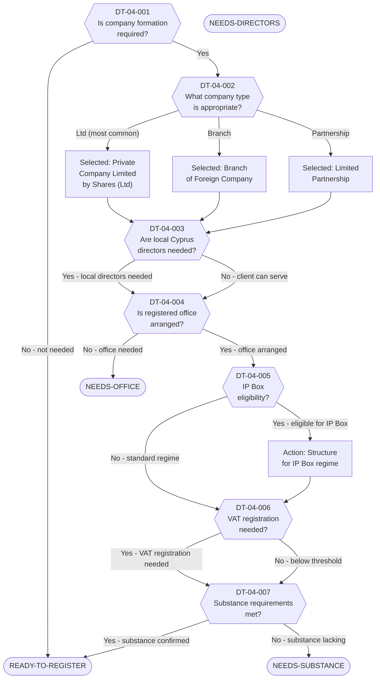

# Decision Tree 04: Cyprus Company Establishment

## Purpose

Guides the process of **establishing a Cyprus company** as part of the client's post-exit corporate structure. Determines the appropriate entity type, assesses substance requirements, and identifies blockers that must be resolved before registration.

## Prerequisite

Client has reached DT-02-003 (Cyprus entity needed) or engagement scope includes Cyprus corporate structuring.

## Terminal States

| Terminal | Meaning | Next Step |
|----------|---------|-----------|
| `READY-TO-REGISTER` | All requirements met; company can be registered with the Cyprus Registrar of Companies | Proceed with registration; open bank account (DT-05) |
| `NEEDS-SUBSTANCE` | Entity type determined but economic substance requirements not yet met | Arrange substance elements before registration |
| `NEEDS-DIRECTORS` | Local Cyprus directors required but not yet identified/engaged | Engage director service provider or recruit local directors |
| `NEEDS-OFFICE` | Registered office and/or physical office space not yet arranged | Secure office space in Cyprus |

---

## Mermaid Diagram

<!-- EXPERT INPUT REQUIRED: Validate company type selection criteria against Cyprus Companies Law Cap.113. Confirm substance requirements per EU anti-avoidance directives. -->

---

## Node Table

<!-- EXPERT INPUT REQUIRED: Confirm substance requirements checklist. Validate IP Box eligibility criteria against current Cyprus law. -->

| Node ID | Type | Question/Condition | Data Field | Yes Path | No Path | Risk Flag | Legal Source |
|---------|------|--------------------|------------|----------|---------|-----------|-------------|
| DT-04-001 | decision | Is a Cyprus company formation required for the client's post-exit structure? Based on engagement scope, income sources, and asset holding needs. | Engagement scope, DR-06-001 | DT-04-002 | READY-TO-REGISTER | -- | -- |
| DT-04-002 | decision | What entity type is appropriate? Private Company Limited by Shares (Ltd) is most common for Israeli clients. Branch may suit existing foreign companies. Limited Partnership for specific investment structures. | DR-06-002, DR-06-003, DR-06-009 | (type-specific path) | -- | LOW | LTF-03-001, LTF-03-002 |
| DT-04-003 | decision | Are local Cyprus directors needed for tax residency and substance? Cyprus tax residency of a company requires management and control in Cyprus, typically demonstrated by local directors making key decisions. | DR-08-002, DR-08-003 | DT-04-004 | DT-04-004 | HIGH | LTF-03-010, LTF-03-011 |
| DT-04-004 | decision | Is a registered office in Cyprus arranged? Required by law for all Cyprus companies. For substance purposes, a physical office (not just a registered address) may be needed. | DR-08-004 | DT-04-005 | NEEDS-OFFICE | MEDIUM | LTF-03-003 |
| DT-04-005 | decision | Is the company eligible for the Cyprus IP Box regime? Requires qualifying IP assets (patents, copyrighted software, etc.) and a nexus test showing R&D activity in Cyprus. Effective rate can be as low as 2.5%. | DR-06-009, DR-06-010 | Action: Structure for IP Box (then DT-04-006) | DT-04-006 | LOW | LTF-03-007, LTF-03-008 |
| DT-04-006 | decision | Is VAT registration required? Mandatory if taxable supplies in Cyprus exceed EUR 15,600 threshold. Also required for intra-EU B2B services. | DR-08-009, DR-05-001 | DT-04-007 | DT-04-007 | LOW | LTF-03-012 |
| DT-04-007 | decision | Are all economic substance requirements met? Checklist: (a) qualified employees or outsourced functions in Cyprus, (b) physical office space, (c) board meetings held in Cyprus, (d) strategic decisions made in Cyprus, (e) adequate operating expenditure in Cyprus. | DR-08-002, DR-08-003, DR-08-004, DR-08-005, DR-08-006 | READY-TO-REGISTER | NEEDS-SUBSTANCE | HIGH | LTF-03-010, LTF-03-011 |

### Terminal Nodes

| Terminal ID | Type | Classification | Description | Resolution Path |
|-------------|------|----------------|-------------|-----------------|
| READY-TO-REGISTER | terminal | Green | All prerequisites satisfied. Entity type selected, directors in place, office secured, substance confirmed. Company can be submitted to the Cyprus Registrar of Companies. | File registration; timeline ~5-10 business days |
| NEEDS-SUBSTANCE | terminal | Red | Company type and basic setup complete but economic substance requirements not met. Risk of the company being treated as Israeli-managed (and Israeli tax-resident) by the ITA. | Engage local staff/contractors, ensure board meets in Cyprus, document decision-making |
| NEEDS-DIRECTORS | terminal | Amber | Local Cyprus directors required for management-and-control substance but not yet engaged. | Engage a professional director service or recruit local individuals |
| NEEDS-OFFICE | terminal | Amber | No registered office or physical office arranged in Cyprus. Cannot proceed with registration. | Engage office space provider; virtual office may suffice for registration but not for substance |

---

## Company Type Selection Guide

<!-- EXPERT INPUT REQUIRED: Validate tax implications of each entity type -->

| Entity Type | Use Case | Min. Directors | Min. Shareholders | Tax Rate | Notes |
|-------------|----------|---------------|-------------------|----------|-------|
| Private Company Ltd | Most common; holding, trading, services | 1 | 1 | 12.5% corporate | [PLACEHOLDER -- confirm current rate] |
| Branch of Foreign Co. | Extension of existing Israeli/foreign entity | N/A (head office) | N/A | 12.5% on Cyprus-source | Less substance flexibility |
| Limited Partnership | Investment vehicles, fund structures | General partner | 2+ partners | Pass-through (depends) | [PLACEHOLDER -- confirm taxation] |

## Substance Requirements Checklist

<!-- EXPERT INPUT REQUIRED: Confirm minimum acceptable substance levels per EU ATAD and Cyprus tax authority guidance -->

| Requirement | Minimum Standard | Documentation Needed | Risk if Missing |
|-------------|-----------------|---------------------|-----------------|
| Local directors | At least 1 Cyprus-resident director with genuine decision authority | Board minutes, director contracts | HIGH -- company may be deemed Israeli-managed |
| Physical office | Office address with actual workspace (not merely PO box) | Lease agreement, utility bills | MEDIUM -- undermines substance claim |
| Employees/contractors | At least [PLACEHOLDER] qualified persons performing core functions | Employment contracts, payroll records | HIGH -- indicates shell entity |
| Board meetings | Majority of board meetings held in Cyprus | Minutes with location, travel records | HIGH -- management and control indicator |
| Operating expenditure | Proportionate to income (no fixed threshold) | Financial statements, invoices | MEDIUM -- disproportionately low spend flags risk |

---

## Dependencies

| Dependency | Type | Description |
|------------|------|-------------|
| DT-02 (Process) | Upstream | Triggers company formation as process step |
| DR-06 (Corporate Structure) | Data Input | Existing company details, shareholding, IP assets |
| DR-08 (Cyprus-Specific) | Data Input | Cyprus entity details, directors, office, substance |
| LTF-03 (Cyprus Corporate Framework) | Legal Rule | Company law, tax rates, IP Box, substance rules |
| DT-05 (Bank Account) | Downstream | Bank account opening follows company formation |
