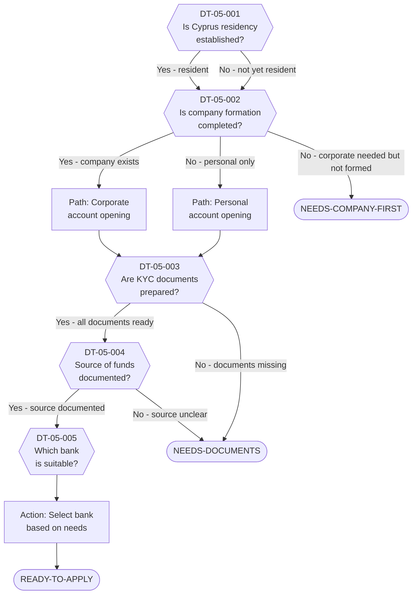

# Decision Tree 05: Cyprus Bank Account Opening

## Purpose

Guides the process of **opening a bank account in Cyprus** for both personal and corporate use. Cyprus banks apply stringent KYC (Know Your Customer) and AML (Anti-Money Laundering) requirements, and the process can take several weeks. This tree identifies prerequisites and common blockers.

## Prerequisite

For corporate accounts: Cyprus company must be established (DT-04 terminal = READY-TO-REGISTER completed).
For personal accounts: Client should have Cyprus residency or be in the process of establishing it.

## Terminal States

| Terminal | Meaning | Next Step |
|----------|---------|-----------|
| `READY-TO-APPLY` | All documents prepared; application can be submitted to selected bank | Submit application; typical processing 2-6 weeks |
| `NEEDS-DOCUMENTS` | Key documents missing; cannot proceed until provided | Gather missing documents |
| `NEEDS-COMPANY-FIRST` | Corporate account requested but company not yet formed | Complete DT-04 first |

---

## Mermaid Diagram

<!-- EXPERT INPUT REQUIRED: Validate KYC document list against current requirements of major Cyprus banks (Bank of Cyprus, Hellenic Bank, Eurobank). Confirm whether personal residency is strictly required for personal account opening. -->

---

## Node Table

<!-- EXPERT INPUT REQUIRED: Confirm current bank requirements. KYC standards change frequently. Validate bank selection criteria. -->

| Node ID | Type | Question/Condition | Data Field | Yes Path | No Path | Risk Flag | Legal Source |
|---------|------|--------------------|------------|----------|---------|-----------|-------------|
| DT-05-001 | decision | Is the client's Cyprus residency established (or in process)? While not always strictly required for account opening, residency status significantly affects which banks will accept the application and what documentation is needed. | DR-08-007, DR-03-004 | DT-05-002 | DT-05-002 | LOW | LTF-04-001 |
| DT-05-002 | decision | Is a Cyprus company already formed? If the client needs a corporate account, the company must be registered with the Registrar of Companies before the bank will process the application. | DR-08-001 | Corporate path -> DT-05-003 | Personal path -> DT-05-003 / NEEDS-COMPANY-FIRST | MEDIUM | LTF-04-002 |
| DT-05-003 | decision | Are all KYC documents prepared? See checklist below for personal and corporate requirements. Banks will not begin processing until the full document set is submitted. | DR-01-001, DR-01-002, DR-08-008 | DT-05-004 | NEEDS-DOCUMENTS | MEDIUM | LTF-04-003, LTF-04-004 |
| DT-05-004 | decision | Is the source of funds adequately documented? AML regulations require clear documentation of the origin of funds to be deposited. This is especially scrutinized for Israeli clients with large transfers. | DR-04-001, DR-05-001, DR-05-002 | DT-05-005 | NEEDS-DOCUMENTS | HIGH | LTF-04-005 |
| DT-05-005 | decision | Which Cyprus bank is suitable for the client's needs? Selection criteria: account type (personal/corporate), transaction volumes, international transfers, multi-currency needs, digital banking, relationship requirements. | DR-08-010 | READY-TO-APPLY | -- | LOW | LTF-04-001 |

### Terminal Nodes

| Terminal ID | Type | Classification | Description | Resolution Path |
|-------------|------|----------------|-------------|-----------------|
| READY-TO-APPLY | terminal | Green | All documents assembled, source of funds documented, bank selected. Application can be submitted. Typical processing time: 2-6 weeks. | Submit application; follow up weekly |
| NEEDS-DOCUMENTS | terminal | Amber | One or more required documents missing. Cannot proceed until document set is complete. | See checklist below; gather missing items |
| NEEDS-COMPANY-FIRST | terminal | Red | Corporate bank account needed but Cyprus company not yet formed. Bank will not accept application without valid company registration. | Complete DT-04 (Cyprus Company Establishment) first |

---

## KYC Document Checklists

<!-- EXPERT INPUT REQUIRED: Validate checklists against current requirements of Bank of Cyprus, Hellenic Bank, and Eurobank Cyprus. Requirements change frequently. -->

### Personal Account

| # | Document | Notes | Required? |
|---|----------|-------|-----------|
| 1 | Valid passport (certified copy) | Must be current; some banks require apostille | Yes |
| 2 | Proof of address (home country) | Utility bill or bank statement, less than 3 months old | Yes |
| 3 | Proof of address (Cyprus) | Rental agreement or utility bill if already resident | If applicable |
| 4 | CV / professional background | Brief summary of professional history | Yes |
| 5 | Source of funds documentation | Tax returns, sale contracts, employment contracts, inheritance docs | Yes |
| 6 | Bank reference letter | From existing bank; confirms good standing | [PLACEHOLDER] |
| 7 | Tax residency certificate | From Israel or Cyprus tax authority | [PLACEHOLDER] |

### Corporate Account

| # | Document | Notes | Required? |
|---|----------|-------|-----------|
| 1 | Certificate of Incorporation | Issued by Cyprus Registrar of Companies | Yes |
| 2 | Memorandum & Articles of Association | Certified copies | Yes |
| 3 | Certificate of Directors and Secretary | Current appointments | Yes |
| 4 | Certificate of Shareholders | Current share register | Yes |
| 5 | Certificate of Registered Office | Official address | Yes |
| 6 | Board resolution to open account | Specifying authorized signatories | Yes |
| 7 | Passport copies of all directors/UBOs | Ultimate Beneficial Owners with 25%+ | Yes |
| 8 | Proof of address for all directors/UBOs | Less than 3 months old | Yes |
| 9 | Business plan / company profile | Description of activities, expected turnover | Yes |
| 10 | Source of funds / source of wealth | For company and UBOs | Yes |
| 11 | First year financial projections | [PLACEHOLDER -- confirm if required by all banks] | [PLACEHOLDER] |

---

## Bank Selection Guide

<!-- EXPERT INPUT REQUIRED: Validate bank details and confirm current acceptance policies for Israeli clients -->

| Bank | Strengths | Considerations | Israeli Client Friendly? |
|------|-----------|----------------|--------------------------|
| Bank of Cyprus | Largest bank; full service; strong digital platform | Longer processing times; strict KYC | [PLACEHOLDER] |
| Hellenic Bank | Good for corporate; competitive fees | Smaller international network | [PLACEHOLDER] |
| Eurobank Cyprus | Greek parent bank; EUR-focused | [PLACEHOLDER] | [PLACEHOLDER] |
| RCB Bank | [PLACEHOLDER -- confirm current status] | [PLACEHOLDER] | [PLACEHOLDER] |
| Alpha Bank Cyprus | [PLACEHOLDER] | [PLACEHOLDER] | [PLACEHOLDER] |

---

## Dependencies

| Dependency | Type | Description |
|------------|------|-------------|
| DT-04 (Cyprus Company) | Upstream | Company must be formed before corporate account |
| DR-01 (Personal Identity) | Data Input | Passport, personal details for KYC |
| DR-04 (Financial Assets) | Data Input | Source of funds documentation |
| DR-05 (Employment/Income) | Data Input | Income documentation for source of funds |
| DR-08 (Cyprus-Specific) | Data Input | Residency status, company details |
| LTF-04 (Cyprus Banking/Mortgage) | Legal Rule | KYC/AML requirements, bank regulations |
