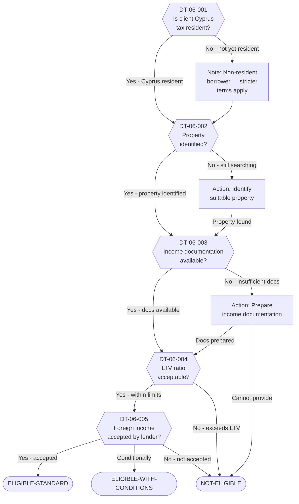

# Decision Tree 06: Cyprus Mortgage Financing

## Purpose

Determines whether a client is **eligible for mortgage financing in Cyprus** for property purchase or construction. Cyprus banks have specific requirements for non-EU nationals and recently relocated residents. This tree evaluates residency status, income documentation, property identification, and LTV (Loan-to-Value) acceptability.

## Prerequisite

Client is considering property purchase or construction in Cyprus as part of the relocation plan.

## Terminal States

| Terminal | Meaning | Next Step |
|----------|---------|-----------|
| `ELIGIBLE-STANDARD` | Client qualifies for standard mortgage terms | Proceed with bank application |
| `ELIGIBLE-WITH-CONDITIONS` | Client may qualify but with non-standard terms (higher deposit, restricted LTV, additional guarantees) | Negotiate terms; prepare additional documentation |
| `NOT-ELIGIBLE` | Client does not currently qualify for Cyprus mortgage financing | Consider cash purchase or alternative financing |

---

## Mermaid Diagram

<!-- EXPERT INPUT REQUIRED: Validate LTV thresholds and income documentation requirements against current Cyprus bank lending policies. Confirm non-EU borrower treatment. -->

---

## Node Table

<!-- EXPERT INPUT REQUIRED: Confirm current LTV ratios offered by Cyprus banks. Validate foreign income acceptance policies. -->

| Node ID | Type | Question/Condition | Data Field | Yes Path | No Path | Risk Flag | Legal Source |
|---------|------|--------------------|------------|----------|---------|-----------|-------------|
| DT-06-001 | decision | Is the client a Cyprus tax resident? Residency status affects eligible LTV ratios, interest rates, and lender willingness. Non-residents face stricter terms but are not automatically excluded. | DR-03-004, DR-08-007 | DT-06-002 | Note: non-resident terms (then DT-06-002) | MEDIUM | LTF-04-006 |
| DT-06-002 | decision | Has a specific property been identified? The bank requires a property valuation as part of the mortgage application. Purchase (existing property) vs. build (land + construction) affects the mortgage structure. | DR-04-008, DR-08-011 | DT-06-003 | Action: search (then DT-06-003) | LOW | LTF-04-006 |
| DT-06-003 | decision | Is income documentation available and sufficient? Banks require proof of stable income to service the mortgage. Documentation typically includes: employment contracts, tax returns (2-3 years), bank statements, company financials for self-employed. | DR-05-001, DR-05-002, DR-05-003, DR-05-004 | DT-06-004 | Action: gather docs / NOT-ELIGIBLE | MEDIUM | LTF-04-007 |
| DT-06-004 | decision | Is the LTV (Loan-to-Value) ratio within acceptable limits? Cyprus banks typically offer: residents up to 70-80% LTV, non-residents up to 50-60% LTV. The client must have sufficient equity (down payment) for the remainder. | DR-04-001, DR-04-008 | DT-06-005 | NOT-ELIGIBLE | HIGH | LTF-04-006, LTF-04-007 |
| DT-06-005 | decision | Will the lender accept the client's income source? Key question for Israeli clients: is the income earned in Israel, Cyprus, or internationally? Some banks restrict lending against foreign-source income or apply haircuts to foreign income. | DR-05-001, DR-05-005 | ELIGIBLE-STANDARD / ELIGIBLE-WITH-CONDITIONS | NOT-ELIGIBLE | MEDIUM | LTF-04-007 |

### Terminal Nodes

| Terminal ID | Type | Classification | Description | Advisory Action |
|-------------|------|----------------|-------------|-----------------|
| ELIGIBLE-STANDARD | terminal | Green | Client qualifies for standard Cyprus mortgage terms. Residency, income, LTV, and income source all acceptable. | Submit mortgage application; expect 4-8 week processing |
| ELIGIBLE-WITH-CONDITIONS | terminal | Amber | Client may qualify but with non-standard conditions: higher down payment, additional collateral or guarantees, or income haircut applied to foreign earnings. | Negotiate with bank; prepare additional security documentation |
| NOT-ELIGIBLE | terminal | Red | Client does not currently qualify for Cyprus mortgage. Reasons may include: insufficient income documentation, LTV exceeds limits, or foreign income not accepted. | Consider cash purchase, seller financing, or defer until residency/income stabilized |

---

## Mortgage Parameters

<!-- EXPERT INPUT REQUIRED: Validate current market rates and terms from major Cyprus lenders -->

### Typical Terms (2025-2026 Market)

| Parameter | Resident | Non-Resident | Notes |
|-----------|----------|-------------|-------|
| Maximum LTV | [PLACEHOLDER -- ~70-80%] | [PLACEHOLDER -- ~50-60%] | Varies by bank and property type |
| Interest rate (variable) | [PLACEHOLDER]% + ECB base | [PLACEHOLDER]% + ECB base | Typically Euribor + margin |
| Interest rate (fixed) | [PLACEHOLDER]% | [PLACEHOLDER]% | Fixed periods usually 3-5 years |
| Maximum term | [PLACEHOLDER] years | [PLACEHOLDER] years | Typically up to 25-30 years |
| Minimum loan amount | EUR [PLACEHOLDER] | EUR [PLACEHOLDER] | Varies by bank |
| Income-to-debt ratio | Max [PLACEHOLDER]% | Max [PLACEHOLDER]% | Monthly repayment vs. net income |

### Property Types

| Property Type | Eligible? | Special Conditions |
|---------------|-----------|-------------------|
| Apartment (existing) | Yes | Standard valuation |
| House (existing) | Yes | Standard valuation |
| New build / off-plan | [PLACEHOLDER] | Stage payments may apply |
| Land (for construction) | [PLACEHOLDER] | Construction mortgage structure |
| Commercial property | [PLACEHOLDER] | Different LTV and terms |

---

## Income Documentation Requirements

<!-- EXPERT INPUT REQUIRED: Confirm requirements specific to Israeli clients with mixed income sources -->

| Income Type | Required Documents | Accepted by Banks? |
|-------------|-------------------|-------------------|
| Employment (Cyprus) | Contract, payslips (6 months), tax returns | Yes - standard |
| Employment (Israel) | Contract, payslips, tax returns (translated) | [PLACEHOLDER] |
| Self-employment (Cyprus company) | Audited financials (2 years), tax returns | Yes - with conditions |
| Self-employment (Israeli company) | Audited financials, tax returns (translated) | [PLACEHOLDER] |
| Rental income | Lease agreements, bank statements | [PLACEHOLDER] |
| Investment income | Brokerage statements, dividend certificates | [PLACEHOLDER] |
| Mixed sources | Combination of above | [PLACEHOLDER -- how do banks treat mixed?] |

---

## Dependencies

| Dependency | Type | Description |
|------------|------|-------------|
| DR-03 (Residence/Presence) | Data Input | Cyprus residency status |
| DR-04 (Financial Assets) | Data Input | Down payment capacity, property value |
| DR-05 (Employment/Income) | Data Input | Income documentation for serviceability |
| DR-08 (Cyprus-Specific) | Data Input | Cyprus residency details, property info |
| LTF-04 (Cyprus Banking/Mortgage) | Legal Rule | Mortgage regulations, LTV rules, bank requirements |
