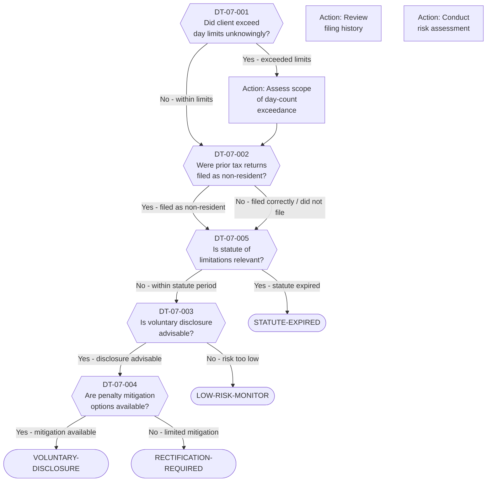

# Decision Tree 07: Retroactive Rectification

## Purpose

Guides the assessment and resolution process for clients who may need **retroactive correction** of their tax residency status or filings. This applies to clients who unknowingly exceeded day-count thresholds, filed incorrectly as non-residents, or failed to report Israeli-source obligations while abroad.

## Prerequisite

Client has been identified (through initial screening or DT-01 analysis) as having potential historical non-compliance with Israeli residency or reporting rules.

## Terminal States

| Terminal | Meaning | Next Step |
|----------|---------|-----------|
| `RECTIFICATION-REQUIRED` | Material errors exist; formal rectification with the ITA is necessary | Engage tax counsel for amended filings |
| `VOLUNTARY-DISCLOSURE` | Voluntary disclosure procedure recommended to mitigate penalties | File voluntary disclosure application with ITA |
| `LOW-RISK-MONITOR` | Minor discrepancies; risk is low but situation should be monitored | Document position; monitor for ITA inquiries |
| `STATUTE-EXPIRED` | Relevant periods are beyond the statute of limitations; no action required | Document analysis; close matter |

---

## Mermaid Diagram

<!-- EXPERT INPUT REQUIRED: Validate voluntary disclosure procedure availability and current ITA practice. Confirm statute of limitations periods (3, 6, or 10 years depending on context). -->

---

## Node Table

<!-- EXPERT INPUT REQUIRED: Confirm ITA voluntary disclosure procedure terms, penalty rates, and statute of limitations periods. -->

| Node ID | Type | Question/Condition | Data Field | Yes Path | No Path | Risk Flag | Legal Source |
|---------|------|--------------------|------------|----------|---------|-----------|-------------|
| DT-07-001 | decision | Did the client exceed Israeli day-count thresholds (183-day or weighted 3-year test) in any prior tax year without realizing it? Common for frequent travelers, remote workers, or those who counted days incorrectly (e.g., excluding partial days). | DR-03-001, DR-03-002, DR-03-003 | Action: Assess scope (then DT-07-002) | DT-07-002 | HIGH | LTF-01-003, LTF-01-004 |
| DT-07-002 | decision | Were prior-year Israeli tax returns filed with non-resident status despite the client potentially meeting residency criteria? If yes, this constitutes an incorrect filing that may need amendment. | DR-03-014, DR-03-015 | DT-07-005 | DT-07-005 | HIGH | LTF-01-001, LTF-06-001 |
| DT-07-003 | decision | Is a voluntary disclosure procedure advisable? The ITA has operated voluntary disclosure programs that allow taxpayers to rectify past non-compliance with reduced penalties. Assessment considers: magnitude of underreporting, number of years affected, likelihood of independent ITA detection, and client risk tolerance. | Risk assessment output | DT-07-004 | LOW-RISK-MONITOR | HIGH | LTF-01-012 |
| DT-07-004 | decision | Are penalty mitigation options available? Includes: voluntary disclosure penalty reductions, reasonable cause defenses, first-time penalty abatement, or negotiated settlements with the ITA. | DR-03-014, DR-03-015 | VOLUNTARY-DISCLOSURE | RECTIFICATION-REQUIRED | MEDIUM | LTF-01-013, LTF-01-014 |
| DT-07-005 | decision | Is the statute of limitations relevant for the affected tax years? Israeli statute periods: generally 3 years for assessment, 6 years for amended assessment, 10 years for fraud or failure to file. If all affected years are beyond the applicable statute, no action is required. | DR-03-014, DR-03-015 | STATUTE-EXPIRED | DT-07-003 | MEDIUM | LTF-01-015 |

### Terminal Nodes

| Terminal ID | Type | Classification | Description | Advisory Action |
|-------------|------|----------------|-------------|-----------------|
| RECTIFICATION-REQUIRED | terminal | Red | Material filing errors exist within the statute period, and voluntary disclosure is either unavailable or provides insufficient mitigation. Formal rectification (amended returns) must be filed with the ITA. | Engage specialized Israeli tax attorney; prepare amended returns; budget for tax + interest + penalties |
| VOLUNTARY-DISCLOSURE | terminal | Amber | Material filing errors exist but voluntary disclosure procedure is available and advisable. Reduced penalties and potential criminal immunity make this the preferred path. | File voluntary disclosure application; prepare full documentation of affected years |
| LOW-RISK-MONITOR | terminal | Green | Minor discrepancies identified but risk of ITA enforcement is low. No formal action recommended at this time, but the position should be documented and monitored. | Document analysis; set reminder to reassess annually; prepare defense position if queried |
| STATUTE-EXPIRED | terminal | Green | All affected tax years are beyond the applicable statute of limitations. No rectification action is required or possible. | Document statute analysis; retain records; close matter |

---

## Statute of Limitations Reference

<!-- EXPERT INPUT REQUIRED: Validate statute periods against current Israeli Income Tax Ordinance provisions -->

| Scenario | Statute Period | Starting Point | Legal Source |
|----------|---------------|----------------|-------------|
| Standard assessment | [PLACEHOLDER -- 3 years?] | End of tax year in which return was filed | LTF-01-015 |
| Amended assessment (ITA-initiated) | [PLACEHOLDER -- 6 years?] | End of relevant tax year | LTF-01-015 |
| Fraud or failure to file | [PLACEHOLDER -- 10 years?] | End of relevant tax year | LTF-01-015 |
| Criminal prosecution | [PLACEHOLDER] | Date of offense | [PLACEHOLDER] |

## Voluntary Disclosure Procedure

<!-- EXPERT INPUT REQUIRED: Confirm whether ITA voluntary disclosure procedure is currently active and its terms -->

| Parameter | Detail |
|-----------|--------|
| Program status | [PLACEHOLDER -- Is the ITA voluntary disclosure program currently active?] |
| Eligibility | [PLACEHOLDER -- Who qualifies? Exclusions?] |
| Penalty reduction | [PLACEHOLDER -- Typical penalty rate under voluntary disclosure vs. standard penalties] |
| Criminal immunity | [PLACEHOLDER -- Does voluntary disclosure provide immunity from criminal prosecution?] |
| Disclosure scope | [PLACEHOLDER -- Must all years be disclosed, or can it be limited?] |
| Timeline | [PLACEHOLDER -- How long does the process typically take?] |
| Confidentiality | [PLACEHOLDER -- Is the disclosure kept confidential?] |

## Risk Assessment Matrix

<!-- EXPERT INPUT REQUIRED: Validate risk factors and scoring -->

| Risk Factor | Low Risk | Medium Risk | High Risk |
|-------------|----------|-------------|-----------|
| Number of years affected | 1 year | 2-3 years | 4+ years |
| Day-count exceedance | 1-10 days over | 11-30 days over | 31+ days over |
| Unreported income | < 100K NIS | 100K-500K NIS | > 500K NIS |
| Assets in Israel | Minimal | Moderate | Substantial |
| ITA detection likelihood | Low (no triggers) | Medium (some CRS data) | High (CRS + local presence) |
| Prior ITA contact | None | General inquiry | Audit or investigation |

---

## Dependencies

| Dependency | Type | Description |
|------------|------|-------------|
| DR-03 (Residence/Presence) | Data Input | Day counts, filing history, residency declarations |
| LTF-01 (Israeli Tax Residency) | Legal Rule | Residency tests, statute of limitations, voluntary disclosure |
| LTF-06 (Reporting Obligations) | Legal Rule | Filing requirements, CRS implications |
| RC-01 (Tax Risk Indicators) | Risk Model | Risk scoring for disclosure decision |
