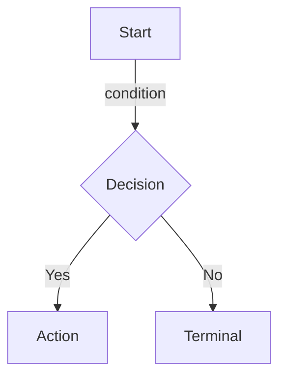

# 02 - Decision Trees

## Section Overview

This section contains **decision tree templates** that encode the advisory logic for Israel-to-Cyprus relocation planning. Each decision tree maps a specific process (eligibility assessment, exit tax calculation, company formation, etc.) into a deterministic flow that can be followed by advisors and, ultimately, executed by automated engines.

## Purpose

1. **Visualize** complex advisory logic as navigable flowcharts (Mermaid diagrams).
2. **Encode** the same logic in structured node tables so rule engines and questionnaire systems can consume it programmatically.
3. **Link** every decision point back to its underlying data fields (`DR-xx-xxx`) and legal rules (`LTF-xx-xxx`), ensuring full traceability.

## Dual Representation: Mermaid + Node Table

Every decision tree file in this section contains **two complementary representations** of the same logic:

### 1. Mermaid Diagram (Visual)

- **Purpose:** Quick visual overview for domain experts and reviewers.
- **Audience:** Attorneys, tax advisors, project stakeholders.
- **Limitation:** Not machine-parseable; serves as a communication and validation tool.

### 2. Structured Node Table (Machine-Readable)

| Node ID | Type | Question/Condition | Data Field | Yes Path | No Path | Risk Flag | Legal Source |
|---------|------|--------------------|------------|----------|---------|-----------|-------------|
| DT-xx-001 | start | Entry condition | DR-xx-xxx | DT-xx-002 | -- | -- | -- |
| DT-xx-002 | decision | Is condition met? | DR-xx-xxx | DT-xx-003 | DT-xx-004 | HIGH | LTF-xx-xxx |

- **Purpose:** Programmatic consumption by rule engines, questionnaire builders, and risk scoring modules.
- **Audience:** Engineers, system integrators, QA testers.
- **Requirement:** Must match the Mermaid diagram exactly -- any change to one must be reflected in the other.

## Node Types

| Type | Shape (Mermaid) | Meaning |
|------|-----------------|---------|
| `start` | `[Start]` rounded box | Entry point of the decision tree |
| `decision` | `{Question?}` diamond | A yes/no branching point based on client data or legal condition |
| `action` | `[Action]` box | An action to be taken (file form, restructure asset, etc.) |
| `subprocess` | `[[Subprocess]]` double-bordered box | Delegates to another decision tree (cross-reference via DT-xx ID) |
| `terminal` | `([Terminal])` stadium shape | End state with a classification label (e.g., ELIGIBLE, BLOCKED, HIGH-LIABILITY) |

## How to Add Nodes

When adding a new node to a decision tree, you **must** update both representations:

### Step 1: Add to the Node Table

1. Assign the next available `DT-xx-xxx` ID.
2. Fill in all columns: Type, Question/Condition, Data Field, Yes Path, No Path, Risk Flag, Legal Source.
3. Ensure the Yes Path and No Path reference valid existing Node IDs (or create additional nodes).

### Step 2: Add to the Mermaid Diagram

1. Add the corresponding node using the correct Mermaid shape for its type.
2. Add edges matching the Yes Path and No Path from the table.
3. Use edge labels (`-->|Yes|` / `-->|No|`) for decision nodes.

### Step 3: Validate Consistency

- Every node in the table must appear in the diagram.
- Every node in the diagram must appear in the table.
- All path references must be bidirectionally consistent.

## Cross-References

Decision trees reference two primary namespaces:

| Namespace | Purpose | Example |
|-----------|---------|---------|
| `DR-xx-xxx` | Data field that supplies the input for a decision node | `DR-03-001` (days in Israel) |
| `LTF-xx-xxx` | Legal rule that governs the threshold or condition | `LTF-01-003` (183-day test) |

These IDs are defined in:
- `03-data-requirements/` -- Client data catalog
- `01-legal-tax-framework/` -- Legal and tax rules

## File Index

| # | File | Subject | Node ID Range |
|---|------|---------|---------------|
| 1 | `01-residency-severance-eligibility.md` | Is client eligible for residency severance? | DT-01-001 -- DT-01-008 |
| 2 | `02-residency-severance-process.md` | Process flow once eligibility confirmed | DT-02-001 -- DT-02-008 |
| 3 | `03-exit-tax-assessment.md` | Section 100A exit tax assessment | DT-03-001 -- DT-03-007 |
| 4 | `04-cyprus-company-establishment.md` | Cyprus company setup flow | DT-04-001 -- DT-04-007 |
| 5 | `05-cyprus-bank-account.md` | Bank account opening flow | DT-05-001 -- DT-05-005 |
| 6 | `06-mortgage-financing.md` | Cyprus mortgage eligibility | DT-06-001 -- DT-06-005 |
| 7 | `07-retroactive-rectification.md` | Retroactive correction for non-compliant clients | DT-07-001 -- DT-07-005 |

## ID Convention

- **Prefix:** `DT` (Decision Tree)
- **Format:** `DT-{FILE_NUMBER}-{ITEM_NUMBER}`
- Example: `DT-03-005` refers to the fifth node in file `03-exit-tax-assessment.md`

## Terminal State Labels

Terminal nodes use standardized labels. Each file defines its own set, but the general pattern is:

| Pattern | Meaning |
|---------|---------|
| `ELIGIBLE-*` | Client qualifies for the assessed process |
| `NOT-ELIGIBLE` | Client does not qualify |
| `BLOCKED-BY-*` | A specific blocker prevents proceeding |
| `NEEDS-*` | Additional information or action required before determination |
| `HIGH/MODERATE/LOW-*` | Risk or liability classification |

## Status Legend

| Status | Meaning |
|--------|---------|
| `draft` | Initial logic seeded; awaiting expert review |
| `expert_review` | Expert has validated logic; pending peer review |
| `verified` | Approved by at least two domain experts |
| `locked` | Finalized -- changes require formal change request |

## How to Contribute

1. Locate `<!-- EXPERT INPUT REQUIRED -->` markers in each file.
2. Replace `[PLACEHOLDER]` text with validated decision logic.
3. Ensure the Mermaid diagram and node table remain synchronized.
4. Update the `status` field in YAML front matter to `expert_review`.
5. Bump the `version` field (e.g., `"1.0"` to `"1.1"`).
6. Update `last_updated` to the current date.
