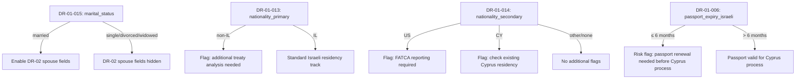
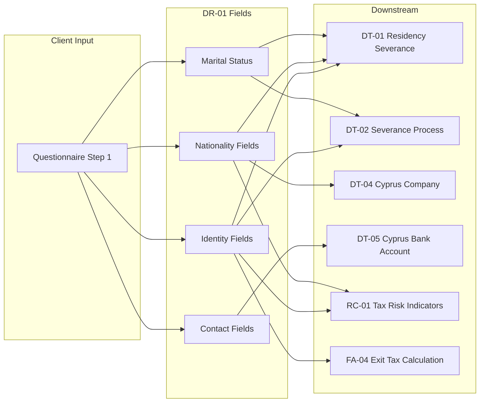

# DR-01 — Personal Identity

## Overview

This file defines all data fields related to client personal identification. These fields are collected at the earliest stage of client onboarding (Questionnaire Step 1: "About You") and are referenced by virtually every downstream process — decision trees for residency determination, risk indicators for identity-related compliance, and financial models for client profile construction.

### Legal Basis for Collection

- **Israeli Income Tax Ordinance, Section 1** — Defines "resident" requiring identity verification
- **Israeli Privacy Protection Law (1981), Section 7** — Consent requirements for PII collection
- **GDPR Article 6(1)(b)** — Processing necessary for contract performance
- **Cyprus Companies Law, Cap. 113** — Director/shareholder identification for company formation
- **CRS/FATCA** — Tax identification number (TIN) collection obligations

<!-- EXPERT INPUT REQUIRED: Legal expert to confirm whether Israeli biometric ID data (smart ID card chip) will ever be collected, and if so, what additional legal basis is needed -->

---

## Field Definitions

| Field ID | Name | Type | Format | Required | Sensitivity | Used By (Trees) | Used By (Risk) | Used By (Finance) | Notes |
|----------|------|------|--------|----------|-------------|-----------------|-----------------|---------------------|-------|
| DR-01-001 | full_legal_name | string | UTF-8, max 200 chars | yes | PII | [PLACEHOLDER] | [PLACEHOLDER] | [PLACEHOLDER] | As appears on Israeli ID card (Teudat Zehut). Latin characters. |
| DR-01-002 | full_legal_name_hebrew | string | UTF-8 Hebrew, max 200 chars | yes | PII | [PLACEHOLDER] | [PLACEHOLDER] | [PLACEHOLDER] | As appears on Israeli ID card. Hebrew characters (שם מלא). Used for Israeli legal documents and ITA filings. |
| DR-01-003 | israeli_id_number | string | 9-digit numeric, zero-padded | yes | PII-sensitive | DT-01-*, DT-02-* | RC-01-* | FA-04-* | Teudat Zehut (תעודת זהות) number. Validated via Israeli ID check-digit algorithm (modular arithmetic, not Luhn). Primary unique identifier for all ITA interactions. |
| DR-01-004 | date_of_birth | date | ISO-8601 (YYYY-MM-DD) | yes | PII | DT-03-* | [PLACEHOLDER] | FA-04-* | Required for pension calculations, exit tax timing, and age-based exemptions. Must be ≤ today. |
| DR-01-005 | passport_number_israeli | string | Alphanumeric, max 20 chars | yes | PII-sensitive | [PLACEHOLDER] | RC-01-* | [PLACEHOLDER] | Israeli passport (דרכון ישראלי). Required for Cyprus company formation and bank account opening. |
| DR-01-006 | passport_expiry_israeli | date | ISO-8601 (YYYY-MM-DD) | yes | PII | DT-04-*, DT-05-* | RC-01-* | [PLACEHOLDER] | Must be at least 6 months in future for Cyprus processes. Risk flag if ≤ 6 months. |
| DR-01-007 | passport_number_cyprus | string | Alphanumeric, max 20 chars | no | PII-sensitive | [PLACEHOLDER] | [PLACEHOLDER] | [PLACEHOLDER] | Cypriot passport number, if client holds Cyprus citizenship. Rare for typical clients. |
| DR-01-008 | cyprus_residency_permit_number | string | Alphanumeric, max 30 chars | no | PII-sensitive | DT-04-* | RC-01-* | [PLACEHOLDER] | Yellow slip (Κίτρινο Φύλλο) or MEU1/MEU3 permit number. Required if client has already begun Cyprus residency process. |
| DR-01-009 | contact_email | string | RFC 5322 email format | yes | PII | [PLACEHOLDER] | [PLACEHOLDER] | [PLACEHOLDER] | Primary communication channel. Used for platform login and document delivery. |
| DR-01-010 | contact_phone | string | E.164 international format (+972..., +357...) | yes | PII | [PLACEHOLDER] | [PLACEHOLDER] | [PLACEHOLDER] | Primary phone. Used for 2FA and urgent communications. |
| DR-01-011 | whatsapp_number | string | E.164 international format | no | PII | [PLACEHOLDER] | [PLACEHOLDER] | [PLACEHOLDER] | Many Israeli clients prefer WhatsApp for communication. May differ from contact_phone. |
| DR-01-012 | current_mailing_address | string | Multiline, UTF-8 | yes | PII | DT-01-* | RC-01-* | [PLACEHOLDER] | Full mailing address including country. Used as one indicator in Center of Life test (מבחן מרכז החיים). |
| DR-01-013 | nationality_primary | enum | ISO-3166-1 alpha-2 country code | yes | internal | DT-01-*, DT-04-* | RC-01-* | [PLACEHOLDER] | Primary citizenship. Determines treaty eligibility and residency rules. Expected: `IL` for most clients. |
| DR-01-014 | nationality_secondary | enum | ISO-3166-1 alpha-2 country code | no | internal | DT-01-*, DT-04-* | RC-01-* | [PLACEHOLDER] | Secondary citizenship if dual national. Affects FATCA applicability (US citizens), treaty access, and Cyprus 60-day rule eligibility. |
| DR-01-015 | marital_status | enum | single / married / divorced / widowed | yes | PII | DT-01-*, DT-02-* | RC-01-* | FA-04-* | Determines whether spouse data (DR-02-*) is required. Israeli law considers married couples jointly for Center of Life assessment. |

<!-- EXPERT INPUT REQUIRED: The following additional fields may be needed. Experts should evaluate and add rows if necessary:
- Gender (required for some Israeli forms)
- Hebrew date of birth (for certain religious/legal contexts)
- Place of birth (city + country — required for some Cyprus forms)
- Mother's maiden name (Israeli bureaucratic forms sometimes require this)
- Israeli ID issuance date
- Previous names (name changes)
- Power of attorney holder details
-->

---

## Conditional Logic

---

## Validation Rules

| Field ID | Validation | Error Message |
|----------|-----------|---------------|
| DR-01-001 | Non-empty, min 2 chars, max 200 chars | "Full legal name is required" |
| DR-01-002 | Non-empty, Hebrew character validation | "Hebrew name is required and must contain Hebrew characters" |
| DR-01-003 | Exactly 9 digits, passes Israeli ID check-digit algorithm | "Invalid Israeli ID number — check digit does not match" |
| DR-01-004 | Valid date, ≤ today, ≥ 1920-01-01 | "Date of birth must be a valid past date" |
| DR-01-005 | Non-empty, alphanumeric, max 20 chars | "Israeli passport number is required" |
| DR-01-006 | Valid date, > today | "Passport expiry must be a future date" |
| DR-01-007 | Alphanumeric if provided | "Invalid Cyprus passport format" |
| DR-01-008 | Alphanumeric if provided | "Invalid Cyprus residency permit format" |
| DR-01-009 | RFC 5322 email format | "Please enter a valid email address" |
| DR-01-010 | E.164 format (+ followed by 7-15 digits) | "Phone must be in international format (e.g., +972501234567)" |
| DR-01-011 | E.164 format if provided | "WhatsApp number must be in international format" |
| DR-01-012 | Non-empty, min 10 chars | "Please enter your full mailing address" |
| DR-01-013 | Valid ISO-3166-1 alpha-2 code | "Please select a valid country" |
| DR-01-014 | Valid ISO-3166-1 alpha-2 code if provided | "Please select a valid country" |
| DR-01-015 | One of: single, married, divorced, widowed | "Please select your marital status" |

### Israeli ID Check-Digit Algorithm

The Israeli Teudat Zehut number uses the following validation:

1. Pad the number to 9 digits with leading zeros
2. Multiply each digit alternately by 1 and 2 (starting from the rightmost digit)
3. If any product is > 9, sum its digits (e.g., 16 → 1+6 = 7)
4. Sum all products
5. The number is valid if the total sum is divisible by 10

<!-- EXPERT INPUT REQUIRED: Developer to confirm this is the exact algorithm used by Israeli government systems. Some sources describe a slightly different version. -->

---

## Data Flow

---

## Notes for Experts

1. **Name matching** — Israeli systems often have discrepancies between Hebrew and Latin name spellings. The platform should support fuzzy matching or manual override.
2. **ID number sensitivity** — The Israeli ID number is the single most sensitive identifier. It must be masked in all UI displays (show only last 4 digits) and encrypted at the field level.
3. **Dual citizens** — Clients with US citizenship trigger additional FATCA obligations. The platform must flag this immediately upon nationality entry.
4. **Passport expiry** — Cyprus bank account opening and company formation both require valid passport with at least 6 months remaining. This is a hard blocker.

<!-- EXPERT INPUT REQUIRED: Are there any Israeli-specific data fields required by the ITA for the formal exit notification (טופס 1348)? If so, those should be added here. -->
