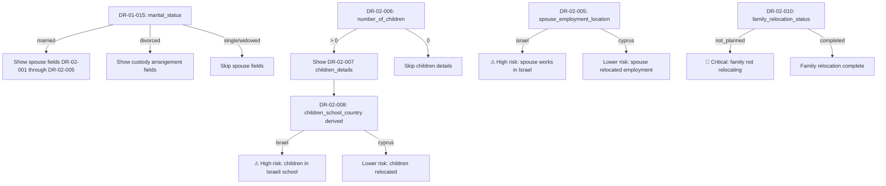

# DR-02 — Family & Household

## Overview

This file defines all data fields related to family structure and household composition. Family data is central to Israeli tax residency determination because the **Center of Life test** (מבחן מרכז החיים) heavily weighs where a taxpayer's family resides, where children attend school, and where the spouse works.

Under Israeli case law (particularly the landmark _Yanko-Weiss_ ruling and subsequent precedents), the Israel Tax Authority examines family ties as primary indicators of residency. A taxpayer who relocates to Cyprus but whose spouse and children remain in Israel will face a strong presumption of continued Israeli residency.

### Legal Basis

- **Israeli Income Tax Ordinance, Section 1(a)** — Center of Life test considers family ties
- **ITA Circular 2/2023** — Guidance on family-based residency indicators
- **Cyprus Civil Registry Law** — Requirements for family member registration
- **Cyprus Immigration Regulations** — Dependent visa/permit requirements

<!-- EXPERT INPUT REQUIRED: Confirm the specific ITA circular number and year for family-based residency indicators. Verify whether post-2025 irrebuttable presumption rules change how family data is weighted. -->

---

## Field Definitions

| Field ID | Name | Type | Format | Required | Sensitivity | Used By (Trees) | Used By (Risk) | Used By (Finance) | Notes |
|----------|------|------|--------|----------|-------------|-----------------|-----------------|---------------------|-------|
| DR-02-001 | spouse_full_name | string | UTF-8, max 200 chars | conditional | PII | DT-01-*, DT-02-* | RC-01-* | [PLACEHOLDER] | Required if DR-01-015 = `married`. Full legal name as on ID document. |
| DR-02-002 | spouse_israeli_id | string | 9-digit numeric, zero-padded | conditional | PII-sensitive | DT-01-*, DT-02-* | RC-01-* | FA-04-* | Required if DR-01-015 = `married` AND spouse is Israeli citizen. Validated with same check-digit as DR-01-003. |
| DR-02-003 | spouse_nationality | enum | ISO-3166-1 alpha-2 | conditional | internal | DT-01-*, DT-04-* | RC-01-* | [PLACEHOLDER] | Required if DR-01-015 = `married`. Affects treaty eligibility and joint residency assessment. |
| DR-02-004 | spouse_tax_residency_current | enum | ISO-3166-1 alpha-2 country code | conditional | confidential | DT-01-*, DT-02-* | RC-01-*, RC-02-* | FA-04-*, FA-05-* | Where spouse is currently tax-resident. **Critical for Center of Life test.** If spouse remains tax-resident in Israel while client moves to Cyprus, this is a major residency risk indicator. |
| DR-02-005 | spouse_employment_location | enum | israel / cyprus / other / none | conditional | confidential | DT-01-*, DT-02-* | RC-01-* | FA-01-*, FA-05-* | Where spouse is employed. Spouse working in Israel while client claims Cyprus residency is a strong ITA challenge point. |
| DR-02-006 | number_of_children | number | Non-negative integer | yes | PII | DT-01-* | RC-01-* | FA-06-* | Total number of dependent children (under 18 or under 23 if in military/national service). |
| DR-02-007 | children_details | array | JSON array: `[{name: string, dob: date, school_location: enum}]` | conditional | PII | DT-01-*, DT-02-* | RC-01-* | [PLACEHOLDER] | Required if DR-02-006 > 0. Each child: name (string), date of birth (ISO-8601), school_location (israel/cyprus/other). **School location is a primary Center of Life indicator.** |
| DR-02-008 | children_school_country | enum | israel / cyprus / other | conditional | confidential | DT-01-*, DT-02-* | RC-01-*, RC-02-* | [PLACEHOLDER] | Summary field derived from DR-02-007. If children attend school in Israel, strong presumption of Israeli residency per ITA guidance. |
| DR-02-009 | dependents_in_israel | number | Non-negative integer | yes | internal | DT-01-* | RC-01-* | [PLACEHOLDER] | Count of financial dependents (elderly parents, disabled siblings, etc.) remaining in Israel. Additional Center of Life tie. |
| DR-02-010 | family_relocation_status | enum | planned / in_progress / completed / not_planned | yes | confidential | DT-01-*, DT-02-* | RC-01-*, RC-02-* | FA-05-*, FA-06-* | Overall family relocation status. `completed` = entire family relocated to Cyprus. `not_planned` = family stays in Israel (high risk for residency challenge). |

<!-- EXPERT INPUT REQUIRED: The following additional fields may be needed:
- Spouse date of birth (for pension/insurance calculations)
- Spouse employment type (employed/self-employed/business-owner)
- Spouse income range (affects joint tax calculations)
- Children ages at relocation (affects school enrollment logistics)
- Custody arrangements if divorced
- Common-law partner data (Israeli law recognizes ידועים בציבור)
- Whether spouse has independent business ties to Israel
- Family members employed by client's company (transfer pricing implications)
-->

---

## Conditional Logic

---

## Center of Life — Family Weight Matrix

The Israel Tax Authority uses family indicators as part of the Center of Life test. The following matrix shows how each family field contributes to the residency assessment:

| Factor | Strong Israel Tie | Neutral | Strong Cyprus Tie |
|--------|-------------------|---------|-------------------|
| Spouse tax residency | Israel | Third country | Cyprus |
| Spouse employment | Works in Israel | Remote/not employed | Works in Cyprus |
| Children's school | Israeli school | Homeschool/online | Cyprus school |
| Family relocation | Not planned | In progress | Completed |
| Dependents in Israel | 2+ | 1 | 0 |

<!-- EXPERT INPUT REQUIRED: Tax attorney to assign specific point values or weighting percentages to each factor based on ITA assessment practice and case law. The above is qualitative — we need quantitative scoring for the risk engine. -->

---

## Validation Rules

| Field ID | Validation | Error Message |
|----------|-----------|---------------|
| DR-02-001 | Non-empty if married, min 2 chars | "Spouse name is required for married clients" |
| DR-02-002 | 9-digit Israeli ID check if married + Israeli spouse | "Invalid spouse Israeli ID number" |
| DR-02-003 | Valid ISO-3166-1 code if married | "Spouse nationality is required" |
| DR-02-004 | Valid ISO-3166-1 code if married | "Spouse current tax residency is required" |
| DR-02-005 | Valid enum value if married | "Spouse employment location is required" |
| DR-02-006 | Non-negative integer | "Number of children must be 0 or more" |
| DR-02-007 | Valid JSON array if children > 0; each entry must have name, dob, school_location | "Please provide details for all children" |
| DR-02-008 | Valid enum, consistent with DR-02-007 | "Children school country must match children details" |
| DR-02-009 | Non-negative integer | "Dependents count must be 0 or more" |
| DR-02-010 | Valid enum value | "Please select family relocation status" |

---

## Risk Implications

Family data generates several critical risk indicators:

1. **Split family risk** — Client in Cyprus, family in Israel → ITA will likely challenge residency severance
2. **School enrollment risk** — Children in Israeli schools → strong Center of Life tie
3. **Spouse income risk** — Spouse earning income in Israel → potential joint assessment as Israeli residents
4. **Incomplete relocation risk** — Family relocation "planned" but not executed → time-bound risk that increases each month

These feed directly into `04-risk-classification/01-tax-risk-indicators.md`.

<!-- EXPERT INPUT REQUIRED: What is the typical ITA response time for challenging a residency severance based on family ties? How quickly after filing does the family situation need to be "clean"? -->

---

## Notes for Experts

1. **Common-law partners** — Israeli law recognizes common-law partnerships (ידועים בציבור / yeduim ba-tzibur) for tax purposes. The platform should handle this equivalently to marriage for Center of Life analysis.
2. **Military service** — Children aged 18-21 in Israeli military service (שירות צבאי) are a nuanced indicator. They are physically in Israel but this may not count against residency severance in the same way as school enrollment. Expert clarification needed.
3. **Joint vs. separate assessment** — Married couples in Israel can file jointly or separately. The platform needs to know which approach the client has used historically.
4. **Divorced clients with Israeli children** — Custody arrangements (joint custody vs. sole custody) affect the Center of Life analysis differently. If the client has visitation rights requiring regular Israel visits, this impacts day count (DR-03).
