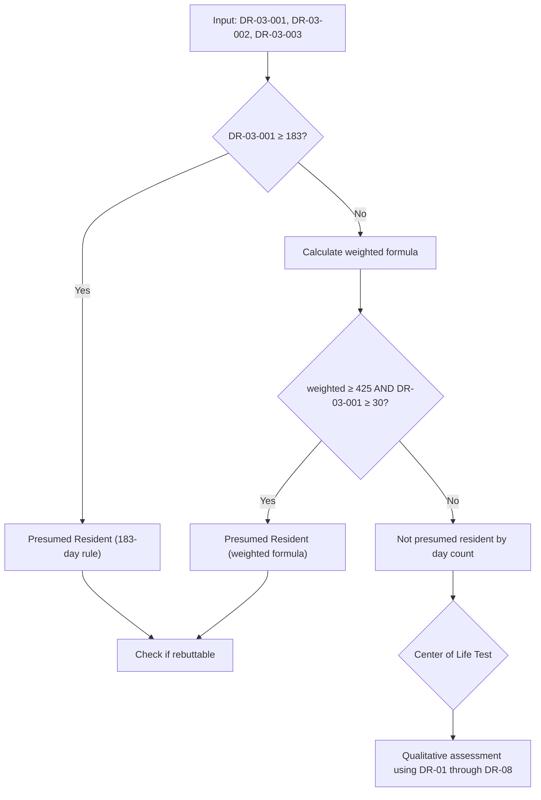

# DR-03 — Residence & Physical Presence

## Overview

This file defines all data fields related to physical residence, property ownership, day-count tracking, and presence indicators. These fields are the **quantitative backbone** of Israeli tax residency determination.

Israeli tax law uses two primary tests for residency:

1. **Day Count Test** (מבחן ספירת הימים) — A quantitative measure based on physical days present in Israel
2. **Center of Life Test** (מבחן מרכז החיים) — A qualitative assessment of personal, economic, and social ties

The fields in this section feed both tests. Day counts provide hard numbers for the 183-day rule and the weighted formula, while property and institutional ties (bank accounts, health insurance, driver's license) serve as Center of Life indicators.

### Legal Basis

- **Israeli Income Tax Ordinance, Section 1(a)(2)** — 183-day rule and weighted day formula
- **Israeli Income Tax Ordinance, Section 1(a)(3)** — Center of Life determination criteria
- **Amendment 223 (2025)** — Irrebuttable presumption rules for high-income individuals
- **Cyprus Income Tax Law, Section 2** — 183-day Cyprus residency rule
- **Cyprus 60-Day Rule** — Alternative Cyprus residency for 60+ days under specific conditions
- **Israel-Cyprus Double Tax Treaty, Article 4** — Tie-breaker provisions for dual residency

<!-- EXPERT INPUT REQUIRED: Confirm whether Amendment 223 (2025) has been enacted and its exact provisions regarding irrebuttable vs. rebuttable presumptions. The amendment number and year may need correction. -->

---

## Field Definitions

| Field ID | Name | Type | Format | Required | Sensitivity | Used By (Trees) | Used By (Risk) | Used By (Finance) | Notes |
|----------|------|------|--------|----------|-------------|-----------------|-----------------|---------------------|-------|
| DR-03-001 | days_in_israel_current_year | number | Non-negative integer, 0–366 | yes | confidential | DT-01-*, DT-02-* | RC-01-*, RC-02-* | [PLACEHOLDER] | Total calendar days physically present in Israel in current tax year (Jan 1 – Dec 31). A partial day counts as a full day per ITA practice. **Key input to 183-day test.** |
| DR-03-002 | days_in_israel_prior_year | number | Non-negative integer, 0–366 | yes | confidential | DT-01-* | RC-01-* | [PLACEHOLDER] | Days in Israel in the year immediately before current year. Used in weighted formula (multiplied by 1/3). |
| DR-03-003 | days_in_israel_two_years_prior | number | Non-negative integer, 0–366 | yes | confidential | DT-01-* | RC-01-* | [PLACEHOLDER] | Days in Israel two years before current year. Used in weighted formula (multiplied by 1/6). |
| DR-03-004 | days_in_cyprus_current_year | number | Non-negative integer, 0–366 | yes | confidential | DT-04-* | RC-01-* | [PLACEHOLDER] | Days physically present in Cyprus in current tax year. Must be ≥ 60 for 60-day rule or ≥ 183 for standard Cyprus residency. |
| DR-03-005 | primary_residence_address_israel | string | Multiline, UTF-8 | conditional | PII | DT-01-* | RC-01-* | FA-03-* | Full address of primary Israeli residence. Required if DR-03-007 = true or if client is currently Israeli resident. |
| DR-03-006 | primary_residence_address_cyprus | string | Multiline, UTF-8 | conditional | PII | DT-04-* | RC-01-* | FA-03-* | Full address of primary Cyprus residence. Required if client has established or is establishing Cyprus residency. |
| DR-03-007 | israel_property_owned | boolean | true / false | yes | confidential | DT-01-*, DT-02-* | RC-01-*, RC-02-* | FA-03-*, FA-04-* | Whether client owns residential property in Israel. Ownership of a home "available for use" is a Center of Life indicator. |
| DR-03-008 | israel_property_rented_out | boolean | true / false | conditional | confidential | DT-01-* | RC-01-* | FA-01-*, FA-05-* | If DR-03-007 = true, is the property rented out to a third party? A rented-out property is a weaker residency indicator than one kept available for the owner's use. Also generates rental income (DR-05). |
| DR-03-009 | cyprus_property_owned | boolean | true / false | yes | confidential | DT-04-* | RC-01-* | FA-03-* | Whether client owns property in Cyprus. Relevant for Cyprus permanent establishment and mortgage feasibility (FA-03). |
| DR-03-010 | cyprus_rental_lease_active | boolean | true / false | conditional | confidential | DT-04-* | RC-01-* | [PLACEHOLDER] | Whether client has an active rental lease in Cyprus. Required if DR-03-009 = false (must demonstrate Cyprus housing). |
| DR-03-011 | declared_exit_date | date | ISO-8601 (YYYY-MM-DD) | conditional | confidential | DT-02-*, DT-03-* | RC-01-*, RC-02-* | FA-04-* | The date on which the client formally declares cessation of Israeli tax residency. Triggers exit tax calculation (Section 100A). Required if residency severance is in progress or completed. |
| DR-03-012 | bituach_leumi_status | enum | active / suspended / severed | yes | confidential | DT-01-*, DT-02-* | RC-01-*, RC-02-* | FA-06-* | National Insurance (ביטוח לאומי) status. `active` = still paying/covered. `suspended` = temporarily on hold. `severed` = formally terminated. Severance is a strong exit indicator; active status suggests ongoing Israeli ties. |
| DR-03-013 | israeli_bank_accounts_open | boolean | true / false | yes | confidential | DT-01-* | RC-01-*, RC-02-* | FA-04-* | Whether client maintains open bank accounts in Israel. Open accounts are a Center of Life indicator, though not conclusive on their own. |
| DR-03-014 | israeli_drivers_license_active | boolean | true / false | yes | internal | DT-01-* | RC-01-* | [PLACEHOLDER] | Whether client holds an active Israeli driver's license. Minor Center of Life indicator. Some advisors recommend surrendering it to strengthen exit case. |
| DR-03-015 | israeli_health_insurance_active | boolean | true / false | yes | confidential | DT-01-*, DT-02-* | RC-01-*, RC-02-* | [PLACEHOLDER] | Whether client maintains active Israeli health insurance (קופת חולים). Active health insurance is a moderate Center of Life indicator. |
| DR-03-016 | weighted_days_formula_result | number | Decimal, 2 decimal places | calculated | confidential | DT-01-* | RC-01-* | [PLACEHOLDER] | **Calculated field.** Formula: `DR-03-001 + (1/3 × DR-03-002) + (1/6 × DR-03-003)`. If result ≥ 425 AND DR-03-001 ≥ 30, the individual is presumed Israeli resident under the weighted formula. |

<!-- EXPERT INPUT REQUIRED: Additional fields to consider:
- Days in Israel by month (monthly breakdown for pattern analysis)
- Purpose of Israel visits (business/family/medical — affects ITA assessment)
- Travel log evidence type (passport stamps / airline records / phone location)
- Country of departure/arrival for each Israel visit
- Days in third countries (not Israel, not Cyprus)
- Property value in Israel (for exit tax calculation)
- Property value in Cyprus (for mortgage feasibility)
- Utility bills active in Israel vs. Cyprus (Center of Life evidence)
- Club memberships in Israel (gym, synagogue, social clubs — minor CoL indicators)
- Vehicle registration country
-->

---

## The 183-Day Rule and Weighted Formula

### Simple 183-Day Test

```
IF days_in_israel_current_year ≥ 183
THEN presumed Israeli tax resident (rebuttable pre-2025; irrebuttable post-2025 for some)
```

### Weighted Three-Year Formula

```
weighted_total = days_current_year + (1/3 × days_prior_year) + (1/6 × days_two_years_prior)

IF weighted_total ≥ 425 AND days_current_year ≥ 30
THEN presumed Israeli tax resident
```

### Calculation Example

| Year | Actual Days | Weight | Weighted Days |
|------|-------------|--------|---------------|
| 2026 (current) | 100 | × 1 | 100.00 |
| 2025 (prior) | 200 | × 1/3 | 66.67 |
| 2024 (two years prior) | 300 | × 1/6 | 50.00 |
| **Total** | | | **216.67** |

Result: 216.67 < 425, so weighted formula does NOT trigger presumption (even though prior years had high counts).



<!-- EXPERT INPUT REQUIRED: Post-2025 amendment details:
1. For which income thresholds does the 183-day presumption become irrebuttable?
2. Does the weighted formula presumption also become irrebuttable?
3. Are there transitional provisions for taxpayers who began exit process before 2025?
-->

---

## Center of Life — Presence Indicators Matrix

| Indicator | Field ID | Strong Israel Tie | Neutral | Strong Exit Indicator |
|-----------|----------|-------------------|---------|----------------------|
| Days in Israel | DR-03-001 | > 120 days | 60–120 days | < 60 days |
| Property owned in Israel | DR-03-007 | Yes, available for use | Yes, rented out | No |
| Property in Cyprus | DR-03-009 | No | Rented | Owned |
| Bituach Leumi | DR-03-012 | Active | Suspended | Severed |
| Bank accounts Israel | DR-03-013 | Active, primary | Active, secondary | Closed |
| Health insurance Israel | DR-03-015 | Active | — | Terminated |
| Driver's license Israel | DR-03-014 | Active | — | Surrendered |
| Declared exit date | DR-03-011 | Not filed | Filed recently | Filed > 1 year ago |

<!-- EXPERT INPUT REQUIRED: Assign numeric weights to each indicator for the risk scoring engine. The qualitative labels above need to be converted to point values (e.g., 1-5 scale or percentage weights summing to 100%). -->

---

## Validation Rules

| Field ID | Validation | Error Message |
|----------|-----------|---------------|
| DR-03-001 | Integer, 0 ≤ n ≤ 366 | "Days in Israel must be between 0 and 366" |
| DR-03-002 | Integer, 0 ≤ n ≤ 366 | "Days in Israel (prior year) must be between 0 and 366" |
| DR-03-003 | Integer, 0 ≤ n ≤ 366 | "Days in Israel (two years prior) must be between 0 and 366" |
| DR-03-004 | Integer, 0 ≤ n ≤ 366 | "Days in Cyprus must be between 0 and 366" |
| DR-03-005 | Non-empty if DR-03-007 = true | "Israeli residence address required if property owned" |
| DR-03-006 | Non-empty if Cyprus residency established | "Cyprus residence address required" |
| DR-03-007 | Boolean | "Please indicate whether you own property in Israel" |
| DR-03-008 | Boolean if DR-03-007 = true | "Please indicate if your Israeli property is rented out" |
| DR-03-009 | Boolean | "Please indicate whether you own property in Cyprus" |
| DR-03-010 | Boolean if DR-03-009 = false | "Please indicate if you have an active Cyprus rental lease" |
| DR-03-011 | Valid date if exit process started | "Please enter your declared exit date" |
| DR-03-012 | Valid enum | "Please select your Bituach Leumi status" |
| DR-03-013 | Boolean | "Please indicate if you have open Israeli bank accounts" |
| DR-03-014 | Boolean | "Please indicate if you have an active Israeli driver's license" |
| DR-03-015 | Boolean | "Please indicate if you have active Israeli health insurance" |
| DR-03-016 | Auto-calculated; no user input | — |

### Cross-Field Validation

| Rule | Condition | Error |
|------|-----------|-------|
| Days consistency | DR-03-001 + DR-03-004 ≤ 366 | "Total days in Israel + Cyprus cannot exceed days in year. Account for third-country days." |
| Property-address | DR-03-007 = true → DR-03-005 required | "Please provide Israeli property address" |
| Cyprus housing | DR-03-009 = false AND DR-03-010 = false → warning | "You have no Cyprus property or lease. Cyprus residency requires a residential address." |
| Exit date vs. days | DR-03-011 set AND DR-03-001 > 183 → warning | "You have declared exit but spent 183+ days in Israel this year — this may trigger residency presumption." |

---

## Notes for Experts

1. **Day counting methodology** — The ITA counts arrival and departure days as full days. A flight landing at 11:59 PM counts as a full day. Experts should confirm if this is still current practice.
2. **Passport stamp gaps** — Many Israeli passports lack entry stamps (automated gates). The platform should support alternative evidence: airline tickets, credit card records, phone location data.
3. **COVID-era precedents** — During 2020-2021, the ITA issued guidance that involuntary days in Israel (due to lockdowns/flight cancellations) could be excluded from the day count. Determine if similar precedents apply.
4. **Property "available for use"** — The distinction between owned-and-available vs. owned-and-rented is legally significant. A furnished apartment kept ready for the owner's use is a much stronger residency indicator than a property rented to tenants on a long-term lease.
5. **Bituach Leumi severance** — Formally severing Bituach Leumi has irreversible consequences (pension gaps, loss of maternity/disability benefits). Clients need to understand this before it is recorded as a data point.
