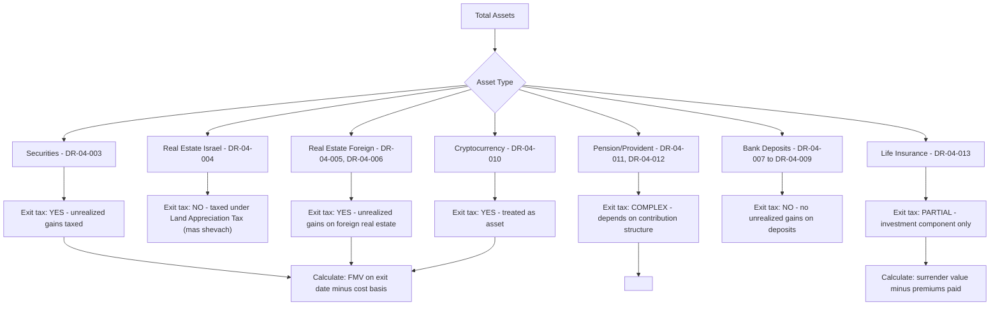

# DR-04 — Financial Assets

## Overview

This file defines all data fields related to the client's financial asset base. Financial data is critical for three downstream processes:

1. **Exit Tax Calculation (Section 100A)** — Deemed liquidation of assets on residency severance date requires accurate valuation of all holdings
2. **Risk Scoring** — Net worth, asset concentration, and cross-border holdings determine risk levels
3. **Financial Planning** — Cash flow projections, mortgage feasibility, and tax optimization depend on complete asset inventory

All monetary values are captured in the original currency with a USD equivalent for standardized comparison. Where the original currency is NIS (Israeli New Shekel), the platform will maintain both NIS and USD values with the exchange rate used.

### Legal Basis

- **Israeli Income Tax Ordinance, Section 100A** — Exit tax on deemed asset liquidation
- **Israeli Income Tax Ordinance, Section 9(2)** — Capital gains exemptions for certain assets
- **Israeli Securities Law (1968)** — Definitions of securities and financial instruments
- **Cyprus Income Tax Law, Sections 5 and 8** — Treatment of foreign income and capital gains
- **CRS (Common Reporting Standard)** — Automatic financial account information exchange
- **Israeli Prohibition of Money Laundering Law (2000)** — Source of funds documentation

<!-- EXPERT INPUT REQUIRED: Financial analyst to confirm whether cryptocurrency holdings require special treatment under Israeli tax law as of 2026. The ITA has been evolving its position on crypto taxation. -->

---

## Field Definitions

| Field ID | Name | Type | Format | Required | Sensitivity | Used By (Trees) | Used By (Risk) | Used By (Finance) | Notes |
|----------|------|------|--------|----------|-------------|-----------------|-----------------|---------------------|-------|
| DR-04-001 | total_net_worth_usd | number | Decimal, USD | yes | confidential | DT-03-* | RC-01-*, RC-04-* | FA-01-*, FA-04-*, FA-06-* | Total net worth in USD equivalent. Sum of all assets minus all liabilities. Used as primary threshold for exit tax materiality and risk scoring. |
| DR-04-002 | liquid_assets_usd | number | Decimal, USD | yes | confidential | DT-03-* | RC-04-* | FA-01-*, FA-02-*, FA-06-* | Cash, demand deposits, money market funds, and other assets convertible to cash within 30 days. Critical for cash flow planning and Cyprus establishment costs. |
| DR-04-003 | israeli_securities_portfolio | number | Decimal, NIS | yes | confidential | DT-03-* | RC-04-* | FA-04-*, FA-05-* | Total value of securities held in Israeli brokerage accounts (Tel Aviv Stock Exchange listed, Israeli mutual funds, Israeli ETFs). Subject to exit tax on unrealized gains. |
| DR-04-004 | real_estate_israel_value | number | Decimal, NIS | yes | confidential | DT-01-*, DT-03-* | RC-01-*, RC-04-* | FA-03-*, FA-04-* | Estimated current market value of all Israeli real estate holdings. Includes residential, commercial, and land. Note: Israeli real estate gains are taxed under Land Appreciation Tax (מס שבח מקרקעין) which has different rules from regular capital gains. |
| DR-04-005 | real_estate_cyprus_value | number | Decimal, EUR | yes | confidential | DT-04-* | RC-04-* | FA-03-* | Current market value of Cyprus real estate holdings. Used for mortgage feasibility and Cyprus substance requirements. |
| DR-04-006 | real_estate_other_value | number | Decimal, USD | no | confidential | [PLACEHOLDER] | RC-04-* | FA-04-* | Value of real estate in jurisdictions other than Israel and Cyprus. Include country breakdown in Notes. |
| DR-04-007 | bank_deposits_israel | number | Decimal, NIS | yes | confidential | [PLACEHOLDER] | RC-04-* | FA-01-*, FA-02-* | Total bank deposits (checking + savings + time deposits) in Israeli banks. Open Israeli bank accounts also serve as Center of Life indicator (DR-03-013). |
| DR-04-008 | bank_deposits_cyprus | number | Decimal, EUR | yes | confidential | DT-05-* | RC-04-* | FA-01-*, FA-02-* | Total bank deposits in Cyprus banks. Minimum balance requirements vary by bank. Some banks require EUR 5,000–50,000 for account opening. |
| DR-04-009 | bank_deposits_other | number | Decimal, USD | no | confidential | [PLACEHOLDER] | RC-04-* | FA-01-* | Bank deposits in other jurisdictions. Include country/bank breakdown in Notes. CRS reporting implications. |
| DR-04-010 | cryptocurrency_holdings | number | Decimal, USD | yes | confidential | DT-03-* | RC-04-* | FA-04-*, FA-05-* | Total value of cryptocurrency holdings at current market rates. Israeli tax treatment: generally treated as assets (not currency), subject to capital gains tax. Exit tax applies to unrealized crypto gains. |
| DR-04-011 | pension_funds_israel | number | Decimal, NIS | yes | confidential | [PLACEHOLDER] | RC-04-* | FA-04-*, FA-06-* | Accumulated value of Israeli pension funds (קרן פנסיה). Note: pension fund withdrawals have special tax treatment. Exit tax treatment of pension funds is complex — may be partially or fully exempt depending on structure. |
| DR-04-012 | provident_funds_israel | number | Decimal, NIS | yes | confidential | [PLACEHOLDER] | RC-04-* | FA-04-*, FA-06-* | Accumulated value of Israeli provident funds (קופות גמל). Includes both long-term savings and education funds (קרן השתלמות). Different tax treatment depending on contribution date and withdrawal terms. |
| DR-04-013 | life_insurance_cash_value | number | Decimal, NIS | no | confidential | [PLACEHOLDER] | [PLACEHOLDER] | FA-04-*, FA-06-* | Cash surrender value of life insurance policies with investment components (ביטוח מנהלים with savings element). May be subject to exit tax on unrealized gains component. |
| DR-04-014 | outstanding_loans_israel | number | Decimal, NIS | yes | confidential | [PLACEHOLDER] | RC-04-* | FA-01-*, FA-02-* | Total outstanding loans from Israeli financial institutions. Includes mortgages, business loans, personal loans. Active Israeli loans create ongoing financial ties (Center of Life indicator). |
| DR-04-015 | outstanding_loans_other | number | Decimal, USD | no | confidential | [PLACEHOLDER] | RC-04-* | FA-01-* | Outstanding loans from non-Israeli institutions. Include breakdown in Notes. |

<!-- EXPERT INPUT REQUIRED: Additional fields likely needed:
- Breakdown of securities portfolio (listed vs. unlisted, Israeli vs. foreign)
- Stock options / RSUs from employer (common for tech clients — complex exit tax treatment)
- Angel investments / venture capital holdings
- Art, jewelry, or other valuable personal property
- Trust assets (if client is beneficiary or settlor)
- Foreign currency holdings
- Safe deposit box contents
- Intellectual property value (if personal, not corporate)
- Date of acquisition for each major asset (cost basis for exit tax)
- Cost basis for each asset category (essential for capital gains calculation)
- Unrealized gains by asset class
-->

---

## Asset Classification for Exit Tax

Section 100A of the Israeli Income Tax Ordinance treats residency severance as a **deemed liquidation** (מכירה רעיונית). The following diagram shows which assets are subject to exit tax:

<!-- EXPERT INPUT REQUIRED: Tax attorney to provide:
1. Current capital gains tax rate for exit tax (25% for securities? 30% for "substantial shareholders"?)
2. Definition of "substantial shareholder" threshold (10%+ of company?)
3. Payment deferral options under Section 100A (installment plan available?)
4. Whether linear allocation method applies (Israeli-period gains only)
5. Treaty protection: does Israel-Cyprus treaty limit exit tax?
-->

---

## Net Worth Summary Template

The platform should display an asset summary dashboard:

| Category | Israel (NIS) | Cyprus (EUR) | Other (USD) | Total (USD) |
|----------|-------------|-------------|-------------|-------------|
| Liquid assets | [DR-04-007] | [DR-04-008] | [DR-04-009] | [DR-04-002] |
| Securities | [DR-04-003] | — | — | [calculated] |
| Real estate | [DR-04-004] | [DR-04-005] | [DR-04-006] | [calculated] |
| Pension/provident | [DR-04-011 + DR-04-012] | — | — | [calculated] |
| Crypto | — | — | [DR-04-010] | [DR-04-010] |
| Insurance | [DR-04-013] | — | — | [calculated] |
| **Gross assets** | | | | **[calculated]** |
| Less: loans | [DR-04-014] | — | [DR-04-015] | [calculated] |
| **Net worth** | | | | **[DR-04-001]** |

---

## Validation Rules

| Field ID | Validation | Error Message |
|----------|-----------|---------------|
| DR-04-001 | Numeric, can be negative (if liabilities > assets) | "Please enter your total net worth" |
| DR-04-002 | Numeric, ≥ 0 | "Liquid assets cannot be negative" |
| DR-04-003 | Numeric, ≥ 0 | "Securities portfolio value cannot be negative" |
| DR-04-004 | Numeric, ≥ 0 | "Real estate value cannot be negative" |
| DR-04-005 | Numeric, ≥ 0 | "Cyprus real estate value cannot be negative" |
| DR-04-006 | Numeric, ≥ 0 if provided | "Other real estate value cannot be negative" |
| DR-04-007 | Numeric, ≥ 0 | "Bank deposits cannot be negative" |
| DR-04-008 | Numeric, ≥ 0 | "Cyprus bank deposits cannot be negative" |
| DR-04-009 | Numeric, ≥ 0 if provided | "Other bank deposits cannot be negative" |
| DR-04-010 | Numeric, ≥ 0 | "Cryptocurrency value cannot be negative" |
| DR-04-011 | Numeric, ≥ 0 | "Pension fund value cannot be negative" |
| DR-04-012 | Numeric, ≥ 0 | "Provident fund value cannot be negative" |
| DR-04-013 | Numeric, ≥ 0 if provided | "Insurance cash value cannot be negative" |
| DR-04-014 | Numeric, ≥ 0 | "Outstanding loans cannot be negative" |
| DR-04-015 | Numeric, ≥ 0 if provided | "Other loans cannot be negative" |

### Cross-Field Validation

| Rule | Condition | Severity |
|------|-----------|----------|
| Net worth consistency | DR-04-001 ≈ sum of assets minus sum of loans (±5% tolerance for rounding/FX) | Warning |
| Liquid vs. total | DR-04-002 ≤ DR-04-001 + DR-04-014 + DR-04-015 | Warning |
| Israel bank vs. accounts | DR-04-007 > 0 implies DR-03-013 = true | Error |
| Cyprus bank vs. deposits | DR-04-008 > 0 implies Cyprus bank account exists | Warning |

---

## Currency Handling

| Currency | Code | Fields Using | Exchange Rate Source |
|----------|------|-------------|---------------------|
| Israeli New Shekel | NIS | DR-04-003, -004, -007, -011, -012, -013, -014 | Bank of Israel daily rate |
| Euro | EUR | DR-04-005, -008 | ECB daily reference rate |
| US Dollar | USD | DR-04-001, -002, -006, -009, -010, -015 | Base currency for comparisons |

<!-- EXPERT INPUT REQUIRED: Which exchange rate date should be used — date of questionnaire completion, tax year end, or exit date? Different rates apply for different purposes. -->

---

## Notes for Experts

1. **Stock options / RSUs** — Many Israeli tech sector clients hold unvested stock options or RSUs. These have complex exit tax treatment (proportional allocation between Israeli and foreign service periods). A dedicated sub-section may be needed.
2. **Real estate vs. securities exit tax** — Israeli real estate is NOT subject to Section 100A exit tax because it is taxed under the separate Land Appreciation Tax (מס שבח מקרקעין). Foreign real estate IS subject to exit tax. This distinction must be clearly communicated to clients.
3. **Pension fund complexity** — Israeli pension funds have multiple layers: employer contributions, employee contributions, and returns on investment. Exit tax treatment may differ for each layer. The Keren Hishtalmut (קרן השתלמות) has a particularly favorable tax exemption that may or may not survive residency severance.
4. **CRS reporting** — Financial accounts over certain thresholds trigger automatic reporting to the Israeli Tax Authority from foreign banks, and vice versa. Clients should be aware that their Cyprus bank balances will be reported to Israel until residency severance is complete and recognized.
5. **Valuation dates** — The exit tax calculation uses fair market value on the declared exit date. Clients should be advised on timing (e.g., declaring exit when markets are low to minimize deemed gains).
