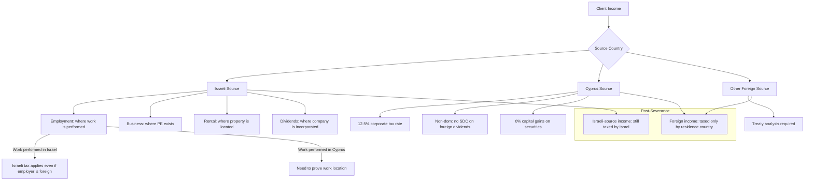

# DR-05 — Employment & Income

## Overview

This file defines all data fields related to the client's employment status and income streams. Employment and income data is essential for:

1. **Center of Life assessment** — Where a person earns their livelihood is a primary residency indicator
2. **Tax optimization** — Structuring income through a Cyprus company vs. Israeli employment has dramatically different tax implications
3. **Cash flow modeling** — Ongoing income determines feasibility of the Cyprus relocation plan
4. **Exit tax impact** — Income level determines potential exposure to irrebuttable presumption rules (post-2025 amendment)

Israeli clients relocating to Cyprus typically fit one of three employment profiles:
- **Tech employees** working remotely for Israeli or foreign companies
- **Business owners** who can relocate their business operations
- **Investors/retirees** living on passive income

Each profile has distinct tax implications and risk factors.

### Legal Basis

- **Israeli Income Tax Ordinance, Sections 2 and 4A** — Income sourcing rules
- **Israeli Income Tax Ordinance, Section 75B** — Controlled Foreign Corporation (CFC) rules
- **Cyprus Income Tax Law, Section 5** — Tax on employment income
- **Cyprus Special Defence Contribution Law** — SDC on dividends, interest, and rents
- **Israel-Cyprus Double Tax Treaty, Articles 7 and 15** — Business profits and employment income allocation
- **Cyprus Non-Dom Regime** — Exemption from SDC for qualifying non-domiciled individuals

<!-- EXPERT INPUT REQUIRED: Confirm whether the post-2025 Israeli amendment introduces income thresholds for irrebuttable residency presumption. If so, the threshold amount must be added as a reference value. -->

---

## Field Definitions

| Field ID | Name | Type | Format | Required | Sensitivity | Used By (Trees) | Used By (Risk) | Used By (Finance) | Notes |
|----------|------|------|--------|----------|-------------|-----------------|-----------------|---------------------|-------|
| DR-05-001 | employment_status | enum | employed / self_employed / business_owner / retired / unemployed / multiple | yes | confidential | DT-01-*, DT-02-*, DT-04-* | RC-01-*, RC-03-* | FA-01-*, FA-05-* | Primary employment status. `multiple` if the client has both employment and self-employment. Determines which income fields are required. |
| DR-05-002 | employer_name | string | UTF-8, max 200 chars | conditional | confidential | [PLACEHOLDER] | RC-03-* | [PLACEHOLDER] | Required if DR-05-001 = `employed`. Legal name of employer. If employed by own company, cross-reference DR-06. |
| DR-05-003 | employer_country | enum | ISO-3166-1 alpha-2 | conditional | confidential | DT-01-*, DT-04-* | RC-01-*, RC-03-* | FA-05-* | Country where employer is incorporated/registered. **Critical:** Israeli employer → income sourced in Israel unless specific conditions met. Cyprus employer → favorable treatment under non-dom regime. |
| DR-05-004 | annual_gross_salary_nis | number | Decimal, NIS | conditional | confidential | [PLACEHOLDER] | RC-04-* | FA-01-*, FA-02-*, FA-05-* | Annual gross salary from Israeli sources (before tax and social contributions). Required if any Israeli employment income exists. Used for tax comparison models. |
| DR-05-005 | annual_gross_salary_other | number | Decimal, USD | conditional | confidential | [PLACEHOLDER] | RC-04-* | FA-01-*, FA-02-*, FA-05-* | Annual gross salary from non-Israeli sources (converted to USD). Includes Cyprus employment income, foreign employer income, etc. |
| DR-05-006 | self_employment_income | number | Decimal, USD | conditional | confidential | DT-04-* | RC-03-*, RC-04-* | FA-01-*, FA-05-* | Annual net self-employment income. Required if DR-05-001 = `self_employed` or `multiple`. Sourcing depends on where services are performed. |
| DR-05-007 | business_income_israel | number | Decimal, NIS | conditional | confidential | DT-01-* | RC-03-*, RC-04-* | FA-01-*, FA-04-*, FA-05-* | Annual business income from Israeli operations (all Israeli-source business profits). Includes income from permanent establishment in Israel. |
| DR-05-008 | business_income_cyprus | number | Decimal, EUR | conditional | confidential | DT-04-* | RC-03-*, RC-04-* | FA-01-*, FA-05-* | Annual business income from Cyprus operations. Cyprus corporate tax rate: 12.5%. |
| DR-05-009 | rental_income_israel | number | Decimal, NIS | conditional | confidential | [PLACEHOLDER] | RC-04-* | FA-01-*, FA-05-* | Annual gross rental income from Israeli properties. Required if DR-03-008 = true. Tax options: 10% flat tax, marginal rate with expense deductions, or exempt up to ceiling. |
| DR-05-010 | rental_income_cyprus | number | Decimal, EUR | conditional | confidential | [PLACEHOLDER] | RC-04-* | FA-01-*, FA-05-* | Annual gross rental income from Cyprus properties. Subject to income tax + SDC (unless non-dom exemption applies). |
| DR-05-011 | dividend_income | number | Decimal, USD | conditional | confidential | DT-03-*, DT-04-* | RC-03-*, RC-04-* | FA-01-*, FA-04-*, FA-05-* | Annual dividend income from all sources. **Critical for Cyprus non-dom planning:** dividends from foreign (non-Cyprus) sources are exempt from SDC for non-dom individuals. Israeli withholding tax on dividends may apply depending on treaty. |
| DR-05-012 | capital_gains_last_3_years | number | Decimal, USD | yes | confidential | DT-03-* | RC-04-* | FA-04-* | Total capital gains realized in last 3 tax years (combined). Used for exit tax projection and risk assessment. Large recent capital gains may indicate tax-motivated relocation (ITA red flag). |

<!-- EXPERT INPUT REQUIRED: Additional fields likely needed:
- Monthly vs. annual income breakdown (for cash flow modeling)
- Stock option/RSU income (extremely common for Israeli tech clients)
- Bonus/commission income (variable component)
- Income from Israeli government bonds (special tax treatment)
- Alimony received/paid
- Social security income (Bituach Leumi payments received)
- Foreign pension income
- Interest income (Israeli vs. foreign)
- Royalty income
- Income from partnerships
- Historical income for last 3-5 years (trend analysis for ITA)
-->

---

## Income Source Classification

Understanding where income is **sourced** is critical because Israel taxes residents on worldwide income and non-residents only on Israeli-source income:

<!-- EXPERT INPUT REQUIRED: Tax attorney to map out:
1. The exact income sourcing rules for remote workers (e.g., Israeli employee working from Cyprus for an Israeli employer)
2. Whether the 2025 amendment changes sourcing rules
3. Transfer pricing implications for business owners moving operations to Cyprus
4. PE (Permanent Establishment) risk for clients who maintain Israeli business activity post-relocation
-->

---

## Employment Profile Risk Matrix

| Employment Profile | Israel Income Risk | Cyprus Opportunity | Key Concern |
|-------------------|-------------------|-------------------|-------------|
| Israeli employer, working in Israel | High — all income Israeli-sourced | Low — must change employment structure | Cannot claim non-residency while employed in Israel |
| Israeli employer, working remotely from Cyprus | Medium — sourcing depends on PE rules | Medium — need formal remote work arrangement | ITA may argue PE in Israel through employer |
| Foreign employer, working from Cyprus | Low — income foreign-sourced | High — clean structure | Must ensure no Israeli PE |
| Self-employed, Israeli clients | High — must relocate client base | Medium — depends on service delivery location | Service location determines source |
| Business owner, Israeli company | High — company income Israeli-sourced | High — can establish Cyprus subsidiary | Transfer pricing, CFC rules apply |
| Business owner, Cyprus company | Low — properly structured | High — 12.5% rate + non-dom benefits | Must demonstrate economic substance |
| Retired, pension income | Medium — Israeli pension sourcing complex | Medium — depends on pension structure | Treaty article on pensions |
| Investor, passive income | Low-Medium — depends on asset location | High — non-dom dividend exemption | Capital gains timing around exit date |

<!-- EXPERT INPUT REQUIRED: Assign numeric risk scores (1-10) to each profile for the risk engine. -->

---

## Validation Rules

| Field ID | Validation | Error Message |
|----------|-----------|---------------|
| DR-05-001 | Valid enum value | "Please select your employment status" |
| DR-05-002 | Non-empty if employed | "Employer name is required" |
| DR-05-003 | Valid ISO-3166-1 code if employed | "Employer country is required" |
| DR-05-004 | Numeric, ≥ 0 if Israeli employment | "Israeli salary cannot be negative" |
| DR-05-005 | Numeric, ≥ 0 if non-Israeli employment | "Non-Israeli salary cannot be negative" |
| DR-05-006 | Numeric, ≥ 0 if self-employed | "Self-employment income cannot be negative" |
| DR-05-007 | Numeric (can be negative if loss) if business in Israel | "Please enter your Israeli business income" |
| DR-05-008 | Numeric (can be negative if loss) if business in Cyprus | "Please enter your Cyprus business income" |
| DR-05-009 | Numeric, ≥ 0 if Israeli rental property | "Rental income cannot be negative" |
| DR-05-010 | Numeric, ≥ 0 if Cyprus rental property | "Cyprus rental income cannot be negative" |
| DR-05-011 | Numeric, ≥ 0 if dividend income exists | "Dividend income cannot be negative" |
| DR-05-012 | Numeric (can be negative if losses) | "Please enter capital gains for last 3 years" |

### Cross-Field Validation

| Rule | Condition | Severity |
|------|-----------|----------|
| Employment-income match | DR-05-001 = `employed` → DR-05-004 or DR-05-005 > 0 | Warning |
| Rental-property match | DR-05-009 > 0 → DR-03-008 should = true | Warning |
| Business-company match | DR-05-007 > 0 → DR-06-001 should be non-empty | Warning |
| Cyprus business | DR-05-008 > 0 → DR-06-002 should be non-empty | Warning |
| Income consistency | Total income should be proportional to DR-04-001 net worth | Info (sanity check) |

---

## Tax Rate Comparison Reference

For financial modeling context, the key tax rates affecting income are:

| Income Type | Israel Rate | Cyprus Rate | Treaty Rate | Notes |
|-------------|-------------|-------------|-------------|-------|
| Employment | Up to 50% (marginal) | Up to 35% (marginal) | Article 15 | [PLACEHOLDER] |
| Self-employment | Up to 50% + Bituach Leumi | 12.5% (through company) | Article 14 | [PLACEHOLDER] |
| Corporate profits | 23% | 12.5% | Article 7 | [PLACEHOLDER] |
| Dividends (domestic) | 25-30% | 17% (SDC + GHS) | — | [PLACEHOLDER] |
| Dividends (foreign) | 25-30% | 0% (non-dom) | Article 10 | [PLACEHOLDER] |
| Rental income | 10% flat or marginal | Marginal rate | Article 6 | [PLACEHOLDER] |
| Capital gains | 25% (listed) / 30% (substantial) | 0% (securities) | Article 13 | [PLACEHOLDER] |

<!-- EXPERT INPUT REQUIRED: Tax expert to validate all rates as of 2026, add Bituach Leumi rates, and specify applicable thresholds and conditions for each rate. -->

---

## Notes for Experts

1. **Remote work trap** — An Israeli employee working remotely from Cyprus for an Israeli employer may still have Israeli-sourced income if the employer has a PE in Israel. The platform must flag this scenario prominently.
2. **CFC rules (Section 75B)** — If a client creates a Cyprus company and that company earns passive income, Israeli CFC rules may attribute that income to the Israeli shareholder even after relocation (if ownership exceeds threshold). Timing of residency severance relative to company formation is critical.
3. **Salary restructuring timeline** — Clients cannot simply "move" their Israeli salary to Cyprus overnight. There are notice periods, employment law requirements, and social security transitions. The platform should guide the timeline.
4. **Rental income optimization** — Israeli rental income up to a certain monthly ceiling (currently around NIS 5,470/month — verify current amount) is tax-exempt. Above that, the taxpayer can choose 10% flat tax or marginal rate with deductions. This is a common optimization for clients retaining Israeli property.
5. **Capital gains timing** — Selling assets before vs. after residency severance has dramatically different tax consequences. The platform should model both scenarios.
