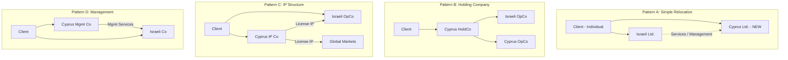
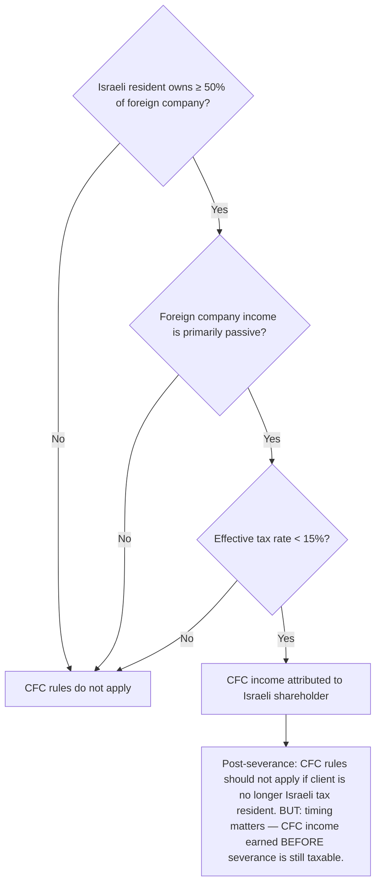

# DR-06 — Corporate Structure

## Overview

This file defines all data fields related to the client's corporate holdings, company structures, and business entities. For Israeli clients relocating to Cyprus, corporate structure is typically the **centerpiece of the tax planning strategy** — the way companies are held, where they are incorporated, and how they interact determines the overall tax efficiency of the relocation.

Common structures for L.T.A clients include:

- **Israeli Ltd. (חברה בע"מ)** — Client's existing Israeli company
- **Cyprus Private Company Ltd.** — New company formed as part of relocation
- **Holding structures** — Cyprus HoldCo owning Israeli OpCo
- **IP holding companies** — Cyprus entity holding intellectual property (IP Box regime)
- **Management companies** — Cyprus entity providing management services

### Legal Basis

- **Israeli Companies Law (1999)** — Israeli company obligations
- **Israeli Income Tax Ordinance, Section 75B** — CFC (Controlled Foreign Corporation) rules
- **Israeli Income Tax Ordinance, Section 85A** — Transfer pricing regulations
- **Cyprus Companies Law, Cap. 113** — Cyprus company formation and obligations
- **EU Anti-Tax Avoidance Directive (ATAD)** — Substance requirements, anti-abuse provisions
- **Israel-Cyprus Double Tax Treaty, Article 7** — Business profits attribution
- **Cyprus IP Box Regime (Section 9(1)(k))** — Reduced rate on qualifying IP income

<!-- EXPERT INPUT REQUIRED: Cyprus corporate lawyer to confirm current formation requirements, timelines, and costs as of 2026. Also confirm whether the EU Unshell Directive (proposed) affects Cyprus shell company structures. -->

---

## Field Definitions

| Field ID | Name | Type | Format | Required | Sensitivity | Used By (Trees) | Used By (Risk) | Used By (Finance) | Notes |
|----------|------|------|--------|----------|-------------|-----------------|-----------------|---------------------|-------|
| DR-06-001 | israeli_companies_owned | array | JSON array: `[{name, reg_number, type, ownership_pct, role}]` | yes | confidential | DT-01-*, DT-03-*, DT-04-* | RC-01-*, RC-03-* | FA-01-*, FA-04-*, FA-05-* | List of all Israeli-registered companies where client holds shares or is a director. Include: company name, Israeli company registration number (ח.פ.), company type, ownership percentage, client role (shareholder/director/both). Enter empty array `[]` if none. |
| DR-06-002 | cyprus_companies_owned | array | JSON array: `[{name, reg_number, type, ownership_pct, role}]` | yes | confidential | DT-04-*, DT-05-* | RC-03-* | FA-01-*, FA-05-* | List of all Cyprus-registered companies. Same structure as DR-06-001. Enter empty array `[]` if none. For clients in planning phase, include planned companies with `status: planned`. |
| DR-06-003 | other_jurisdiction_companies | array | JSON array: `[{name, country, reg_number, type, ownership_pct}]` | no | confidential | DT-01-* | RC-01-*, RC-03-* | FA-05-* | Companies in jurisdictions other than Israel and Cyprus. Include BVI, Delaware, UK, or any other entities. These may trigger additional CFC analysis. |
| DR-06-004 | ownership_percentage_per_entity | number | Decimal, percentage (0–100) per entity | yes | confidential | DT-03-* | RC-03-*, RC-04-* | FA-04-*, FA-05-* | Extracted from DR-06-001/002/003 for cross-reference. Ownership ≥ 10% of an Israeli company = "substantial shareholder" (בעל מניות מהותי) with higher capital gains tax rate (30% vs. 25%). |
| DR-06-005 | company_types | enum | ltd / llc / partnership / sole_prop / public_company / cooperative | yes | confidential | DT-04-* | RC-03-* | FA-05-* | Type of each entity. Determines applicable corporate law, tax treatment, and reporting obligations. Most common for clients: Israeli בע"מ (Ltd.) and Cyprus Private Company Limited. |
| DR-06-006 | annual_revenue_per_entity | number | Decimal, in entity's functional currency | yes | confidential | DT-04-* | RC-03-*, RC-04-* | FA-01-*, FA-02-*, FA-05-* | Annual revenue for each entity. Used for substance assessment (Cyprus entities need proportional substance to revenue) and transfer pricing analysis. |
| DR-06-007 | number_of_employees_per_entity | number | Non-negative integer | yes | confidential | DT-04-* | RC-03-* | FA-02-*, FA-06-* | Employee headcount per entity. Cyprus economic substance requires proportional employees. Zero employees in a Cyprus company with significant revenue is a red flag. |
| DR-06-008 | ip_assets_owned | boolean | true / false | yes | confidential | DT-04-* | RC-03-* | FA-05-* | Whether any entity in the group owns intellectual property (patents, trademarks, software, copyrights). If true, IP Box regime analysis is triggered. |
| DR-06-009 | ip_registered_jurisdiction | enum | ISO-3166-1 alpha-2 | conditional | confidential | DT-04-* | RC-03-* | FA-05-* | Where IP is registered/developed. Required if DR-06-008 = true. IP developed in Israel and transferred to Cyprus has complex transfer pricing implications. |
| DR-06-010 | transfer_pricing_arrangements | boolean | true / false | yes | confidential | [PLACEHOLDER] | RC-03-* | FA-05-* | Whether any intercompany transactions exist between related entities (management fees, service agreements, IP licenses, loans). If true, transfer pricing documentation is required. |
| DR-06-011 | intercompany_loans | array | JSON array: `[{lender, borrower, amount, currency, interest_rate, term}]` | conditional | confidential | [PLACEHOLDER] | RC-03-*, RC-04-* | FA-01-*, FA-05-* | Details of all loans between related entities. Required if DR-06-010 = true. Interest rates must be at arm's length (market rate). Israeli transfer pricing rules are aggressive on this. |
| DR-06-012 | shareholder_agreements | boolean | true / false | yes | confidential | [PLACEHOLDER] | RC-03-* | [PLACEHOLDER] | Whether formal shareholder agreements exist. Relevant for multi-shareholder companies where exit may trigger tag-along/drag-along provisions or change-of-control clauses. |

<!-- EXPERT INPUT REQUIRED: Additional fields likely needed:
- Company formation date (for each entity — age of company matters for substance)
- Company bank accounts per entity (for cash flow tracking)
- Board of directors composition per entity (local directors in Cyprus)
- Company secretary details (statutory requirement in Cyprus)
- Annual audit status (mandatory in Cyprus for non-dormant companies)
- Tax status per entity (active/dormant/strike-off pending)
- VAT registration per entity
- Historical dividends distributed per entity
- Retained earnings per entity
- Group structure diagram (organizational chart)
- Place of effective management (POEM) per entity
- Nominee arrangements (if any)
-->

---

## Corporate Structure Patterns

### Common Structures for Israeli-Cyprus Relocation

<!-- EXPERT INPUT REQUIRED: Corporate lawyer to:
1. Evaluate which patterns are most common among L.T.A client profiles
2. Identify any patterns that are considered aggressive by the ITA
3. Confirm which patterns have received favorable advance rulings
4. Add any additional common patterns (e.g., R&D center split, sales hub)
-->

---

## Economic Substance Requirements

Cyprus entities must demonstrate genuine economic substance to avoid challenge by Israeli (CFC/POEM) and EU (ATAD/Unshell) authorities:

| Substance Indicator | Minimum Requirement | Best Practice | Data Source |
|---------------------|---------------------|---------------|------------|
| Physical office | Registered office address | Dedicated office space | DR-08-004 |
| Local employees | At least 1 (secretary/admin) | Proportional to revenue | DR-06-007 |
| Local directors | At least 1 Cyprus-resident director | Majority local board | DR-08-005 |
| Board meetings | Annual minimum | Quarterly, held in Cyprus | [PLACEHOLDER] |
| Bank account | Cyprus bank account | Active transactional account | DR-08-006, DR-08-007 |
| Decision making | Key decisions made in Cyprus | Documented board resolutions | [PLACEHOLDER] |
| Books and records | Maintained in Cyprus | Annual statutory audit | DR-08-010 |

<!-- EXPERT INPUT REQUIRED: What is the minimum substance that would withstand an ITA POEM challenge? Provide specific case law references where Israeli authorities have successfully or unsuccessfully challenged Cyprus company substance. -->

---

## CFC Rules Analysis

Israeli CFC rules (Section 75B) may attribute income of a foreign company to an Israeli shareholder:

| CFC Rule Element | Threshold | Data Source |
|------------------|-----------|------------|
| Ownership threshold | ≥ 50% (direct + indirect) | DR-06-004 |
| Passive income test | Majority of income is passive | DR-06-006, DR-05-011 |
| Low tax test | Effective rate < 15% | [PLACEHOLDER] — calculated from entity financials |
| Control test | Israeli residents control the company | DR-06-001, DR-06-002 |

<!-- EXPERT INPUT REQUIRED: Tax attorney to confirm:
1. Exact CFC thresholds as of 2026
2. Whether the 2025 amendment changes CFC rules
3. How CFC interacts with residency severance timing
4. Whether Cyprus 12.5% rate triggers the <15% low-tax test
-->

---

## Validation Rules

| Field ID | Validation | Error Message |
|----------|-----------|---------------|
| DR-06-001 | Valid JSON array (can be empty) | "Please list Israeli companies or enter empty array" |
| DR-06-002 | Valid JSON array (can be empty) | "Please list Cyprus companies or enter empty array" |
| DR-06-003 | Valid JSON array if provided | "Invalid company list format" |
| DR-06-004 | 0–100 per entity, sum may exceed 100 across entities | "Ownership percentage must be between 0 and 100" |
| DR-06-005 | Valid enum per entity | "Please select company type" |
| DR-06-006 | Numeric, ≥ 0 per entity | "Revenue cannot be negative" |
| DR-06-007 | Non-negative integer per entity | "Employee count must be 0 or more" |
| DR-06-008 | Boolean | "Please indicate if any entity holds IP" |
| DR-06-009 | Valid ISO-3166-1 if DR-06-008 = true | "IP jurisdiction is required" |
| DR-06-010 | Boolean | "Please indicate if intercompany transactions exist" |
| DR-06-011 | Valid JSON array if DR-06-010 = true | "Please provide intercompany loan details" |
| DR-06-012 | Boolean | "Please indicate if shareholder agreements exist" |

### Cross-Field Validation

| Rule | Condition | Severity |
|------|-----------|----------|
| Substance check | DR-06-002 non-empty AND DR-06-007 = 0 for Cyprus entity → warning | Warning |
| IP consistency | DR-06-008 = true → DR-06-009 required | Error |
| Revenue-employee ratio | Cyprus entity revenue > EUR 500K AND employees = 0 → substance risk | Warning |
| Transfer pricing trigger | DR-06-010 = true → DR-06-011 required | Error |
| CFC flag | Israeli-resident client + Cyprus company + passive income → CFC warning | Warning |

---

## Notes for Experts

1. **Place of effective management (POEM)** — The ITA may argue a Cyprus company is effectively managed from Israel if key decisions are made by the Israeli-resident client. The platform should collect evidence of where board meetings are held and who makes strategic decisions.
2. **IP transfer pricing** — Transferring IP from an Israeli company to a Cyprus company is one of the most scrutinized transactions by the ITA. The platform should flag this immediately and require professional valuation documentation.
3. **Nominee directors** — Using nominee directors in Cyprus is common but may not satisfy substance requirements. The platform should distinguish between nominee and active directors.
4. **Company migration** — Some clients may want to migrate (redomicile) their Israeli company to Cyprus rather than creating a new entity. This has different legal and tax implications than forming a new Cyprus company.
5. **Beneficial ownership registers** — Both Israel and Cyprus maintain beneficial ownership registers. Clients should be aware that their ownership of Cyprus companies may be visible to Israeli authorities through EU-wide transparency initiatives.
