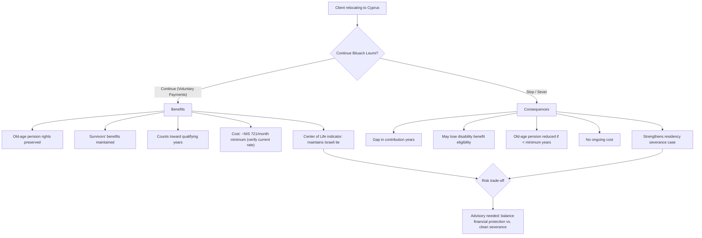
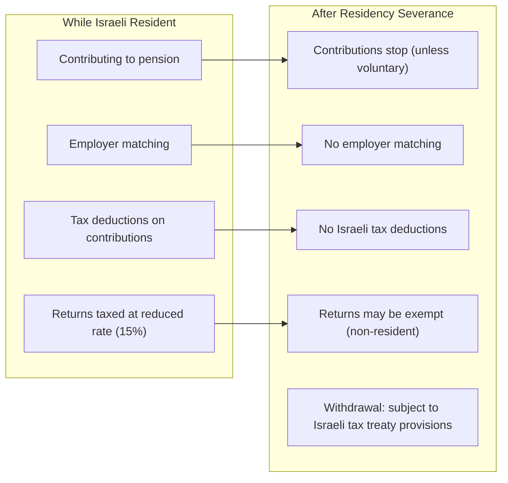

# DR-07 — Insurance & Pension

## Overview

This file defines all data fields related to insurance, pension, and social security. For Israeli clients relocating to Cyprus, the insurance and pension landscape is one of the most **emotionally and financially consequential** aspects of the move. Unlike corporate restructuring or income optimization, decisions about pension and insurance are often **irreversible** — severing Bituach Leumi contributions creates permanent gaps in social security coverage, and pension fund access rules change upon residency change.

Key considerations:

1. **Bituach Leumi (National Insurance)** — Ongoing contributions, severance implications, benefit eligibility
2. **Pension funds** — Israeli pension funds (קרנות פנסיה) have strict regulation; residency change affects withdrawal and contribution rules
3. **Keren Hishtalmut** — The Israeli education/training fund (קרן השתלמות) has favorable tax treatment that may be lost upon exit
4. **Life and health insurance** — Israeli Kupat Cholim (health fund) coverage, private health insurance, and disability coverage
5. **Severance fund (Pitzuyim)** — Accumulated severance pay (פיצויי פיטורים) has specific tax treatment

### Legal Basis

- **National Insurance Law (1953)** — Bituach Leumi obligations and benefits
- **Supervision of Financial Services Law (Provident Funds) (2005)** — Pension fund regulation
- **Israeli Income Tax Ordinance, Sections 3(e3), 9(5), 9A** — Pension taxation provisions
- **National Health Insurance Law (1994)** — Kupat Cholim coverage
- **Severance Pay Law (1963)** — Pitzuyim regulations
- **Israel-Cyprus Social Security Agreement** — Totalization agreement provisions

<!-- EXPERT INPUT REQUIRED: Confirm whether an Israel-Cyprus social security totalization agreement exists. If not, this is a significant gap that affects pension rights. Also confirm current Bituach Leumi voluntary payment rates for Israeli citizens abroad. -->

---

## Field Definitions

| Field ID | Name | Type | Format | Required | Sensitivity | Used By (Trees) | Used By (Risk) | Used By (Finance) | Notes |
|----------|------|------|--------|----------|-------------|-----------------|-----------------|---------------------|-------|
| DR-07-001 | bituach_leumi_monthly_payment | number | Decimal, NIS | yes | confidential | DT-02-* | RC-02-* | FA-01-*, FA-02-*, FA-06-* | Current monthly Bituach Leumi payment amount. If not currently paying (e.g., already abroad), enter 0. Employed persons: deducted from salary. Self-employed: paid directly. Rate depends on income bracket. |
| DR-07-002 | bituach_leumi_years_contributed | number | Decimal, years (to 1 decimal place) | yes | confidential | DT-02-* | RC-02-* | FA-06-* | Total years of Bituach Leumi contributions. Affects eligibility for: old-age pension (קצבת זקנה), survivors' benefits (קצבת שארים), disability benefits (קצבת נכות). Minimum qualifying years vary by benefit type. |
| DR-07-003 | pension_fund_names | array | JSON array of strings | yes | confidential | [PLACEHOLDER] | [PLACEHOLDER] | FA-06-* | Names of all pension funds. Common Israeli pension funds: Meitav Dash, Migdal, Menora Mivtachim, Harel, Phoenix, Clal. Enter empty array `[]` if none. |
| DR-07-004 | pension_monthly_contribution | number | Decimal, NIS | conditional | confidential | [PLACEHOLDER] | [PLACEHOLDER] | FA-01-*, FA-02-*, FA-06-* | Current total monthly pension contribution (employee + employer portions). Required if DR-07-003 is non-empty. Contributions may stop or change upon leaving Israeli employment. |
| DR-07-005 | pension_accumulated_value | number | Decimal, NIS | conditional | confidential | [PLACEHOLDER] | RC-04-* | FA-04-*, FA-06-* | Total accumulated value across all pension funds. Required if DR-07-003 is non-empty. This is the current balance if withdrawn today (note: early withdrawal penalties may apply). |
| DR-07-006 | managers_insurance_policies | array | JSON array: `[{provider, accumulated, monthly_contribution}]` | no | confidential | [PLACEHOLDER] | [PLACEHOLDER] | FA-06-* | Manager's insurance (ביטוח מנהלים) policies. These are hybrid insurance-savings products common for Israeli executives. Include provider name, accumulated value (NIS), and current monthly contribution. Being phased out for new policies but many existing policies remain active. |
| DR-07-007 | life_insurance_policies | array | JSON array: `[{provider, type, coverage_amount, monthly_premium}]` | no | confidential | [PLACEHOLDER] | [PLACEHOLDER] | FA-06-* | Life insurance policies (ביטוח חיים). Include provider, type (term/whole/universal), coverage amount (NIS), and monthly premium. Consider whether policies need to be converted to international coverage upon relocation. |
| DR-07-008 | health_insurance_provider | enum | clalit / maccabi / meuhedet / leumit / private / none | yes | confidential | DT-02-* | RC-02-* | FA-01-*, FA-06-* | Current health insurance provider. The four Israeli Kupot Cholim: כללית (Clalit), מכבי (Maccabi), מאוחדת (Meuhedet), לאומית (Leumit). Or private/international health insurance. Maintaining Israeli health insurance is a Center of Life indicator (DR-03-015). |
| DR-07-009 | disability_insurance | boolean | true / false | yes | confidential | [PLACEHOLDER] | [PLACEHOLDER] | FA-06-* | Whether client has private disability insurance beyond Bituach Leumi disability. Important safety net consideration — Bituach Leumi disability benefits may be lost if contributions stop. |
| DR-07-010 | severance_fund_balance | number | Decimal, NIS | conditional | confidential | [PLACEHOLDER] | [PLACEHOLDER] | FA-04-*, FA-06-* | Accumulated severance pay balance (פיצויי פיטורים). Under Section 14 arrangement, employer deposits 8.33% of salary monthly to a severance fund. Required if DR-05-001 = `employed`. Tax treatment: first NIS ~12,640 per year of employment is exempt from tax; remainder taxed at reduced rates. |

<!-- EXPERT INPUT REQUIRED: Additional fields likely needed:
- Bituach Leumi benefit type currently received (if any)
- Pension fund type per fund (comprehensive / insurance-based / old model)
- Keren Hishtalmut balance and vesting date (crucial — tax-free withdrawal after 6 years)
- Private medical insurance (supplementary — Shaban / commercial)
- Travel insurance / international health insurance
- Disability insurance coverage amount
- Long-term care insurance (סיעוד)
- Professional liability insurance
- Social security status in Cyprus (if already contributing)
- Expected old-age pension monthly amount from Bituach Leumi
- Pension withdrawal age preference
-->

---

## Bituach Leumi Decision Framework

Bituach Leumi (ביטוח לאומי) severance is one of the most consequential decisions in the relocation process:

### Bituach Leumi Benefit Thresholds

| Benefit | Minimum Years | Monthly Amount (est.) | Notes |
|---------|--------------|----------------------|-------|
| Old-age pension (קצבת זקנה) | 10 years (verify) | NIS 1,700–3,500 | Depends on years contributed and income bracket |
| Survivors' pension (קצבת שארים) | 12 months | Varies | For spouse/children if insured person dies |
| Disability (קצבת נכות) | Active coverage | Up to 75% of income | Lost if coverage lapses |
| Maternity (דמי לידה) | 10 of 14 months or 15 of 22 months | Full salary (capped) | Relevant if spouse remains covered |
| Unemployment (דמי אבטלה) | 12 of 18 months | Up to 80% of salary | Only for Israeli residents |

<!-- EXPERT INPUT REQUIRED: Bituach Leumi specialist to:
1. Confirm all minimum qualifying periods as of 2026
2. Provide current voluntary payment rates for citizens abroad
3. Clarify whether years contributed before relocation count toward post-return benefits
4. Explain the reinstatement process if client returns to Israel after several years
5. Confirm whether Israel-Cyprus social security agreement allows totalizing contribution years
-->

---

## Pension Fund Impact Analysis

### Key Pension Questions for Clients

| Question | Impact | Data Needed |
|----------|--------|-------------|
| Can I withdraw my pension early? | Early withdrawal penalties + tax | DR-07-005, DR-01-004 (age) |
| Will I lose my Keren Hishtalmut tax exemption? | Tax-free withdrawal at risk if < 6 years | [PLACEHOLDER] |
| Should I continue voluntary pension contributions? | Keeps fund growing tax-efficiently | DR-07-004, DR-05 income |
| What happens to my Manager's Insurance? | Frozen but continues to earn returns | DR-07-006 |
| Can I transfer my pension to Cyprus? | Generally no — Israeli pension funds cannot be transferred | DR-07-003 |

<!-- EXPERT INPUT REQUIRED: Pension specialist to provide:
1. Exact rules for pension fund access after residency change
2. Whether Section 9A exemptions continue for non-residents
3. Treaty provisions (Article 18) for pension taxation
4. Keren Hishtalmut tax treatment after residency severance
5. Manager's Insurance conversion options
-->

---

## Validation Rules

| Field ID | Validation | Error Message |
|----------|-----------|---------------|
| DR-07-001 | Numeric, ≥ 0 | "Bituach Leumi payment cannot be negative" |
| DR-07-002 | Numeric, ≥ 0, ≤ 50 | "Contribution years must be between 0 and 50" |
| DR-07-003 | Valid JSON array (can be empty) | "Please list pension funds or enter empty array" |
| DR-07-004 | Numeric, ≥ 0 if pension funds exist | "Pension contribution cannot be negative" |
| DR-07-005 | Numeric, ≥ 0 if pension funds exist | "Pension value cannot be negative" |
| DR-07-006 | Valid JSON array if provided | "Invalid manager's insurance format" |
| DR-07-007 | Valid JSON array if provided | "Invalid life insurance format" |
| DR-07-008 | Valid enum value | "Please select your health insurance provider" |
| DR-07-009 | Boolean | "Please indicate if you have disability insurance" |
| DR-07-010 | Numeric, ≥ 0 if employed | "Severance fund balance cannot be negative" |

### Cross-Field Validation

| Rule | Condition | Severity |
|------|-----------|----------|
| BL status match | DR-07-001 > 0 implies DR-03-012 ≠ `severed` | Warning |
| Pension-employment | DR-07-004 > 0 AND DR-05-001 ≠ `employed` → verify voluntary | Info |
| Health-residency | DR-07-008 ∈ {clalit, maccabi, meuhedet, leumit} implies DR-03-015 = true | Error |
| Severance-employment | DR-07-010 > 0 requires DR-05-001 = `employed` (current or recent) | Warning |

---

## Insurance Coverage Gap Analysis

When relocating, clients face potential coverage gaps:

| Coverage Type | Israeli Coverage | Gap Period | Cyprus Alternative | Risk |
|---------------|-----------------|------------|-------------------|------|
| Health insurance | Kupat Cholim | 0–3 months | GESY (Cyprus NHS) or private | Medical emergency without coverage |
| Disability | Bituach Leumi | Immediate upon lapse | Private disability insurance | Income loss without coverage |
| Life insurance | Israeli policies may have territorial limits | Varies | International life insurance | Policy may not cover foreign residence |
| Pension | Frozen upon leaving employment | Ongoing | Cyprus social insurance + private | Long-term retirement shortfall |
| Unemployment | Lost upon leaving Israel | N/A | Cyprus unemployment insurance (if employed there) | No safety net during transition |

<!-- EXPERT INPUT REQUIRED: Insurance specialist to:
1. Confirm GESY enrollment process for new Cyprus residents
2. Identify recommended international health insurance providers
3. Determine whether Israeli life insurance policies remain valid for Cyprus residents
4. Estimate the cost of replacing Israeli coverage with equivalent international coverage
-->

---

## Notes for Experts

1. **Section 14 arrangement** — Under Section 14 (סעיף 14) of the Severance Pay Law, most Israeli employees have a "money on the table" arrangement where employers deposit 8.33% monthly to a severance fund. Upon leaving employment (including relocation), the employee can access these funds. The tax treatment of the withdrawal is critical to model correctly.
2. **Keren Hishtalmut timing** — The Keren Hishtalmut (קרן השתלמות) offers tax-free withdrawal after 6 years (3 years for designated purposes). If a client is approaching the 6-year mark, it may be worth delaying the formal exit to qualify for tax-free withdrawal. The platform should flag this timing opportunity.
3. **Pension fund consolidation** — Many Israeli clients have multiple small pension funds from different employers. Before relocation, consolidating into a single fund simplifies ongoing management.
4. **Double coverage risk** — If a client is paying both Israeli Bituach Leumi (voluntary) and Cyprus social insurance (through employment), they may be paying double. A social security agreement (if exists) would prevent this.
5. **Manager's Insurance payout** — Clients with Manager's Insurance (ביטוח מנהלים) should understand the difference between taking the balance as a lump sum (taxable) vs. converting to an annuity (partially tax-exempt).
