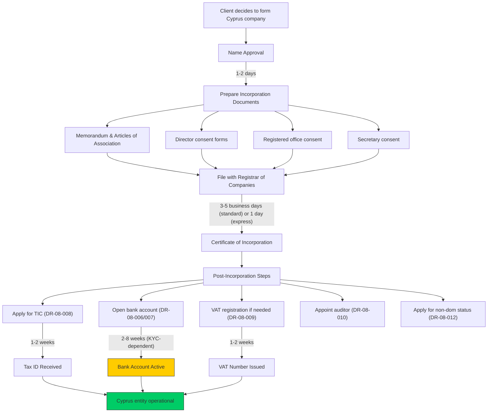

# DR-08 — Cyprus-Specific Data

## Overview

This file defines all data fields specific to the client's Cyprus establishment. While earlier sections capture the client's Israeli-side profile, this section captures the **Cyprus-side infrastructure** that must be built as part of the relocation: company formation, bank accounts, tax registration, local professional appointments, and the non-dom status application.

For L.T.A Advisory's service tracks, these fields represent the **deliverables** of the advisory engagement — when these fields transition from empty/planned to populated/active, the client's Cyprus setup is progressing.

### Service Track Mapping

| L.T.A Service Track | DR-08 Fields Used |
|---------------------|-------------------|
| Track A — Company Formation | DR-08-001 through DR-08-005, DR-08-010, DR-08-011 |
| Track B — Banking & Mortgage | DR-08-006, DR-08-007 |
| Track C — Full Relocation | All DR-08 fields |

### Legal Basis

- **Cyprus Companies Law, Cap. 113** — Company incorporation requirements
- **Cyprus Income Tax Law, Sections 2 and 6** — Tax residency and non-dom provisions
- **Cyprus Central Bank Directive** — Bank account opening KYC requirements
- **Cyprus Registrar of Companies** — Filing and reporting obligations
- **EU Anti-Money Laundering Directive (6AMLD)** — Due diligence requirements for company formation
- **Cyprus VAT Law, Cap. 421** — VAT registration thresholds and requirements

<!-- EXPERT INPUT REQUIRED: Cyprus corporate lawyer to confirm:
1. Current company formation timeline (typically 5-7 business days — still accurate?)
2. Current formation costs (government fees + professional fees)
3. Whether electronic formation is available for non-residents
4. Current bank account opening timeline (reportedly 2-8 weeks — confirm)
5. Whether non-dom status application can be filed before relocation
-->

---

## Field Definitions

| Field ID | Name | Type | Format | Required | Sensitivity | Used By (Trees) | Used By (Risk) | Used By (Finance) | Notes |
|----------|------|------|--------|----------|-------------|-----------------|-----------------|---------------------|-------|
| DR-08-001 | cyprus_company_name | string | UTF-8, max 200 chars | conditional | confidential | DT-04-* | RC-03-* | FA-05-* | Registered name of the Cyprus company. Required if Cyprus company formation is part of the plan. Name must be approved by Cyprus Registrar of Companies (no conflicts with existing names). Suffix: "Limited" or "Ltd." |
| DR-08-002 | cyprus_company_reg_number | string | HE + digits (e.g., HE 412345) | conditional | confidential | DT-04-*, DT-05-* | RC-03-* | FA-05-* | Cyprus company registration number assigned by the Registrar. Format: "HE" prefix followed by numeric sequence. Will be blank during planning phase; populated upon incorporation. |
| DR-08-003 | cyprus_company_formation_date | date | ISO-8601 (YYYY-MM-DD) | conditional | confidential | DT-04-* | RC-03-* | FA-05-* | Date of incorporation with Cyprus Registrar. Important for: substance timeline (company age), first annual return due date, and financial year establishment. |
| DR-08-004 | cyprus_registered_office | string | Multiline, UTF-8 | conditional | confidential | DT-04-* | RC-03-* | [PLACEHOLDER] | Registered office address in Cyprus. Statutory requirement under Cap. 113. Must be a physical address in Cyprus (not a P.O. Box). Typically provided by the corporate services firm. Also used as substance indicator. |
| DR-08-005 | cyprus_local_directors | array | JSON array: `[{name, nationality, residency, role}]` | conditional | confidential | DT-04-* | RC-03-* | [PLACEHOLDER] | List of Cyprus-resident directors. At least one local director is strongly recommended (though not strictly required by law) to establish Place of Effective Management (POEM) in Cyprus. Each entry: name, nationality (ISO-3166), residency (cyprus_resident: true/false), role (executive/non-executive). |
| DR-08-006 | cyprus_bank_name | string | UTF-8, max 100 chars | conditional | confidential | DT-05-* | RC-03-* | FA-02-*, FA-03-* | Name of the Cyprus bank where the corporate or personal account is held. Major banks: Bank of Cyprus, Hellenic Bank, Eurobank Cyprus, Alpha Bank Cyprus. Bank selection affects mortgage availability (FA-03). |
| DR-08-007 | cyprus_bank_account_number | string | IBAN format (CYxxxxxxxxxxxx) | conditional | PII-sensitive | DT-05-* | [PLACEHOLDER] | FA-02-* | Cyprus bank account IBAN. Format: CY + 2 check digits + 3 digit bank code + 5 digit branch code + 16 character account number. Sensitive field — required for fund transfers and mortgage applications. |
| DR-08-008 | cyprus_tax_id | string | Alphanumeric, TIC format | conditional | PII-sensitive | DT-04-* | RC-03-* | FA-05-* | Cyprus Tax Identification Code (TIC / Αριθμός Φορολογικού Μητρώου). Issued by the Cyprus Tax Department upon registration. Required for all tax filings, invoicing, and official correspondence. |
| DR-08-009 | cyprus_vat_registered | boolean | true / false | conditional | confidential | DT-04-* | RC-03-* | FA-05-* | Whether the Cyprus company is VAT registered. Mandatory if annual taxable turnover exceeds EUR 15,600 (verify current threshold). Voluntary registration possible below threshold. VAT number format: CY + 8 digits + 1 letter. |
| DR-08-010 | cyprus_audit_firm | string | UTF-8, max 200 chars | conditional | confidential | [PLACEHOLDER] | RC-03-* | FA-05-* | Name of the appointed audit firm. All Cyprus companies (except dormant) must have their accounts audited annually by a registered auditor. Big Four firms and local firms both serve this market. |
| DR-08-011 | cyprus_secretary | string | UTF-8, max 200 chars | conditional | confidential | [PLACEHOLDER] | RC-03-* | [PLACEHOLDER] | Company secretary (required under Cap. 113). Must be a natural person or a body corporate. Typically provided by the corporate services firm. Responsible for statutory filings and compliance. |
| DR-08-012 | non_dom_status_application_date | date | ISO-8601 (YYYY-MM-DD) | conditional | confidential | DT-04-* | RC-01-*, RC-03-* | FA-05-* | Date on which the client applied for or obtained non-domiciled status in Cyprus. Non-dom status exempts foreign dividends and interest from the Special Defence Contribution (SDC). Available for individuals not domiciled in Cyprus who become tax residents. Lasts for 17 years from first Cyprus tax residency. |

<!-- EXPERT INPUT REQUIRED: Additional fields likely needed:
- Cyprus company activity code (NACE code for company type)
- Cyprus company authorized share capital
- Cyprus company issued shares
- Nominee shareholder arrangements (if any)
- Power of attorney for Cyprus operations
- Cyprus company email domain
- Cyprus virtual office provider (if applicable)
- Cyprus company phone number
- Annual accounts filing deadline
- Annual return (HE32) filing status
- UBO (Ultimate Beneficial Owner) registration with Cyprus authorities
- Cyprus social insurance employer registration number
- GESY (National Health System) registration status
- Estimated annual running costs for Cyprus structure (audit, secretary, office, directors)
-->

---

## Cyprus Company Formation Workflow

**Note:** Bank account opening (highlighted) is typically the longest step and the primary bottleneck. KYC (Know Your Customer) requirements have tightened significantly due to EU AML directives.

<!-- EXPERT INPUT REQUIRED: Cyprus corporate services provider to:
1. Confirm current express formation fee (was EUR 500 premium — verify)
2. List required documents for bank account opening (passport, utility bill, reference letter, source of funds declaration, etc.)
3. Confirm whether Israeli clients face additional KYC scrutiny at Cyprus banks
4. Provide current list of banks accepting Israeli clients without restriction
-->

---

## Bank Account Opening — Common Challenges

Israeli clients face specific challenges when opening Cyprus bank accounts:

| Challenge | Description | Mitigation | Data Needed |
|-----------|-------------|------------|-------------|
| Source of funds | Banks require proof of how the client accumulated their wealth | Prepare salary slips, tax returns, property sale documents | DR-04-*, DR-05-* |
| Reference letter | Some banks require a reference from the client's Israeli bank | Request early — Israeli banks may take 2-4 weeks | DR-04-007 (Israeli bank) |
| Politically Exposed Person (PEP) | Government-connected clients face enhanced due diligence | Disclose early; some banks decline PEPs | [PLACEHOLDER] |
| Business purpose | Banks want clarity on what the Cyprus company will do | Prepare detailed business plan | DR-06-006, DR-06-007 |
| Minimum deposit | Banks require initial deposit (EUR 5,000–50,000 range) | Plan liquidity accordingly | DR-04-002 |
| US person status | Dual US citizens face FATCA complications — some banks refuse | Disclose nationality early | DR-01-014 |

<!-- EXPERT INPUT REQUIRED: Banking consultant to provide:
1. Updated minimum deposit requirements by bank
2. Current list of Cyprus banks that reliably accept Israeli clients
3. Average account opening timeline as of 2026
4. Whether fintech/e-money alternatives (Revolut, Wise) are acceptable for initial operations
-->

---

## Non-Dom Status — Requirements and Benefits

The Cyprus non-domiciled (non-dom) regime is a cornerstone of the tax planning strategy:

### Eligibility Requirements

| Requirement | Description | Data Source |
|-------------|-------------|------------|
| Not born in Cyprus | Client must not have been domiciled in Cyprus at birth | DR-01-013 (nationality) |
| Not tax resident for 17+ years | Client must not have been Cyprus tax resident for 17+ of the last 20 years | DR-08-012, DR-03 |
| Become tax resident | Client must become Cyprus tax resident (183-day or 60-day rule) | DR-03-004 |

### Benefits of Non-Dom Status

| Income Type | With Non-Dom | Without Non-Dom | Savings |
|-------------|-------------|-----------------|---------|
| Foreign dividends | 0% SDC | 17% SDC | 17% |
| Foreign interest | 0% SDC | 30% SDC | 30% |
| Rental income (Cyprus) | 0% SDC | 3% SDC | 3% |
| Employment income | No SDC impact | No SDC impact | — |
| Capital gains (securities) | 0% (general exemption) | 0% (general exemption) | — |

<!-- EXPERT INPUT REQUIRED: Tax advisor to:
1. Confirm the 17-year non-dom duration is still current
2. Clarify whether Cyprus rental income SDC exemption applies to non-doms
3. Confirm whether GHS (GESY) contribution applies in addition to SDC
4. Provide the GHS contribution rates for employed and self-employed non-doms
-->

---

## Validation Rules

| Field ID | Validation | Error Message |
|----------|-----------|---------------|
| DR-08-001 | Non-empty if company formation planned, max 200 chars | "Company name is required" |
| DR-08-002 | Pattern: `HE\s?\d+` if provided | "Invalid Cyprus company registration number format" |
| DR-08-003 | Valid date if company exists | "Please enter the company formation date" |
| DR-08-004 | Non-empty if company exists | "Registered office address is required" |
| DR-08-005 | Valid JSON array if company exists | "Please provide director details" |
| DR-08-006 | Non-empty if bank account opened | "Bank name is required" |
| DR-08-007 | IBAN format: `CY\d{2}\d{3}\d{5}.{16}` if provided | "Invalid Cyprus IBAN format" |
| DR-08-008 | Non-empty if tax-registered in Cyprus | "Cyprus Tax ID is required" |
| DR-08-009 | Boolean if company exists | "Please indicate VAT registration status" |
| DR-08-010 | Non-empty if company is non-dormant | "Audit firm appointment is required for active companies" |
| DR-08-011 | Non-empty if company exists | "Company secretary is required under Cyprus law" |
| DR-08-012 | Valid date if non-dom status applied for or obtained | "Please enter non-dom application date" |

### Cross-Field Validation

| Rule | Condition | Severity |
|------|-----------|----------|
| Company completeness | DR-08-001 non-empty → DR-08-004, DR-08-010, DR-08-011 also required | Error |
| Bank-company link | DR-08-007 provided → DR-08-001 should be non-empty (need company for corporate account) | Warning |
| Non-dom timing | DR-08-012 set → DR-03-004 ≥ 60 (must meet day count for residency) | Warning |
| Substance check | DR-08-005 empty or no Cyprus-resident director → substance risk flag | Warning |
| VAT threshold | DR-06-006 (Cyprus entity revenue) > EUR 15,600 → DR-08-009 should be true | Warning |

---

## Cyprus Setup Cost Estimate

For financial planning (FA-06), the platform should estimate Cyprus setup and ongoing costs:

| Cost Item | One-Time (EUR) | Annual (EUR) | Data Source |
|-----------|---------------|-------------|------------|
| Company formation (standard) | 1,000–2,500 | — | [PLACEHOLDER] |
| Company formation (express) | 1,500–3,000 | — | [PLACEHOLDER] |
| Registered office | — | 1,000–3,000 | DR-08-004 |
| Company secretary | — | 500–1,500 | DR-08-011 |
| Local director (nominee) | — | 3,000–6,000 | DR-08-005 |
| Statutory audit | — | 2,000–5,000 | DR-08-010 |
| Annual return filing | — | 350–500 | [PLACEHOLDER] |
| Bank account opening | 0–500 | 0–600 | DR-08-006 |
| VAT registration | 0 | 0 | DR-08-009 |
| **Estimated total** | **2,500–6,000** | **6,850–16,600** | |

<!-- EXPERT INPUT REQUIRED: Corporate services provider to validate and narrow these cost ranges based on actual 2026 pricing. -->

---

## Notes for Experts

1. **Name reservation** — Cyprus company names can be reserved before incorporation. If a client has a specific desired name, it should be reserved early to avoid conflicts.
2. **Shelf companies** — Pre-formed "shelf" companies are available in Cyprus for faster setup. However, some banks view shelf companies with suspicion (concerns about prior use). Expert should advise on the trade-offs.
3. **Multi-jurisdictional structures** — Some clients may want to use other jurisdictions (BVI, Malta, Netherlands) in conjunction with Cyprus. If so, additional data fields will be needed. This file focuses on Cyprus-only data.
4. **Annual compliance calendar** — Cyprus companies must file annual returns (HE32) within 28 days of the annual general meeting, and companies must hold an AGM within 18 months of incorporation and annually thereafter. The platform should generate compliance reminders.
5. **Strike-off risk** — Companies that fail to file annual returns risk being struck off the register. If a client's Cyprus company is struck off, it creates serious legal and tax complications. Proactive monitoring is essential.
