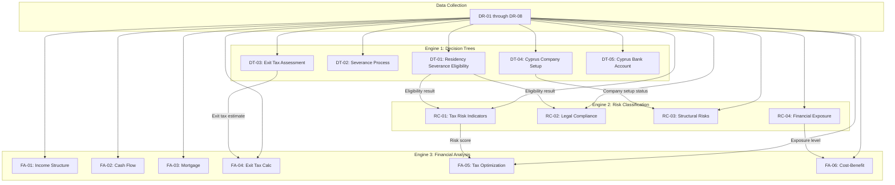

# DR-09 — Cross-Reference Matrix

## Overview

This file is the **master mapping** between every data field defined in sections DR-01 through DR-08 and the downstream engines that consume them: Decision Trees (DT), Risk Classification (RC), and Financial Analysis (FA). It also maps each field to the questionnaire section where it is collected.

This matrix serves as:

1. **Impact analysis tool** — When a field changes, this matrix shows every consumer that must be updated
2. **Completeness check** — Fields with no consumers may be unnecessary; consumers with missing fields may have gaps
3. **Integration specification** — Developers use this matrix to wire data fields to engine inputs
4. **Audit trail** — Reviewers can verify that every field is justified by at least one consumer

### How to Read This Matrix

- **Field ID** — Unique identifier from DR-01 through DR-08
- **Decision Trees** — Which decision tree nodes consume this field (DT-XX-XXX format)
- **Risk Indicators** — Which risk indicators use this field (RC-XX-XXX format)
- **Financial Models** — Which financial models use this field (FA-XX-XXX format)
- **Questionnaire Section** — Which client-facing questionnaire step collects this field

Entries marked `[PLACEHOLDER]` require expert mapping. Entries marked `—` indicate the field is confirmed as not used by that engine.

<!-- EXPERT INPUT REQUIRED: This entire matrix needs expert validation. Each [PLACEHOLDER] should be replaced with specific IDs from the Decision Tree, Risk Classification, and Financial Analysis sections once those sections are populated. This file should be the LAST to be finalized, after all other sections have been completed. -->

---

## DR-01: Personal Identity

| Field ID | Field Name | Decision Trees | Risk Indicators | Financial Models | Questionnaire Section |
|----------|-----------|---------------|-----------------|------------------|-----------------------|
| DR-01-001 | full_legal_name | [PLACEHOLDER] | [PLACEHOLDER] | [PLACEHOLDER] | Step 1: About You |
| DR-01-002 | full_legal_name_hebrew | [PLACEHOLDER] | [PLACEHOLDER] | [PLACEHOLDER] | Step 1: About You |
| DR-01-003 | israeli_id_number | DT-01-*, DT-02-* | RC-01-* | FA-04-* | Step 1: About You |
| DR-01-004 | date_of_birth | DT-03-* | [PLACEHOLDER] | FA-04-* | Step 1: About You |
| DR-01-005 | passport_number_israeli | [PLACEHOLDER] | RC-01-* | [PLACEHOLDER] | Step 1: About You |
| DR-01-006 | passport_expiry_israeli | DT-04-*, DT-05-* | RC-01-* | [PLACEHOLDER] | Step 1: About You |
| DR-01-007 | passport_number_cyprus | [PLACEHOLDER] | [PLACEHOLDER] | [PLACEHOLDER] | Step 1: About You |
| DR-01-008 | cyprus_residency_permit_number | DT-04-* | RC-01-* | [PLACEHOLDER] | Step 1: About You |
| DR-01-009 | contact_email | [PLACEHOLDER] | [PLACEHOLDER] | [PLACEHOLDER] | Step 1: About You |
| DR-01-010 | contact_phone | [PLACEHOLDER] | [PLACEHOLDER] | [PLACEHOLDER] | Step 1: About You |
| DR-01-011 | whatsapp_number | [PLACEHOLDER] | [PLACEHOLDER] | [PLACEHOLDER] | Step 1: About You |
| DR-01-012 | current_mailing_address | DT-01-* | RC-01-* | [PLACEHOLDER] | Step 1: About You |
| DR-01-013 | nationality_primary | DT-01-*, DT-04-* | RC-01-* | [PLACEHOLDER] | Step 1: About You |
| DR-01-014 | nationality_secondary | DT-01-*, DT-04-* | RC-01-* | [PLACEHOLDER] | Step 1: About You |
| DR-01-015 | marital_status | DT-01-*, DT-02-* | RC-01-* | FA-04-* | Step 1: About You |

---

## DR-02: Family & Household

| Field ID | Field Name | Decision Trees | Risk Indicators | Financial Models | Questionnaire Section |
|----------|-----------|---------------|-----------------|------------------|-----------------------|
| DR-02-001 | spouse_full_name | DT-01-*, DT-02-* | RC-01-* | [PLACEHOLDER] | Step 2: Your Family |
| DR-02-002 | spouse_israeli_id | DT-01-*, DT-02-* | RC-01-* | FA-04-* | Step 2: Your Family |
| DR-02-003 | spouse_nationality | DT-01-*, DT-04-* | RC-01-* | [PLACEHOLDER] | Step 2: Your Family |
| DR-02-004 | spouse_tax_residency_current | DT-01-*, DT-02-* | RC-01-*, RC-02-* | FA-04-*, FA-05-* | Step 2: Your Family |
| DR-02-005 | spouse_employment_location | DT-01-*, DT-02-* | RC-01-* | FA-01-*, FA-05-* | Step 2: Your Family |
| DR-02-006 | number_of_children | DT-01-* | RC-01-* | FA-06-* | Step 2: Your Family |
| DR-02-007 | children_details | DT-01-*, DT-02-* | RC-01-* | [PLACEHOLDER] | Step 2: Your Family |
| DR-02-008 | children_school_country | DT-01-*, DT-02-* | RC-01-*, RC-02-* | [PLACEHOLDER] | Step 2: Your Family |
| DR-02-009 | dependents_in_israel | DT-01-* | RC-01-* | [PLACEHOLDER] | Step 2: Your Family |
| DR-02-010 | family_relocation_status | DT-01-*, DT-02-* | RC-01-*, RC-02-* | FA-05-*, FA-06-* | Step 2: Your Family |

---

## DR-03: Residence & Physical Presence

| Field ID | Field Name | Decision Trees | Risk Indicators | Financial Models | Questionnaire Section |
|----------|-----------|---------------|-----------------|------------------|-----------------------|
| DR-03-001 | days_in_israel_current_year | DT-01-*, DT-02-* | RC-01-*, RC-02-* | [PLACEHOLDER] | Step 3: Where You Live |
| DR-03-002 | days_in_israel_prior_year | DT-01-* | RC-01-* | [PLACEHOLDER] | Step 3: Where You Live |
| DR-03-003 | days_in_israel_two_years_prior | DT-01-* | RC-01-* | [PLACEHOLDER] | Step 3: Where You Live |
| DR-03-004 | days_in_cyprus_current_year | DT-04-* | RC-01-* | [PLACEHOLDER] | Step 3: Where You Live |
| DR-03-005 | primary_residence_address_israel | DT-01-* | RC-01-* | FA-03-* | Step 3: Where You Live |
| DR-03-006 | primary_residence_address_cyprus | DT-04-* | RC-01-* | FA-03-* | Step 3: Where You Live |
| DR-03-007 | israel_property_owned | DT-01-*, DT-02-* | RC-01-*, RC-02-* | FA-03-*, FA-04-* | Step 3: Where You Live |
| DR-03-008 | israel_property_rented_out | DT-01-* | RC-01-* | FA-01-*, FA-05-* | Step 3: Where You Live |
| DR-03-009 | cyprus_property_owned | DT-04-* | RC-01-* | FA-03-* | Step 3: Where You Live |
| DR-03-010 | cyprus_rental_lease_active | DT-04-* | RC-01-* | [PLACEHOLDER] | Step 3: Where You Live |
| DR-03-011 | declared_exit_date | DT-02-*, DT-03-* | RC-01-*, RC-02-* | FA-04-* | Step 3: Where You Live |
| DR-03-012 | bituach_leumi_status | DT-01-*, DT-02-* | RC-01-*, RC-02-* | FA-06-* | Step 3: Where You Live |
| DR-03-013 | israeli_bank_accounts_open | DT-01-* | RC-01-*, RC-02-* | FA-04-* | Step 3: Where You Live |
| DR-03-014 | israeli_drivers_license_active | DT-01-* | RC-01-* | [PLACEHOLDER] | Step 3: Where You Live |
| DR-03-015 | israeli_health_insurance_active | DT-01-*, DT-02-* | RC-01-*, RC-02-* | [PLACEHOLDER] | Step 3: Where You Live |
| DR-03-016 | weighted_days_formula_result | DT-01-* | RC-01-* | [PLACEHOLDER] | Calculated (not collected) |

---

## DR-04: Financial Assets

| Field ID | Field Name | Decision Trees | Risk Indicators | Financial Models | Questionnaire Section |
|----------|-----------|---------------|-----------------|------------------|-----------------------|
| DR-04-001 | total_net_worth_usd | DT-03-* | RC-01-*, RC-04-* | FA-01-*, FA-04-*, FA-06-* | Step 4: Your Assets |
| DR-04-002 | liquid_assets_usd | DT-03-* | RC-04-* | FA-01-*, FA-02-*, FA-06-* | Step 4: Your Assets |
| DR-04-003 | israeli_securities_portfolio | DT-03-* | RC-04-* | FA-04-*, FA-05-* | Step 4: Your Assets |
| DR-04-004 | real_estate_israel_value | DT-01-*, DT-03-* | RC-01-*, RC-04-* | FA-03-*, FA-04-* | Step 4: Your Assets |
| DR-04-005 | real_estate_cyprus_value | DT-04-* | RC-04-* | FA-03-* | Step 4: Your Assets |
| DR-04-006 | real_estate_other_value | [PLACEHOLDER] | RC-04-* | FA-04-* | Step 4: Your Assets |
| DR-04-007 | bank_deposits_israel | [PLACEHOLDER] | RC-04-* | FA-01-*, FA-02-* | Step 4: Your Assets |
| DR-04-008 | bank_deposits_cyprus | DT-05-* | RC-04-* | FA-01-*, FA-02-* | Step 4: Your Assets |
| DR-04-009 | bank_deposits_other | [PLACEHOLDER] | RC-04-* | FA-01-* | Step 4: Your Assets |
| DR-04-010 | cryptocurrency_holdings | DT-03-* | RC-04-* | FA-04-*, FA-05-* | Step 4: Your Assets |
| DR-04-011 | pension_funds_israel | [PLACEHOLDER] | RC-04-* | FA-04-*, FA-06-* | Step 4: Your Assets |
| DR-04-012 | provident_funds_israel | [PLACEHOLDER] | RC-04-* | FA-04-*, FA-06-* | Step 4: Your Assets |
| DR-04-013 | life_insurance_cash_value | [PLACEHOLDER] | [PLACEHOLDER] | FA-04-*, FA-06-* | Step 4: Your Assets |
| DR-04-014 | outstanding_loans_israel | [PLACEHOLDER] | RC-04-* | FA-01-*, FA-02-* | Step 4: Your Assets |
| DR-04-015 | outstanding_loans_other | [PLACEHOLDER] | RC-04-* | FA-01-* | Step 4: Your Assets |

---

## DR-05: Employment & Income

| Field ID | Field Name | Decision Trees | Risk Indicators | Financial Models | Questionnaire Section |
|----------|-----------|---------------|-----------------|------------------|-----------------------|
| DR-05-001 | employment_status | DT-01-*, DT-02-*, DT-04-* | RC-01-*, RC-03-* | FA-01-*, FA-05-* | Step 5: Your Income |
| DR-05-002 | employer_name | [PLACEHOLDER] | RC-03-* | [PLACEHOLDER] | Step 5: Your Income |
| DR-05-003 | employer_country | DT-01-*, DT-04-* | RC-01-*, RC-03-* | FA-05-* | Step 5: Your Income |
| DR-05-004 | annual_gross_salary_nis | [PLACEHOLDER] | RC-04-* | FA-01-*, FA-02-*, FA-05-* | Step 5: Your Income |
| DR-05-005 | annual_gross_salary_other | [PLACEHOLDER] | RC-04-* | FA-01-*, FA-02-*, FA-05-* | Step 5: Your Income |
| DR-05-006 | self_employment_income | DT-04-* | RC-03-*, RC-04-* | FA-01-*, FA-05-* | Step 5: Your Income |
| DR-05-007 | business_income_israel | DT-01-* | RC-03-*, RC-04-* | FA-01-*, FA-04-*, FA-05-* | Step 5: Your Income |
| DR-05-008 | business_income_cyprus | DT-04-* | RC-03-*, RC-04-* | FA-01-*, FA-05-* | Step 5: Your Income |
| DR-05-009 | rental_income_israel | [PLACEHOLDER] | RC-04-* | FA-01-*, FA-05-* | Step 5: Your Income |
| DR-05-010 | rental_income_cyprus | [PLACEHOLDER] | RC-04-* | FA-01-*, FA-05-* | Step 5: Your Income |
| DR-05-011 | dividend_income | DT-03-*, DT-04-* | RC-03-*, RC-04-* | FA-01-*, FA-04-*, FA-05-* | Step 5: Your Income |
| DR-05-012 | capital_gains_last_3_years | DT-03-* | RC-04-* | FA-04-* | Step 5: Your Income |

---

## DR-06: Corporate Structure

| Field ID | Field Name | Decision Trees | Risk Indicators | Financial Models | Questionnaire Section |
|----------|-----------|---------------|-----------------|------------------|-----------------------|
| DR-06-001 | israeli_companies_owned | DT-01-*, DT-03-*, DT-04-* | RC-01-*, RC-03-* | FA-01-*, FA-04-*, FA-05-* | Step 6: Your Companies |
| DR-06-002 | cyprus_companies_owned | DT-04-*, DT-05-* | RC-03-* | FA-01-*, FA-05-* | Step 6: Your Companies |
| DR-06-003 | other_jurisdiction_companies | DT-01-* | RC-01-*, RC-03-* | FA-05-* | Step 6: Your Companies |
| DR-06-004 | ownership_percentage_per_entity | DT-03-* | RC-03-*, RC-04-* | FA-04-*, FA-05-* | Step 6: Your Companies |
| DR-06-005 | company_types | DT-04-* | RC-03-* | FA-05-* | Step 6: Your Companies |
| DR-06-006 | annual_revenue_per_entity | DT-04-* | RC-03-*, RC-04-* | FA-01-*, FA-02-*, FA-05-* | Step 6: Your Companies |
| DR-06-007 | number_of_employees_per_entity | DT-04-* | RC-03-* | FA-02-*, FA-06-* | Step 6: Your Companies |
| DR-06-008 | ip_assets_owned | DT-04-* | RC-03-* | FA-05-* | Step 6: Your Companies |
| DR-06-009 | ip_registered_jurisdiction | DT-04-* | RC-03-* | FA-05-* | Step 6: Your Companies |
| DR-06-010 | transfer_pricing_arrangements | [PLACEHOLDER] | RC-03-* | FA-05-* | Step 6: Your Companies |
| DR-06-011 | intercompany_loans | [PLACEHOLDER] | RC-03-*, RC-04-* | FA-01-*, FA-05-* | Step 6: Your Companies |
| DR-06-012 | shareholder_agreements | [PLACEHOLDER] | RC-03-* | [PLACEHOLDER] | Step 6: Your Companies |

---

## DR-07: Insurance & Pension

| Field ID | Field Name | Decision Trees | Risk Indicators | Financial Models | Questionnaire Section |
|----------|-----------|---------------|-----------------|------------------|-----------------------|
| DR-07-001 | bituach_leumi_monthly_payment | DT-02-* | RC-02-* | FA-01-*, FA-02-*, FA-06-* | Step 7: Insurance & Pension |
| DR-07-002 | bituach_leumi_years_contributed | DT-02-* | RC-02-* | FA-06-* | Step 7: Insurance & Pension |
| DR-07-003 | pension_fund_names | [PLACEHOLDER] | [PLACEHOLDER] | FA-06-* | Step 7: Insurance & Pension |
| DR-07-004 | pension_monthly_contribution | [PLACEHOLDER] | [PLACEHOLDER] | FA-01-*, FA-02-*, FA-06-* | Step 7: Insurance & Pension |
| DR-07-005 | pension_accumulated_value | [PLACEHOLDER] | RC-04-* | FA-04-*, FA-06-* | Step 7: Insurance & Pension |
| DR-07-006 | managers_insurance_policies | [PLACEHOLDER] | [PLACEHOLDER] | FA-06-* | Step 7: Insurance & Pension |
| DR-07-007 | life_insurance_policies | [PLACEHOLDER] | [PLACEHOLDER] | FA-06-* | Step 7: Insurance & Pension |
| DR-07-008 | health_insurance_provider | DT-02-* | RC-02-* | FA-01-*, FA-06-* | Step 7: Insurance & Pension |
| DR-07-009 | disability_insurance | [PLACEHOLDER] | [PLACEHOLDER] | FA-06-* | Step 7: Insurance & Pension |
| DR-07-010 | severance_fund_balance | [PLACEHOLDER] | [PLACEHOLDER] | FA-04-*, FA-06-* | Step 7: Insurance & Pension |

---

## DR-08: Cyprus-Specific

| Field ID | Field Name | Decision Trees | Risk Indicators | Financial Models | Questionnaire Section |
|----------|-----------|---------------|-----------------|------------------|-----------------------|
| DR-08-001 | cyprus_company_name | DT-04-* | RC-03-* | FA-05-* | Step 8: Cyprus Setup |
| DR-08-002 | cyprus_company_reg_number | DT-04-*, DT-05-* | RC-03-* | FA-05-* | Step 8: Cyprus Setup |
| DR-08-003 | cyprus_company_formation_date | DT-04-* | RC-03-* | FA-05-* | Step 8: Cyprus Setup |
| DR-08-004 | cyprus_registered_office | DT-04-* | RC-03-* | [PLACEHOLDER] | Step 8: Cyprus Setup |
| DR-08-005 | cyprus_local_directors | DT-04-* | RC-03-* | [PLACEHOLDER] | Step 8: Cyprus Setup |
| DR-08-006 | cyprus_bank_name | DT-05-* | RC-03-* | FA-02-*, FA-03-* | Step 8: Cyprus Setup |
| DR-08-007 | cyprus_bank_account_number | DT-05-* | [PLACEHOLDER] | FA-02-* | Step 8: Cyprus Setup |
| DR-08-008 | cyprus_tax_id | DT-04-* | RC-03-* | FA-05-* | Step 8: Cyprus Setup |
| DR-08-009 | cyprus_vat_registered | DT-04-* | RC-03-* | FA-05-* | Step 8: Cyprus Setup |
| DR-08-010 | cyprus_audit_firm | [PLACEHOLDER] | RC-03-* | FA-05-* | Step 8: Cyprus Setup |
| DR-08-011 | cyprus_secretary | [PLACEHOLDER] | RC-03-* | [PLACEHOLDER] | Step 8: Cyprus Setup |
| DR-08-012 | non_dom_status_application_date | DT-04-* | RC-01-*, RC-03-* | FA-05-* | Step 8: Cyprus Setup |

---

## Summary Statistics

### Fields Per Section

| Section | Total Fields | Required | Conditional | Calculated | Optional |
|---------|-------------|----------|-------------|------------|----------|
| DR-01 Personal Identity | 15 | 11 | 0 | 0 | 4 |
| DR-02 Family & Household | 10 | 3 | 6 | 0 | 1 |
| DR-03 Residence & Presence | 16 | 7 | 8 | 1 | 0 |
| DR-04 Financial Assets | 15 | 11 | 0 | 0 | 4 |
| DR-05 Employment & Income | 12 | 2 | 9 | 0 | 1 |
| DR-06 Corporate Structure | 12 | 7 | 3 | 0 | 2 |
| DR-07 Insurance & Pension | 10 | 5 | 3 | 0 | 2 |
| DR-08 Cyprus Specific | 12 | 0 | 12 | 0 | 0 |
| **Total** | **102** | **46** | **41** | **1** | **14** |

### Consumer Coverage

| Consumer Engine | Fields Mapped | Fields with [PLACEHOLDER] | Coverage % |
|----------------|--------------|--------------------------|------------|
| Decision Trees (DT) | [PLACEHOLDER] | [PLACEHOLDER] | [PLACEHOLDER] |
| Risk Indicators (RC) | [PLACEHOLDER] | [PLACEHOLDER] | [PLACEHOLDER] |
| Financial Models (FA) | [PLACEHOLDER] | [PLACEHOLDER] | [PLACEHOLDER] |

<!-- EXPERT INPUT REQUIRED: After all DT, RC, and FA sections are populated, calculate:
1. Total number of fields consumed by each engine
2. Number of fields still unmapped (PLACEHOLDER)
3. Coverage percentage (mapped/total)
4. Identify any orphan fields (not consumed by any engine) — consider removing or justifying
5. Identify any engine inputs that don't map to a DR field — these are gaps to fill
-->

---

## Cross-Engine Dependencies

Some data fields feed into multiple engines in sequence (not just in parallel). This section documents the flow order:

### Key Sequential Dependencies

| Step | Input | Process | Output | Next Consumer |
|------|-------|---------|--------|---------------|
| 1 | DR-03-001/002/003 | Calculate weighted days (DR-03-016) | Residency presumption result | DT-01 |
| 2 | DT-01 result + DR-01 through DR-03 | Residency eligibility assessment | Eligible/not eligible/conditional | RC-01 risk scoring |
| 3 | DR-04, DR-06 | Asset + corporate valuation | Total exposure value | DT-03 exit tax assessment |
| 4 | DT-03 result | Exit tax calculation | Exit tax amount | FA-04 financial model |
| 5 | RC-01 through RC-04 scores | Aggregate risk profile | Overall risk level | FA-05 optimization, FA-06 cost-benefit |

<!-- EXPERT INPUT REQUIRED: System architect to validate the dependency order and identify any circular dependencies or missing links. -->

---

## Placeholder Resolution Tracker

This section tracks the resolution of `[PLACEHOLDER]` entries as experts fill in specific IDs:

| Section | Total Cells | Placeholders Remaining | Last Updated |
|---------|------------|----------------------|--------------|
| DR-01 | 45 (15 fields x 3 engines) | [PLACEHOLDER] | 2026-02-10 |
| DR-02 | 30 (10 x 3) | [PLACEHOLDER] | 2026-02-10 |
| DR-03 | 48 (16 x 3) | [PLACEHOLDER] | 2026-02-10 |
| DR-04 | 45 (15 x 3) | [PLACEHOLDER] | 2026-02-10 |
| DR-05 | 36 (12 x 3) | [PLACEHOLDER] | 2026-02-10 |
| DR-06 | 36 (12 x 3) | [PLACEHOLDER] | 2026-02-10 |
| DR-07 | 30 (10 x 3) | [PLACEHOLDER] | 2026-02-10 |
| DR-08 | 36 (12 x 3) | [PLACEHOLDER] | 2026-02-10 |
| **Total** | **306** | **[PLACEHOLDER]** | |

**Target:** 100% resolution before status changes from `draft` to `expert_review`.

---

## Notes for Experts

1. **Wildcard references** — Entries like `DT-01-*` mean "one or more nodes in decision tree 01." These should be replaced with specific node IDs (e.g., `DT-01-003, DT-01-007`) once the decision tree nodes are defined.
2. **Bidirectional mapping** — This matrix shows DR → Consumer. The inverse mapping (Consumer → DR) should be maintained in each consumer's file for redundancy checking.
3. **Versioning** — When a field is added or removed from any DR file, this matrix MUST be updated in the same commit.
4. **Orphan detection** — Fields with `—` in all three consumer columns are candidates for removal. However, some fields may be collected purely for compliance/documentation purposes (e.g., contact email) — mark these as `compliance` in the Notes.
5. **Gap detection** — If a decision tree node or risk indicator references a field ID that does not appear in this matrix, that is a data gap that must be resolved by adding the field to the appropriate DR section.
