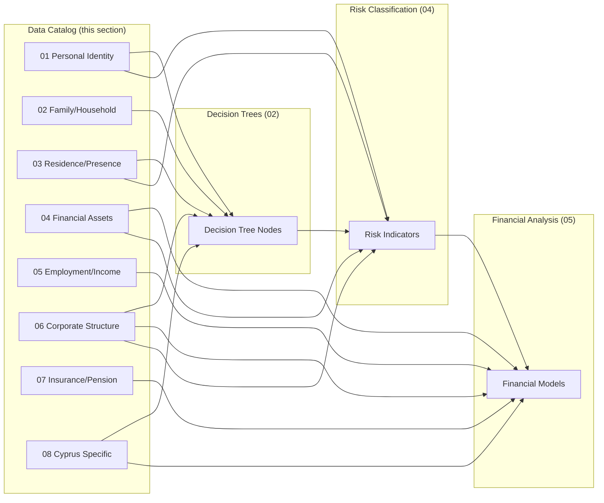

# 03 — Data Requirements: Client Data Catalog

## Purpose

This section defines **every data field** the L.T.A Advisory platform collects from clients. It is the **spine** of the Phase 1 template system — all other sections reference it:

- **Decision Trees** (`02-decision-trees/`) consume data fields as node inputs
- **Risk Classification** (`04-risk-classification/`) scores risk based on data field values
- **Financial Analysis** (`05-financial-analysis/`) builds models from financial data fields
- **Validation Scenarios** (`06-validation-scenarios/`) test end-to-end using complete client data profiles
- **Legal/Tax Framework** (`01-legal-tax-framework/`) defines the legal basis that determines which fields are mandatory

Every field has a unique ID that is cross-referenced throughout the system. Changing a field here cascades to every consumer.

---

## File Inventory

| # | File | Domain | Field IDs | Field Count |
|---|------|--------|-----------|-------------|
| 1 | `01-personal-identity.md` | Client personal identification | DR-01-001 → DR-01-015 | 15+ |
| 2 | `02-family-household.md` | Family structure and household | DR-02-001 → DR-02-010 | 10+ |
| 3 | `03-residence-presence.md` | Residence, day counts, presence indicators | DR-03-001 → DR-03-016 | 16+ |
| 4 | `04-financial-assets.md` | Assets, net worth, portfolio | DR-04-001 → DR-04-015 | 15+ |
| 5 | `05-employment-income.md` | Employment status and income streams | DR-05-001 → DR-05-012 | 12+ |
| 6 | `06-corporate-structure.md` | Company holdings and corporate details | DR-06-001 → DR-06-012 | 12+ |
| 7 | `07-insurance-pension.md` | Insurance, pension, social security | DR-07-001 → DR-07-010 | 10+ |
| 8 | `08-cyprus-specific.md` | Cyprus company and establishment data | DR-08-001 → DR-08-012 | 12+ |
| 9 | `09-cross-reference-matrix.md` | Master field-to-consumer mapping | All DR-* | — |

**Total seed fields: 117+** (experts will add more during review)

---

## ID Convention

### Field ID Format

```
DR-{SECTION}-{ITEM}
```

| Component | Format | Example | Meaning |
|-----------|--------|---------|---------|
| Prefix | `DR` | `DR` | Data Requirement |
| Section | 2-digit zero-padded | `01` | File number (01 = personal identity) |
| Item | 3-digit zero-padded | `007` | Sequential field within file |

**Example:** `DR-03-016` = Data Requirement, file 03 (Residence/Presence), field 016 (weighted days formula result)

### Adding New Fields

When experts add fields, they MUST:

1. Use the next available item number in the section
2. Fill all columns in the field table (no blank cells — use `N/A` or `[PLACEHOLDER]`)
3. Assign the correct sensitivity level (see below)
4. Add the new field ID to `09-cross-reference-matrix.md`

---

## Type Codes

Every field has a type drawn from this controlled vocabulary:

| Type Code | Description | Example Value | Storage Notes |
|-----------|-------------|---------------|---------------|
| `string` | Free-text or formatted string | `"Yosef Ben David"` | UTF-8 encoded, max length varies |
| `number` | Numeric value (integer or decimal) | `182`, `1500000.00` | Specify integer vs. decimal in Format column |
| `date` | Calendar date | `2026-03-15` | Always ISO-8601 (`YYYY-MM-DD`) |
| `boolean` | True/false flag | `true` / `false` | Stored as yes/no in UI, boolean in DB |
| `enum` | Value from a defined set | `"married"` | Valid values listed in Format column |
| `array` | Ordered collection of objects | `[{name: "...", dob: "..."}]` | JSON array; schema in Notes column |

<!-- EXPERT INPUT REQUIRED: Confirm whether additional types are needed (e.g., currency, percentage, file/document reference) -->

---

## Sensitivity Levels

Every field is classified by data sensitivity. This drives encryption at rest, access control, audit logging, and GDPR/Israeli Privacy Protection Law compliance.

### Sensitivity Legend

| Level | Label | Color Code | Description | Encryption | Access | Audit | Retention |
|-------|-------|------------|-------------|------------|--------|-------|-----------|
| 1 | `public` | 🟢 Green | Non-sensitive business data | Standard | All authenticated users | Standard | Indefinite |
| 2 | `internal` | 🟡 Yellow | Business-sensitive but not personal | Standard | Role-based (advisor+) | Standard | Per engagement |
| 3 | `confidential` | 🟠 Orange | Financially or legally sensitive | AES-256 at rest | Named advisors only | Enhanced | 7 years post-engagement |
| 4 | `PII` | 🔴 Red | Personally identifiable information | AES-256 at rest + TLS in transit | Named advisors + data subject | Full audit trail | GDPR Article 17 erasure on request |
| 5 | `PII-sensitive` | ⚫ Black | Government IDs, biometric, health | AES-256 + field-level encryption | Named advisors + 2FA required | Full audit + tamper detection | GDPR Article 9; encrypted backup only |

### Legal Basis for Classification

- **Israeli Privacy Protection Law (1981)** — Requires database registration and security measures for PII
- **GDPR** — Applies to Cyprus operations and any EU data subjects
- **Israeli Income Tax Ordinance** — Financial data retention requirements (7 years)
- **Cyprus Data Protection Law (2018)** — Implements GDPR locally
- **CRS/FATCA** — Cross-border reporting obligations affect data handling

<!-- EXPERT INPUT REQUIRED: Legal expert to confirm retention periods align with current ITA requirements and Cyprus AML directives -->

---

## Cross-Reference Architecture

Data fields flow into three downstream engines:



### Cross-Reference Format

When a downstream consumer references a data field, it uses the full field ID:

- Decision Tree node input: `"input: DR-03-001"` (days in Israel current year)
- Risk indicator source: `"source: DR-06-003"` (other jurisdiction companies)
- Financial model variable: `"var: DR-04-001"` (total net worth USD)

The complete mapping is maintained in `09-cross-reference-matrix.md`.

---

## Field Requirement Levels

| Requirement | Meaning | Questionnaire Behavior |
|-------------|---------|----------------------|
| `yes` | Always required for all clients | Field is mandatory; form cannot submit without it |
| `no` | Optional for all clients | Field is shown but can be left blank |
| `conditional` | Required based on another field's value | Field appears/becomes required dynamically |
| `calculated` | System-computed from other fields | Field is read-only; displayed but not editable |

For `conditional` fields, the triggering condition is documented in the Notes column of each field table.

---

## Questionnaire Mapping

Each data section maps to a questionnaire screen in the client-facing application:

| Data Section | Questionnaire Step | Estimated Time | Prerequisite |
|--------------|--------------------|----------------|--------------|
| 01 Personal Identity | Step 1: "About You" | 5 min | None |
| 02 Family/Household | Step 2: "Your Family" | 5 min | Step 1 |
| 03 Residence/Presence | Step 3: "Where You Live" | 10 min | Step 1 |
| 04 Financial Assets | Step 4: "Your Assets" | 15 min | Step 1 |
| 05 Employment/Income | Step 5: "Your Income" | 10 min | Step 1 |
| 06 Corporate Structure | Step 6: "Your Companies" | 10 min | Step 1, Step 5 |
| 07 Insurance/Pension | Step 7: "Insurance & Pension" | 10 min | Step 1 |
| 08 Cyprus Specific | Step 8: "Cyprus Setup" | 10 min | Step 6 |

<!-- EXPERT INPUT REQUIRED: UX expert to validate estimated completion times and step ordering -->

---

## Validation Rules

Every field should have validation rules defined. Common patterns:

| Rule Type | Example | Applies To |
|-----------|---------|------------|
| Format regex | `^\d{9}$` for Israeli ID | String fields with known format |
| Range check | `0 ≤ days ≤ 366` | Numeric fields |
| Date range | `date ≤ today` for DOB | Date fields |
| Enum membership | Value must be in defined set | Enum fields |
| Cross-field | `spouse_id` required if `marital_status = married` | Conditional fields |
| Checksum | Luhn algorithm for Israeli ID | Government ID fields |

<!-- EXPERT INPUT REQUIRED: Developer to confirm Israeli ID validation algorithm (it uses a specific modular check, not standard Luhn) -->

---

## Change Control

Because this section is the spine, changes require extra care:

1. **Adding a field** — Add to the section file AND `09-cross-reference-matrix.md`
2. **Renaming a field** — Search all 50 template files for the old ID; update everywhere
3. **Removing a field** — Must verify no downstream consumer references it (check matrix)
4. **Changing sensitivity** — Requires legal review and security team sign-off
5. **Changing type** — Requires downstream model validation (types flow into calculations)

All changes to locked fields require a formal Change Request documented in the file's YAML front matter.
