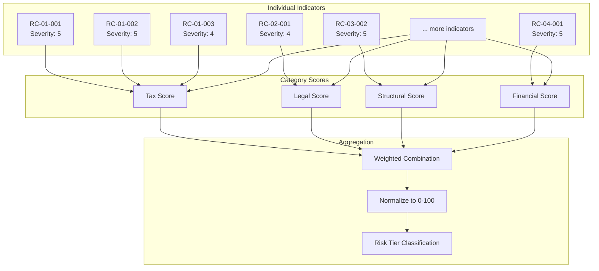

# 05 — Scoring Methodology

## Purpose

This file defines the **methodology for aggregating individual risk indicator scores** into category-level and overall risk classifications. The scoring system produces a normalized 0–100 score that maps to a risk tier (Green / Yellow / Orange / Red), which drives downstream actions, escalation paths, and review frequencies as defined in `06-risk-threshold-matrix.md`.

---

## Scoring Architecture Overview



---

## Step 1: Individual Indicator Scoring

Each risk indicator is evaluated against its trigger condition. If triggered, it receives a severity score (1–5) as defined in the indicator table. If not triggered, the indicator scores 0 and does not contribute to the category score.

| Severity | Score | Label |
|----------|-------|-------|
| Not triggered | 0 | — |
| Informational | 1 | Informational |
| Low | 2 | Low |
| Moderate | 3 | Moderate |
| High | 4 | High |
| Critical | 5 | Critical |

**Notes:**
- A single indicator can only contribute one score (its defined severity level) when triggered.
- Some composite indicators (e.g., RC-01-003 Center of Life Challenge) have variable severity based on the number of sub-conditions met. In these cases, the trigger logic determines the final severity.

---

## Step 2: Category Score Calculation

Within each category, the triggered indicators are aggregated into a category score using the following formula:

```
Category_Score = Max_Severity + (Count_Adjustment * Breadth_Factor)
```

Where:

| Variable | Definition | Formula |
|----------|------------|---------|
| `Max_Severity` | Highest severity among all triggered indicators in the category | `max(indicator_severity for all triggered indicators)` |
| `Count_Adjustment` | Adjustment for the number of triggered indicators beyond the first | `min(triggered_count - 1, 4) * 0.5` |
| `Breadth_Factor` | Scaling factor reflecting that more triggered indicators increase overall risk | `1.0` (default; see calibration notes) |

**Category Score is capped at 7.0** to prevent any single category from dominating.

### Example: Tax Category Calculation

Assume the following tax indicators are triggered:

| Indicator | Severity |
|-----------|----------|
| RC-01-001 (Day Count Failure) | 5 |
| RC-01-003 (Center of Life) | 4 |
| RC-01-005 (Bituach Leumi) | 3 |
| RC-01-010 (Health Insurance) | 2 |

```
Max_Severity = 5
triggered_count = 4
Count_Adjustment = min(4 - 1, 4) * 0.5 = 1.5
Breadth_Factor = 1.0
Category_Score = 5 + (1.5 * 1.0) = 6.5
```

<!-- EXPERT INPUT REQUIRED: The Count_Adjustment formula (adding 0.5 per additional triggered indicator, capped at +2.0) is an initial estimate. Expert panel should calibrate this based on whether multiple moderate risks are more or less dangerous than a single critical risk. Consider case studies from actual ITA audits. -->

---

## Step 3: Weighted Category Combination

Category scores are combined using configurable weights:

| Category | Weight | Rationale |
|----------|--------|-----------|
| Tax (`W_tax`) | 0.35 | Highest financial impact; direct ITA enforcement risk; most common challenge area |
| Legal & Compliance (`W_legal`) | 0.30 | Regulatory penalties, criminal exposure, and structural invalidation risk |
| Structural (`W_struct`) | 0.20 | Substance challenges can unwind the entire Cyprus arrangement |
| Financial Exposure (`W_fin`) | 0.15 | Financial risks are often mitigable through planning and timing adjustments |

**Sum of weights must equal 1.00.**

```
Weighted_Sum = (W_tax * Tax_Score) + (W_legal * Legal_Score) + (W_struct * Structural_Score) + (W_fin * Financial_Score)
```

<!-- EXPERT INPUT REQUIRED: Category weights must be calibrated by a panel of at least two domain experts:
- One Israeli tax attorney (for tax and legal weight calibration)
- One Cyprus corporate specialist (for structural weight calibration)
- One financial advisor (for financial weight calibration)

Open questions:
1. Should weights be static or should they vary by client profile (e.g., tech entrepreneur vs. real estate investor)?
2. Should there be a "correlation adjustment" when risks in multiple categories are triggered by the same root cause?
3. Consider whether legal/compliance weight should be higher than tax weight for clients with complex multi-jurisdictional structures.
-->

---

## Step 4: Normalization to 0–100 Scale

The weighted sum is normalized to a 0–100 scale:

```
Overall_Score = (Weighted_Sum / Max_Possible_Weighted_Sum) * 100
```

Where `Max_Possible_Weighted_Sum` is the theoretical maximum (all categories at maximum score 7.0):

```
Max_Possible_Weighted_Sum = (0.35 * 7.0) + (0.30 * 7.0) + (0.20 * 7.0) + (0.15 * 7.0) = 7.0
```

Therefore:

```
Overall_Score = (Weighted_Sum / 7.0) * 100
```

**Overall Score ranges from 0 to 100.**

---

## Step 5: Risk Tier Classification

The normalized score maps to a risk tier:

| Overall Score Range | Classification | Color | Meaning |
|---------------------|----------------|-------|---------|
| 0 – 25 | Low Risk | Green | Proceed with standard process |
| 26 – 50 | Moderate Risk | Yellow | Enhanced monitoring, additional documentation |
| 51 – 75 | High Risk | Orange | Senior expert review required, mitigation plan mandatory |
| 76 – 100 | Critical Risk | Red | Hold process, full team review, client advisory |

Detailed threshold actions are defined in `06-risk-threshold-matrix.md`.

---

## Complete Calculation Example

### Client Profile: Tech Entrepreneur with Israeli Property

**Triggered Tax Indicators:**

| Indicator | Severity |
|-----------|----------|
| RC-01-003 (Center of Life) | 4 |
| RC-01-007 (Israeli Property) | 3 |
| RC-01-009 (Children in Israeli Schools) | 4 |

**Triggered Legal Indicators:**

| Indicator | Severity |
|-----------|----------|
| RC-02-004 (Transfer Pricing) | 4 |

**Triggered Structural Indicators:**

| Indicator | Severity |
|-----------|----------|
| RC-03-002 (Virtual Office Only) | 5 |
| RC-03-003 (No Local Employees) | 4 |

**Triggered Financial Indicators:**

| Indicator | Severity |
|-----------|----------|
| RC-04-004 (Concentrated Asset Risk) | 3 |

### Step 2: Category Scores

**Tax:**
```
Max_Severity = 4
Count_Adjustment = min(3 - 1, 4) * 0.5 = 1.0
Tax_Score = 4 + 1.0 = 5.0
```

**Legal:**
```
Max_Severity = 4
Count_Adjustment = min(1 - 1, 4) * 0.5 = 0.0
Legal_Score = 4 + 0.0 = 4.0
```

**Structural:**
```
Max_Severity = 5
Count_Adjustment = min(2 - 1, 4) * 0.5 = 0.5
Structural_Score = 5 + 0.5 = 5.5
```

**Financial:**
```
Max_Severity = 3
Count_Adjustment = min(1 - 1, 4) * 0.5 = 0.0
Financial_Score = 3 + 0.0 = 3.0
```

### Step 3: Weighted Combination

```
Weighted_Sum = (0.35 * 5.0) + (0.30 * 4.0) + (0.20 * 5.5) + (0.15 * 3.0)
             = 1.75 + 1.20 + 1.10 + 0.45
             = 4.50
```

### Step 4: Normalization

```
Overall_Score = (4.50 / 7.0) * 100 = 64.3
```

### Step 5: Classification

**Overall Score: 64.3 — Orange (High Risk)**

Required actions: Senior expert review required, mitigation plan mandatory. See `06-risk-threshold-matrix.md` for full action table.

---

## Critical Severity Override

Regardless of the overall score, certain conditions trigger an automatic escalation:

| Override Condition | Effect | Rationale |
|-------------------|--------|-----------|
| Any single indicator at Severity 5 | Minimum tier = Yellow | A critical indicator always demands attention |
| Two or more indicators at Severity 5 | Minimum tier = Orange | Multiple critical risks require comprehensive review |
| RC-01-001 (Day Count Failure) at Severity 5 | Minimum tier = Red | Day count failure is time-critical and may be irreversible |
| RC-02-002 (FATCA) at Severity 5 | Minimum tier = Red | US tax non-compliance carries criminal penalties |
| RC-02-003 (Unreported Assets) at Severity 5 | Minimum tier = Red | ITA criminal investigation risk |

<!-- EXPERT INPUT REQUIRED: Review override conditions. Should RC-03-004 (IP Without Substance) at Severity 5 also trigger a Red override? Consider whether any financial risk should trigger an automatic Red. -->

---

## Sensitivity Analysis

The scoring methodology should be stress-tested by varying key parameters:

| Parameter | Range to Test | Impact Area |
|-----------|---------------|-------------|
| Category weights | Tax: 0.25–0.45; Legal: 0.20–0.40; Structural: 0.10–0.30; Financial: 0.05–0.25 | Overall score distribution |
| Count_Adjustment multiplier | 0.25 – 1.0 per additional indicator | Category score sensitivity to breadth |
| Category score cap | 5.0 – 10.0 | Ceiling effect on heavily-triggered categories |
| Tier boundaries | +/- 5 points on each boundary | Classification sensitivity |

<!-- EXPERT INPUT REQUIRED: Expert panel should run sensitivity analysis across the validation scenarios in `06-validation-scenarios/` to ensure the methodology produces intuitively correct risk classifications. If a validation scenario produces a counter-intuitive result, the parameters should be adjusted. -->

[PLACEHOLDER — Include sensitivity analysis results after validation scenarios are populated and scored]

---

## Expert Calibration Notes

<!-- EXPERT INPUT REQUIRED: This section must be completed by the expert panel during calibration workshops.

Calibration questions to resolve:
1. Is the 0.5 increment per additional triggered indicator appropriate, or should it be higher (penalizing breadth more) or lower?
2. Should the category score cap be 7.0, or should it be higher to allow extreme multi-risk scenarios to score higher?
3. Should the normalization denominator be theoretical max (7.0) or observed max across client base?
4. Are the tier boundaries (25/50/75) appropriately spaced, or should they be adjusted (e.g., more granular at the high end)?
5. Should the model include temporal dynamics (e.g., risks that are increasing over time score higher than stable risks)?
6. How should the model handle risks that are already mitigated but not yet fully resolved?
-->

[PLACEHOLDER — Document calibration workshop outcomes, including participant names, dates, and agreed parameter values]

---

## Version History

| Version | Date | Changes | Author |
|---------|------|---------|--------|
| 1.0 | 2026-02-10 | Initial draft with seed methodology | [PLACEHOLDER] |

[PLACEHOLDER — Update version history as methodology is refined through expert calibration]

---

## Professional Disclaimer

> **IMPORTANT:** The scoring methodology defined in this file produces **indicative risk scores** intended to support professional advisory judgment. Scores are derived from a simplified model and do not capture all factors that may affect client risk. The methodology must be calibrated by qualified domain experts before use in client-facing contexts. Risk scores must not be presented to clients as definitive assessments of their legal, tax, or financial position. See `Professional_Disclaimer.md` for complete disclaimer language.

[PLACEHOLDER — Confirm scoring methodology with actuarial or quantitative risk specialist if available]
