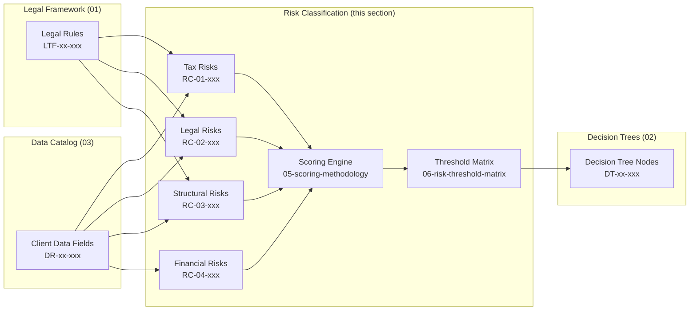

# 04 — Risk Classification: Risk Framework & Methodology

## Purpose

This section defines the **risk assessment framework** for the Israel-to-Cyprus relocation advisory system. Every risk indicator, scoring formula, and threshold used to evaluate client exposure originates from the files in this directory.

The risk classification engine:

1. **Identifies** specific risk indicators triggered by client data fields (`DR-xx-xxx`)
2. **Scores** each indicator on a standardized severity scale (1–5)
3. **Aggregates** individual scores into category-level and overall risk scores
4. **Classifies** the client engagement into a risk tier (Green / Yellow / Orange / Red)
5. **Triggers** required actions, escalation paths, and review frequencies based on thresholds

Risk outputs feed directly into:

- **Financial Analysis** (`05-financial-analysis/`) — risk-adjusted modeling and scenario selection
- **Validation Scenarios** (`06-validation-scenarios/`) — end-to-end test cases verify risk scoring accuracy
- **Decision Trees** (`02-decision-trees/`) — terminal nodes reference risk thresholds for routing

---

## Severity Scale

All risk indicators are scored on a uniform 1–5 scale:

| Severity | Label | Description | Typical Response |
|----------|-------|-------------|------------------|
| 1 | Informational | Awareness item; no action required | Log and monitor |
| 2 | Low | Minor exposure; standard mitigation sufficient | Document in client file |
| 3 | Moderate | Material risk requiring active management | Mitigation plan required |
| 4 | High | Significant exposure; may block or delay process | Senior expert review + mitigation plan |
| 5 | Critical | Showstopper; immediate attention required | Full team review; process hold possible |

<!-- EXPERT INPUT REQUIRED: Validate severity scale against ITA enforcement patterns and Cyprus regulatory practice. Confirm whether a 5-level scale provides sufficient granularity or whether sub-levels (e.g., 4a/4b) are needed for tax vs. legal distinctions. -->

---

## Risk Categories

Risk indicators are organized into four categories, each covered by a dedicated file:

| Category | File | Prefix Range | Description |
|----------|------|--------------|-------------|
| Tax | `01-tax-risk-indicators.md` | RC-01-xxx | Israeli tax residency, exit tax, day counts, center of life |
| Legal & Compliance | `02-legal-compliance-risks.md` | RC-02-xxx | CRS, FATCA, reporting gaps, anti-avoidance, treaty issues |
| Structural | `03-structural-risks.md` | RC-03-xxx | Cyprus company substance, corporate governance, office/employees |
| Financial Exposure | `04-financial-exposure-risks.md` | RC-04-xxx | Liquidity, currency, concentrated assets, double taxation |

---

## File Inventory

| # | File | Domain | Risk ID Range | Indicator Count |
|---|------|--------|---------------|-----------------|
| 1 | `01-tax-risk-indicators.md` | Tax residency, exit tax, center of life | RC-01-001 → RC-01-010 | 10+ |
| 2 | `02-legal-compliance-risks.md` | CRS, FATCA, reporting, anti-avoidance | RC-02-001 → RC-02-008 | 8+ |
| 3 | `03-structural-risks.md` | Cyprus substance, governance, IP | RC-03-001 → RC-03-008 | 8+ |
| 4 | `04-financial-exposure-risks.md` | Liquidity, currency, concentration | RC-04-001 → RC-04-008 | 8+ |
| 5 | `05-scoring-methodology.md` | Aggregation formulas and weights | — | — |
| 6 | `06-risk-threshold-matrix.md` | Thresholds, actions, escalation | — | — |

**Total seed indicators: 34+** (experts will add more during review)

---

## ID Convention

### Risk Indicator ID Format

```
RC-{SECTION}-{ITEM}
```

| Component | Format | Example | Meaning |
|-----------|--------|---------|---------|
| Prefix | `RC` | `RC` | Risk Classification |
| Section | 2-digit zero-padded | `01` | File number (01 = tax risks) |
| Item | 3-digit zero-padded | `002` | Sequential indicator within file |

**Example:** `RC-01-002` = Risk Classification, file 01 (Tax Risk Indicators), indicator 002 (Weighted Formula Breach)

---

## How Risks Link to Decision Trees and Data Fields

Each risk indicator specifies:

1. **Data Fields** (`DR-xx-xxx`) — The client data that feeds the risk evaluation. When a data field value changes, all linked risk indicators are re-evaluated.
2. **Trigger Condition** — A logical expression over data fields that activates the risk (e.g., `DR-03-001 > 183`).
3. **Decision Tree Nodes** (`DT-xx-xxx`) — The decision tree nodes where this risk is relevant. Risk scores influence routing at these nodes.
4. **Legal References** (`LTF-xx-xxx`) — The legal basis for the risk, traced back to specific rules in the Legal/Tax Framework.



<!-- EXPERT INPUT REQUIRED: Confirm the feedback loop — should decision tree outcomes also feed back into risk scoring (e.g., a DT terminal "ineligible" raises risk score), or is the flow strictly one-directional? -->

---

## Aggregation Methodology

Individual risk indicator scores are combined into an overall risk classification through a weighted aggregation process:

1. **Individual Scoring** — Each triggered indicator contributes its severity score (1–5).
2. **Category Aggregation** — Within each category (tax, legal, structural, financial), the highest severity score is taken as the category score, then adjusted by the number of triggered indicators.
3. **Weighted Category Combination** — Category scores are combined using configurable weights (see `05-scoring-methodology.md`).
4. **Overall Score Normalization** — The weighted sum is normalized to a 0–100 scale.
5. **Threshold Classification** — The normalized score maps to a risk tier (Green / Yellow / Orange / Red) per `06-risk-threshold-matrix.md`.

**Default category weights:**

| Category | Weight | Rationale |
|----------|--------|-----------|
| Tax | 0.35 | Highest financial impact; direct ITA enforcement risk |
| Legal & Compliance | 0.30 | Regulatory penalties and criminal exposure |
| Structural | 0.20 | Substance challenges can unwind the entire structure |
| Financial Exposure | 0.15 | Financial risks are often mitigable through planning |

<!-- EXPERT INPUT REQUIRED: Category weights must be calibrated by a panel of at least two domain experts (one Israeli tax attorney, one Cyprus corporate specialist). The above defaults are initial estimates only. -->

---

## Risk Indicator Table Format

Every risk file uses a consistent table format:

| Risk ID | Name | Category | Trigger Condition | Severity (1-5) | Mitigation | Legal Reference | Decision Tree Nodes | Data Fields |
|---------|------|----------|-------------------|-----------------|------------|-----------------|---------------------|-------------|

Column definitions:

| Column | Description |
|--------|-------------|
| Risk ID | Unique identifier (`RC-xx-xxx`) |
| Name | Short human-readable name |
| Category | Risk category (tax / legal / structural / financial) |
| Trigger Condition | Logical expression over data fields that activates this risk |
| Severity (1-5) | Severity score per the scale above |
| Mitigation | Recommended mitigation actions |
| Legal Reference | `LTF-xx-xxx` IDs and statute citations |
| Decision Tree Nodes | `DT-xx-xxx` IDs where this risk is evaluated |
| Data Fields | `DR-xx-xxx` IDs consumed by the trigger condition |

---

## Professional Disclaimer

> **IMPORTANT:** The risk indicators and scoring methodology in this section are designed to support — not replace — professional advisory judgment. All risk classifications must be reviewed by a qualified professional before client communication. Risk scores are indicative and must not be presented to clients as definitive legal or tax advice. See `Professional_Disclaimer.md` for complete disclaimer language.

[PLACEHOLDER — Link to signed Professional_Disclaimer.md and confirm integration with client-facing risk reports]

---

## Cross-References

- **Data fields** consumed by risk indicators use the `DR-xx-xxx` namespace from `03-data-requirements/`
- **Legal rules** referenced by risk indicators use the `LTF-xx-xxx` namespace from `01-legal-tax-framework/`
- **Decision tree nodes** that consume risk outputs use the `DT-xx-xxx` namespace from `02-decision-trees/`
- **Financial models** that consume risk outputs use the `FA-xx-xxx` namespace from `05-financial-analysis/`

---

## How to Contribute

1. Locate the relevant `<!-- EXPERT INPUT REQUIRED -->` marker in any file.
2. Replace `[PLACEHOLDER]` text with validated content.
3. Update the `status` field in the YAML front matter to `expert_review`.
4. Bump the `version` field (e.g., `"1.0"` to `"1.1"`).
5. Update `last_updated` to the current date.
6. When adding new risk indicators, use the next available ID in the appropriate file.
7. Ensure every new indicator has all columns filled (no blank cells — use `N/A` or `[PLACEHOLDER]`).

---

## Status Legend

| Status | Meaning |
|--------|---------|
| `draft` | Initial content seeded; awaiting expert review |
| `expert_review` | Expert has filled in content, pending peer review |
| `verified` | Reviewed and approved by at least two domain experts |
| `locked` | Finalized — changes require formal change request |
