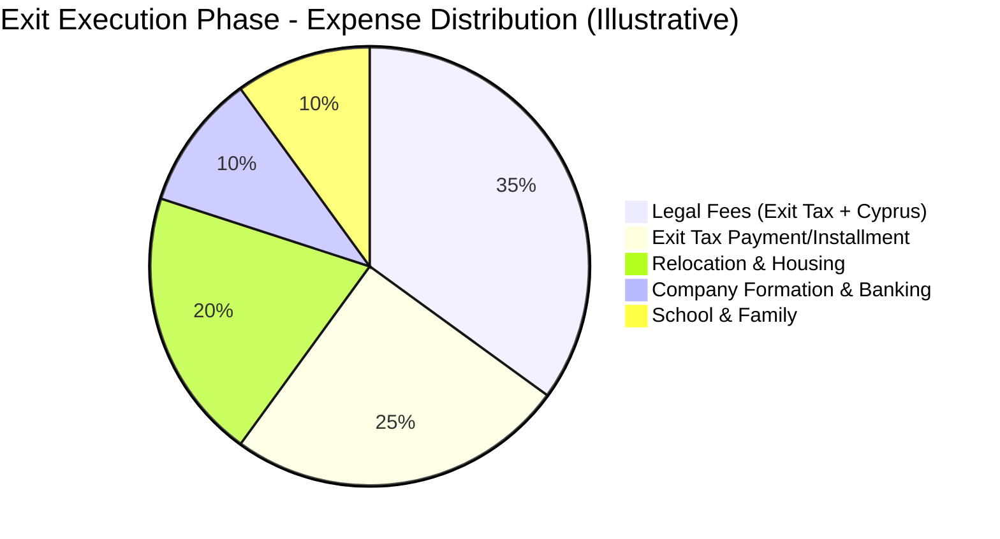
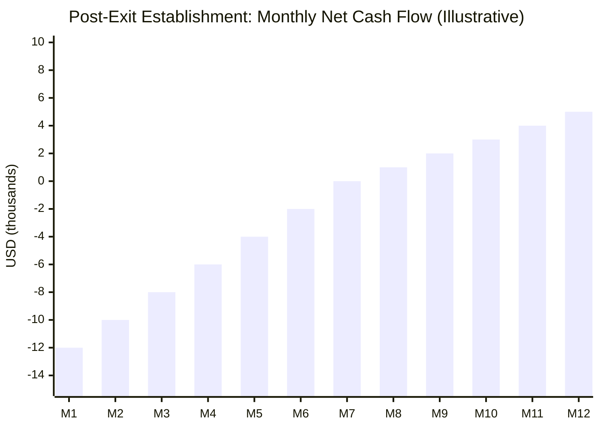

# Cash Flow Projection Scenarios

## Overview

This file models **cash flow projections** across the four phases of an Israel-to-Cyprus relocation. Each scenario captures income sources, major expenses, and net monthly cash flow for a distinct lifecycle phase -- from pre-exit planning through steady-state operation in Cyprus.

Cash flow modeling is critical because relocation involves **front-loaded costs** (legal fees, company formation, relocation, housing deposits) that precede the **recurring tax savings**. Advisors must demonstrate to clients that the transition is financially viable in the short term, not just beneficial over a multi-year horizon.

All figures are in **USD** unless otherwise noted. NIS and EUR equivalents should be provided where significant.

---

## Relocation Timeline Overview

```mermaid
timeline
    title Israel-to-Cyprus Relocation Cash Flow Phases
    section Phase 1: Pre-Exit Preparation
        12-24 months before exit : FA-02-001
        Legal consultations : Tax planning
        Asset restructuring : Company planning
        Property searches : School research
    section Phase 2: Exit Execution
        Exit month ±3 months : FA-02-002
        Residency severance : Exit tax filing
        Company formation : Bank account opening
        Physical relocation : Housing setup
    section Phase 3: Post-Exit Establishment
        First 12 months in Cyprus : FA-02-003
        Substance building : Office setup
        Income transition : Client migration
        Family settling : School enrollment
    section Phase 4: Steady State
        Year 2+ in Cyprus : FA-02-004
        Full tax benefits : Optimized structure
        Recurring costs stabilized : Savings realized
```

---

## Scenario Summary Table

| Scenario ID | Phase | Duration | Income Sources | Major Expenses | Net Monthly Cash Flow | Assumptions | Data Fields |
|-------------|-------|----------|----------------|----------------|-----------------------|-------------|-------------|
| FA-02-001 | Pre-exit preparation | 12-24 months | Current Israeli income (all streams per FA-01) | Legal consultations, tax advisory, restructuring fees, property search trips | Net positive (existing income continues; advisory fees are incremental) | No income disruption; advisory fees ~$2K-5K/month | DR-05-001 through DR-05-009, DR-04-001 |
| FA-02-002 | Exit execution | ~6 months (exit month ±3) | Israeli income (winding down); initial Cyprus income (if any) | Legal fees (exit tax filing), company formation, relocation costs, housing deposit, school registration | Significantly negative (major one-time outlays) | Income may dip during transition; costs cluster in this period | DR-05-001, DR-08-001, DR-08-003, DR-04-001 |
| FA-02-003 | Post-exit establishment | 12 months | Cyprus company income (ramping); residual Israeli income (rental, dividends) | Office rental, employee salary, audit/accounting setup, ongoing housing, school fees, travel to Israel | Moderately negative to break-even (costs high, income rebuilding) | Income reaches 80% of pre-move level by month 6; substance costs ongoing | DR-05-001, DR-06-005, DR-08-003, DR-08-005 |
| FA-02-004 | Steady state | Ongoing (Year 2+) | Full Cyprus income; Israeli passive income; investment returns | Recurring: audit, accounting, office, substance maintenance, travel, insurance | Net positive with significant tax savings vs. Israeli baseline | Full income restored; tax optimization active; costs stabilized | DR-05-001, DR-06-005, DR-04-005, DR-04-010 |

---

## 1. FA-02-001: Pre-Exit Preparation Phase (12-24 Months Before Exit)

### Description

The preparation phase involves planning, professional consultations, and preliminary restructuring **while the client is still an Israeli tax resident**. Cash flow is largely unchanged from the client's current pattern, with incremental advisory fees.

### Monthly Cash Flow Model

| Category | Item | Monthly Amount (USD) | Frequency | Phase Total (18 months) | Data Field | Notes |
|----------|------|---------------------|-----------|--------------------------|------------|-------|
| **Income** | | | | | | |
| | Current employment income | [PLACEHOLDER] | Monthly | [PLACEHOLDER] | DR-05-001 | Per FA-01-001 |
| | Self-employment income | [PLACEHOLDER] | Monthly | [PLACEHOLDER] | DR-05-004 | Per FA-01-002 |
| | Rental income | [PLACEHOLDER] | Monthly | [PLACEHOLDER] | DR-04-005 | Per FA-01-003 |
| | Dividend income | [PLACEHOLDER] | Quarterly | [PLACEHOLDER] | DR-04-010 | Per FA-01-004 |
| | Other passive income | [PLACEHOLDER] | Monthly | [PLACEHOLDER] | DR-04-008 | Per FA-01-008 |
| | **Total Income** | **[PLACEHOLDER]** | | **[PLACEHOLDER]** | | |
| **Expenses (Incremental)** | | | | | | |
| | Israeli tax attorney (exit planning) | $2,000-5,000 | Monthly | $36K-90K | | Retainer basis |
| | Cyprus legal advisor | $1,000-2,000 | Monthly | $18K-36K | | Pre-formation advisory |
| | Financial advisor / CPA | $1,000-2,000 | Monthly | $18K-36K | | Restructuring planning |
| | Property search trips to Cyprus | $2,000-4,000 | Quarterly (x6) | $12K-24K | | Flights + accommodation |
| | School research / application fees | $500-1,000 | One-time or periodic | $1K-3K | | International school deposits |
| | Asset valuation fees (exit tax prep) | $3,000-10,000 | One-time | $3K-10K | DR-04-011, DR-04-012 | For Section 100A computation |
| | **Total Incremental Expenses** | **$4K-10K/month avg** | | **$88K-199K** | | |
| **Net Monthly Impact** | | **-$4K to -$10K** | | | | Against existing income |

<!-- EXPERT INPUT REQUIRED: Validate professional fee ranges for the Israeli market. Top-tier Israeli tax attorneys for exit planning may charge significantly more. Confirm whether asset valuation for Section 100A is typically a one-time engagement or iterative. -->

### Risk Indicators

- **RC-04-001**: Liquidity risk if advisory fees consume a significant portion of disposable income.
- **RC-04-003**: Opportunity cost of capital deployed in planning rather than invested.

---

## 2. FA-02-002: Exit Execution Phase (Exit Month +/- 3 Months)

### Description

The most cash-flow-intensive phase. Large one-time expenditures cluster around the actual relocation date. Income may dip as the client transitions employment arrangements.

### Monthly Cash Flow Model

| Category | Item | Amount (USD) | Timing | Data Field | Notes |
|----------|------|-------------|--------|------------|-------|
| **Income** | | | | | |
| | Israeli employment (final months) | [PLACEHOLDER] | Months -3 to 0 | DR-05-001 | May include severance |
| | Severance pay (if applicable) | [PLACEHOLDER] | Month 0 | DR-05-010 | Tax treatment per LTF-08-003 |
| | Initial Cyprus income (if any) | [PLACEHOLDER] | Months 0 to +3 | DR-08-005 | May be minimal initially |
| | Passive income (continues) | [PLACEHOLDER] | Monthly | DR-04-005, DR-04-010 | Rental, dividends |
| | **Total Income** | **[PLACEHOLDER]** | | | |
| **One-Time Expenses** | | | | | |
| | Exit tax filing and legal fees | $10,000-30,000 | Month 0 | | Depends on asset complexity |
| | Exit tax payment / first installment | [PLACEHOLDER] | Month 0 or per plan | DR-04-011, DR-04-012 | See FA-04-006 for installment model |
| | Cyprus company formation | €3,000-5,000 ($3,200-5,400) | Month -1 to 0 | DR-08-003 | Per LTF-03-001 |
| | Cyprus bank account opening | €500-2,000 ($540-2,160) | Month -1 to +1 | DR-08-004 | Compliance/due diligence fees |
| | Housing deposit (Cyprus) | €5,000-15,000 ($5,400-16,200) | Month -1 | | 2-3 months rent |
| | International school registration | €2,000-10,000 ($2,160-10,800) | Month -2 to 0 | | Deposit + first term |
| | Relocation costs (shipping, flights) | $5,000-15,000 | Month -1 to +1 | | Family size dependent |
| | Temporary accommodation | €3,000-6,000/month ($3,240-6,480) | 1-3 months | | Hotel/serviced apartment |
| | Work permit / visa fees | €500-2,000 ($540-2,160) | Month -2 to 0 | DR-08-001 | If not EU citizen |
| | **Total One-Time Expenses** | **$30K-100K+** | | | Highly variable |
| **Net Phase Cash Flow** | | **Significantly negative** | | | |

<!-- EXPERT INPUT REQUIRED: The exit tax payment timing is critical. Confirm whether (a) the full amount is due on filing, (b) a 10-year installment plan can be elected immediately (per Section 100A(d)), (c) interest accrues on installments and at what rate. See FA-04-006 for detailed installment modeling. -->

### Major Expense Categories Breakdown



### Risk Indicators

- **RC-04-002**: Cash flow concentration risk -- multiple large outlays in a short window.
- **RC-04-004**: Exchange rate risk on EUR-denominated costs against USD/NIS income.
- **RC-01-008**: Exit tax installment commitment creates a multi-year liability.

---

## 3. FA-02-003: Post-Exit Establishment Phase (First 12 Months in Cyprus)

### Description

The establishment phase covers the first year in Cyprus. Income is rebuilding through the new structure, while substance costs (office, staff, compliance) are ramping up. The client is building the economic foundation that supports the tax position.

### Monthly Cash Flow Model

| Category | Item | Monthly Amount (USD) | Annual Total | Data Field | Notes |
|----------|------|---------------------|--------------|------------|-------|
| **Income** | | | | | |
| | Cyprus company revenue | [PLACEHOLDER] (ramping) | [PLACEHOLDER] | DR-06-005 | Expect 50-80% of prior income initially |
| | Cyprus employment salary | [PLACEHOLDER] | [PLACEHOLDER] | DR-08-005 | If employed by own or third-party company |
| | Israeli rental income | [PLACEHOLDER] | [PLACEHOLDER] | DR-04-005 | Continues from Israeli properties |
| | Dividend income | [PLACEHOLDER] | [PLACEHOLDER] | DR-04-010 | From Israeli and other investments |
| | Interest income | [PLACEHOLDER] | [PLACEHOLDER] | DR-04-008 | |
| | **Total Income** | **[PLACEHOLDER]** | **[PLACEHOLDER]** | | |
| **Recurring Expenses** | | | | | |
| | Office rental (Cyprus) | €500-2,000/mo ($540-2,160) | $6.5K-26K | DR-08-003 | Substance requirement; see LTF-03-010 |
| | Employee salary (substance) | €1,500-3,500/mo ($1,620-3,780) | $19K-45K | DR-08-003 | At least one qualified local employee |
| | Accounting services | €200-500/mo ($215-540) | $2.6K-6.5K | | Monthly bookkeeping |
| | Legal retainer (Cyprus) | €500-1,000/mo ($540-1,080) | $6.5K-13K | | Ongoing corporate advisory |
| | Housing (family) | €1,500-4,000/mo ($1,620-4,320) | $19.4K-51.8K | | Limassol/Paphos market dependent |
| | International school fees | €500-1,500/mo ($540-1,620) | $6.5K-19.4K | | Per child; varies by school |
| | Health insurance (private) | €300-800/mo ($325-865) | $3.9K-10.4K | | Until GESY coverage established |
| | Travel to/from Israel | $1,500-3,000 | $18K-36K (monthly trips) | | Maintaining client/family relationships |
| | Exit tax installment | [PLACEHOLDER] | [PLACEHOLDER] | | Per FA-04-006 |
| | Car lease / transport | €400-800/mo ($430-865) | $5.2K-10.4K | | |
| | Miscellaneous / contingency | $500-1,000/mo | $6K-12K | | 10% buffer |
| | **Total Expenses** | **$8K-20K/month** | **$94K-231K** | | |
| **Net Monthly Cash Flow** | | **[PLACEHOLDER]** | | | Negative to break-even expected |

<!-- EXPERT INPUT REQUIRED: Validate housing and school cost ranges for Limassol and Paphos (the two primary locations for Israeli relocations to Cyprus). Confirm whether GESY coverage begins immediately upon registration or has a waiting period. -->

### Cash Flow Ramp-Up Projection



### Risk Indicators

- **RC-03-001**: Substance deficiency if office/employee costs are cut to manage cash flow.
- **RC-04-005**: Income ramp-up may take longer than projected if client migration is slow.
- **RC-02-003**: Compliance risk if annual filings or audits are delayed due to cost management.

---

## 4. FA-02-004: Steady State Phase (Year 2+ in Cyprus)

### Description

By Year 2, the client's income should be fully operational through the Cyprus structure, substance is established, and recurring costs have stabilized. **This is the phase where tax savings consistently exceed incremental costs.**

### Annual Cash Flow Model

| Category | Item | Annual Amount (USD) | Data Field | Notes |
|----------|------|---------------------|------------|-------|
| **Income** | | | | |
| | Cyprus company revenue (net of corporate tax) | [PLACEHOLDER] | DR-06-005 | 12.5% corporate tax applied |
| | Director salary (after personal tax) | [PLACEHOLDER] | DR-08-005 | Optimized split per FA-01-006 |
| | Dividend distributions (after GHS) | [PLACEHOLDER] | DR-04-010 | 0% SDC + 2.65% GHS |
| | Israeli rental income (after treaty credit) | [PLACEHOLDER] | DR-04-005 | Per FA-01-003 |
| | Capital gains (tax-free on securities) | [PLACEHOLDER] | DR-04-011 | Per FA-01-005 |
| | Interest income (non-dom exempt) | [PLACEHOLDER] | DR-04-008 | Per FA-01-008 |
| | **Total Net Income** | **[PLACEHOLDER]** | | |
| **Recurring Annual Costs** | | | | |
| | Annual statutory audit | $3,000-8,000 | | Cyprus company requirement |
| | Accounting / tax compliance | $2,000-5,000 | | Annual filings, VAT, etc. |
| | Office rental | $6,500-26,000 | DR-08-003 | Per substance requirement |
| | Employee costs | $19,000-45,000 | DR-08-003 | Local staff |
| | Legal retainer | $6,500-13,000 | | Corporate governance |
| | Housing | $19,400-51,800 | | Family accommodation |
| | School fees | $6,500-19,400 | | Per child |
| | Health insurance / GESY | $3,900-10,400 | | |
| | Travel Israel | $12,000-24,000 | | Quarterly+ trips |
| | Exit tax installment | [PLACEHOLDER] | | Per FA-04-006 |
| | Director fees (if third-party directors) | $2,000-5,000 | | Substance/governance |
| | Bank charges | $500-2,000 | | Cyprus banking fees |
| | **Total Annual Costs** | **$82K-210K** | | |
| **Tax Savings vs. Israeli Baseline** | | | | |
| | Employment/self-employment tax differential | [PLACEHOLDER] | | Per FA-01-001, FA-01-002 |
| | Dividend tax savings (SDC waiver) | [PLACEHOLDER] | | Per FA-01-004 |
| | Capital gains tax savings | [PLACEHOLDER] | | Per FA-01-005 |
| | Interest/royalty savings | [PLACEHOLDER] | | Per FA-01-008 |
| | **Total Annual Tax Savings** | **[PLACEHOLDER]** | | Per FA-05-005 |
| **Net Annual Benefit** | | **Tax Savings - Incremental Costs** | | Must be positive for viability |

---

## 5. Phase Comparison Dashboard

| Metric | Phase 1 (Pre-Exit) | Phase 2 (Execution) | Phase 3 (Establishment) | Phase 4 (Steady State) |
|--------|--------------------|--------------------|------------------------|----------------------|
| Duration | 12-24 months | ~6 months | 12 months | Ongoing |
| Income trend | Stable | Declining | Rebuilding | Full capacity |
| Expense trend | Incrementally higher | Peak (one-time) | High (ramp-up) | Stabilized |
| Net cash flow | Slightly negative | Significantly negative | Negative to break-even | Positive |
| Cumulative cost | $88K-199K | $30K-100K+ | $94K-231K | — |
| Tax savings realized | None (still Israeli resident) | Minimal | Partial (first-year) | Full |
| Liquidity reserve needed | Low | High | Medium-High | Low |

### Recommended Liquidity Buffer

| Phase | Minimum Reserve | Rationale |
|-------|-----------------|-----------|
| Pre-exit | 3 months living expenses | Standard buffer |
| Execution | 6-9 months living expenses + one-time costs | Peak cash outflow period |
| Establishment | 6 months living expenses + substance costs | Income ramp-up uncertainty |
| Steady state | 3 months living expenses | Standard buffer |

<!-- EXPERT INPUT REQUIRED: Validate liquidity buffer recommendations. For high-net-worth clients these may be conservative; for clients with less liquid wealth (e.g., gains locked in private company shares), the buffer may need to be larger. -->

---

## Open Items for Expert Review

- [ ] Validate professional fee ranges for Israeli tax attorneys and Cyprus advisors
- [ ] Confirm exit tax installment timing and interaction with cash flow (FA-04-006)
- [ ] Validate housing, school, and living cost ranges for Limassol/Paphos
- [ ] Confirm income ramp-up assumptions (50-80% in first 6 months)
- [ ] Review liquidity buffer recommendations for different client profiles
- [ ] Populate placeholder amounts with representative client figures
- [ ] Validate GESY coverage timeline for new arrivals
