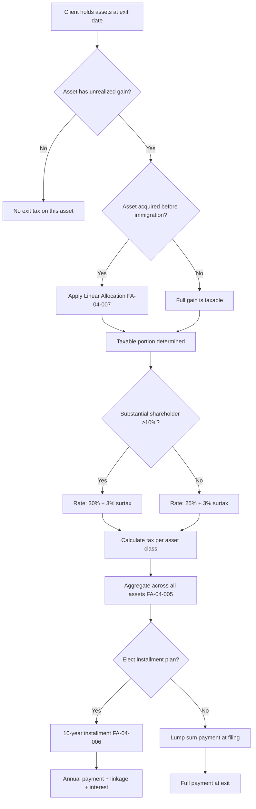

# Exit Tax Calculation Templates (Section 100A)

## Overview

This file provides **calculation templates** for the Israeli exit tax (מס יציאה / Mas Yetzia) under **Section 100A** of the Israeli Income Tax Ordinance. The exit tax is triggered upon cessation of Israeli tax residency and operates as a **deemed liquidation** -- all assets are treated as if sold at fair market value (FMV) on the exit date, and the resulting gain is taxable.

The exit tax is often the single largest financial impact of an Israel-to-Cyprus relocation. Accurate modeling is essential for:

- Advising clients on the **total tax liability** before they commit to relocation
- Evaluating the **10-year installment plan** option (Section 100A(d))
- Applying the **linear allocation** benefit for pre-immigration gains (Section 100A(b))
- Feeding into **optimization scenarios** (see `05-tax-optimization-scenarios.md`)
- Informing the **cost-benefit analysis** (see `06-cost-benefit-analysis.md`)

Legal framework reference: `LTF-02-001` through `LTF-02-010` in `01-legal-tax-framework/02-exit-tax-section-100a.md`.

---

## Exit Tax Models Summary

| Model ID | Asset Category | Cost Basis | FMV at Exit | Gain | Tax Rate | Tax Liability | Linear Allocation | Net Tax | Installment Annual | Data Fields |
|----------|---------------|------------|-------------|------|----------|---------------|-------------------|---------|--------------------|-------------|
| FA-04-001 | Publicly traded securities | [PLACEHOLDER] | [PLACEHOLDER] | [PLACEHOLDER] | 25% (+3% surtax if applicable) | [PLACEHOLDER] | [PLACEHOLDER] | [PLACEHOLDER] | [PLACEHOLDER] | DR-04-011, DR-04-013 |
| FA-04-002 | Private company shares | [PLACEHOLDER] | [PLACEHOLDER] | [PLACEHOLDER] | 25-30% (+3% surtax) | [PLACEHOLDER] | [PLACEHOLDER] | [PLACEHOLDER] | [PLACEHOLDER] | DR-04-012, DR-06-001, DR-06-003 |
| FA-04-003 | Real estate assets | [PLACEHOLDER] | [PLACEHOLDER] | [PLACEHOLDER] | 25% (or betterment tax) | [PLACEHOLDER] | [PLACEHOLDER] | [PLACEHOLDER] | [PLACEHOLDER] | DR-04-006, DR-04-007 |
| FA-04-004 | IP and intangible assets | [PLACEHOLDER] | [PLACEHOLDER] | [PLACEHOLDER] | 25-30% | [PLACEHOLDER] | [PLACEHOLDER] | [PLACEHOLDER] | [PLACEHOLDER] | DR-06-008, DR-06-010 |
| FA-04-005 | **Aggregated total** | **[PLACEHOLDER]** | **[PLACEHOLDER]** | **[PLACEHOLDER]** | **Weighted** | **[PLACEHOLDER]** | **[PLACEHOLDER]** | **[PLACEHOLDER]** | **[PLACEHOLDER]** | All above |
| FA-04-006 | 10-year installment plan | — | — | — | — | Per FA-04-005 | — | — | FA-04-005 / 10 + interest | DR-04-011, DR-04-012 |
| FA-04-007 | Linear allocation benefit | — | — | — | — | — | Calculated | Reduction | — | DR-01-020 (immigration date) |

<!-- EXPERT INPUT REQUIRED: Validate applicable tax rates for each asset category. The 25% rate applies to most capital gains; 30% applies to "substantial shareholders" (≥10% holding). The 3% high-income surtax applies when total income (including the deemed gain) exceeds the threshold. Confirm current threshold amount. -->

---

## 1. FA-04-001: Publicly Traded Securities

### Description

Calculates exit tax on **publicly traded securities** (stocks, bonds, ETFs, mutual funds) held at the time of residency cessation. These are typically the most straightforward to value (FMV = market price on exit date).

### Calculation Template

| Step | Description | Formula | Value | Notes |
|------|-------------|---------|-------|-------|
| 1 | Acquisition cost (cost basis) | Sum of purchase prices + commissions | [PLACEHOLDER] | Per DR-04-013 (portfolio detail) |
| 2 | FMV on exit date | Market close price x quantity per security | [PLACEHOLDER] | Per DR-04-011 |
| 3 | Deemed gain | FMV - Cost Basis | [PLACEHOLDER] | If negative, deemed loss (may offset gains) |
| 4 | Linear allocation adjustment | See FA-04-007 | [PLACEHOLDER] | Applies if securities held before immigration |
| 5 | Taxable gain (after allocation) | Deemed Gain - Exempt Portion | [PLACEHOLDER] | |
| 6 | Tax rate | 25% (+ 3% surtax if total income > threshold) | [PLACEHOLDER]% | LTF-02-003 |
| 7 | **Exit tax liability** | **Taxable Gain x Tax Rate** | **[PLACEHOLDER]** | |

### Practical Considerations

- **Valuation date**: The exit date (date of residency cessation per ITA determination). If disputed, the ITA may use an alternative date. See LTF-01-009.
- **Currency**: Securities denominated in foreign currencies are converted to NIS at the representative rate on the exit date. See LTF-02-005.
- **Loss offset**: Deemed losses on some securities may offset deemed gains on others within the same asset class. Cross-class offset rules apply per Section 92. <!-- EXPERT INPUT REQUIRED: Confirm loss offset rules in the context of deemed liquidation. Can losses from the deemed sale offset gains on private shares? -->
- **Risk indicator**: RC-01-006 (valuation dispute risk for thinly traded securities).

---

## 2. FA-04-002: Private Company Shares (Most Complex)

### Description

Calculates exit tax on **shares in private companies** (closely held corporations). This is the **most complex and highest-value** calculation for many clients, particularly tech entrepreneurs with significant equity in Israeli startups or private companies.

### Valuation Challenges

| Challenge | Description | Approach | Data Field |
|-----------|-------------|----------|------------|
| No market price | Private shares have no public market quotation | Independent valuation required | DR-06-003, DR-04-012 |
| Valuation methodology | ITA may dispute methodology | DCF, comparable transactions, asset-based | DR-06-010 |
| Control premium / minority discount | Holding percentage affects value | Negotiate with ITA | DR-06-001 |
| Vesting restrictions | Unvested options/RSUs | [PLACEHOLDER -- confirm treatment] | DR-05-007 |
| Anti-abuse provisions | Transfers pre-exit to reduce value | Section 100A(f) anti-avoidance | LTF-02-008 |

<!-- EXPERT INPUT REQUIRED: Private company valuation for Section 100A purposes is heavily negotiated with the ITA. Confirm: (a) accepted valuation methodologies, (b) typical discount/premium ranges, (c) treatment of unvested equity (options, RSUs), (d) whether a pre-ruling with the ITA is advisable before exit. -->

### Calculation Template

| Step | Description | Formula | Value | Notes |
|------|-------------|---------|-------|-------|
| 1 | Cost basis of shares | Original investment + any additional paid-in capital | [PLACEHOLDER] | DR-06-001, DR-04-012 |
| 2 | FMV on exit date (per valuation) | Independent valuation report | [PLACEHOLDER] | May require ITA negotiation |
| 3 | Deemed gain | FMV - Cost Basis | [PLACEHOLDER] | |
| 4 | Substantial shareholder test | ≥ 10% holding at any time in 12 months prior | Yes / No | DR-06-001 |
| 5 | Tax rate | 25% (non-substantial) or 30% (substantial) + 3% surtax | [PLACEHOLDER]% | LTF-02-003 |
| 6 | Linear allocation (if applicable) | See FA-04-007 | [PLACEHOLDER] | Pre-immigration portion exempt |
| 7 | Taxable gain after allocation | Deemed Gain - Exempt Portion | [PLACEHOLDER] | |
| 8 | **Exit tax liability** | **Taxable Gain x Tax Rate** | **[PLACEHOLDER]** | |

### Special Cases

| Case | Treatment | Reference |
|------|-----------|-----------|
| ESOP / stock options | Deemed exercise at FMV on exit date; employment income component up to exercise spread | LTF-02-006 |
| RSUs (unvested) | [PLACEHOLDER -- treatment disputed; some practitioners argue only vested RSUs are caught] | LTF-02-006 |
| Convertible notes | [PLACEHOLDER -- treated as debt until conversion; exit tax on conversion feature?] | LTF-02-007 |
| SAFEs | [PLACEHOLDER -- similar to convertible notes; ITA position unclear] | LTF-02-007 |
| Pre-exit restructuring | Anti-avoidance provisions apply to transfers within 2 years of exit | LTF-02-008 |

<!-- EXPERT INPUT REQUIRED: The treatment of unvested equity is one of the most contentious issues in exit tax practice. Israeli tax attorneys disagree on whether Section 100A captures unvested options/RSUs. Provide the prevailing view, any ITA rulings, and recommended approach. -->

### Risk Indicators

- **RC-01-001**: High valuation dispute risk for private companies.
- **RC-01-002**: Substantial shareholder classification triggers higher rate.
- **RC-01-007**: Anti-avoidance provisions may challenge pre-exit restructuring.

---

## 3. FA-04-003: Real Estate Assets

### Description

Calculates exit tax on **Israeli and non-Israeli real estate** held at the time of exit. Note: Israeli real estate sales are generally taxed under the **Land Appreciation Tax (Mas Shevach / מס שבח)** framework rather than capital gains, but the deemed liquidation under Section 100A creates a capital gains event.

### Calculation Template

| Step | Description | Formula | Value | Notes |
|------|-------------|---------|-------|-------|
| 1 | Original cost (plus improvements) | Purchase price + documented improvements + acquisition costs | [PLACEHOLDER] | DR-04-006, DR-04-007 |
| 2 | Indexed cost (inflation adjustment) | Cost x (CPI at exit / CPI at acquisition) | [PLACEHOLDER] | Israeli indexation rules apply |
| 3 | FMV on exit date | Appraised value or tax authority assessment | [PLACEHOLDER] | Independent appraisal recommended |
| 4 | Deemed gain | FMV - Indexed Cost | [PLACEHOLDER] | |
| 5 | Exemptions | Single-apartment exemption (Section 49B)? | [PLACEHOLDER] | May not apply to deemed sale -- confirm |
| 6 | Linear allocation | See FA-04-007 | [PLACEHOLDER] | Pre-immigration portion |
| 7 | Tax rate | 25% (post-2014 gains) | [PLACEHOLDER]% | Pre-2014 gains may have different rates |
| 8 | **Exit tax liability** | **Deemed Gain x Tax Rate** | **[PLACEHOLDER]** | |

### Important Distinctions

| Factor | Israeli Real Estate | Non-Israeli Real Estate |
|--------|--------------------|-----------------------|
| Taxing right post-exit | Israel retains (treaty Art. 13(1)) | Israel loses if not resident |
| Exit tax applicability | Debated -- some argue actual sale triggers tax, not deemed sale | Clearly captured by Section 100A |
| Valuation | ITA assessment or appraiser | International appraiser |
| Single-apartment exemption | [PLACEHOLDER -- confirm applicability to deemed sale] | N/A |

<!-- EXPERT INPUT REQUIRED: There is significant practitioner debate on whether Israeli real estate is captured by Section 100A or whether the existing betterment tax (mas shevach) framework applies exclusively. The ITA has issued contradictory guidance. Confirm the prevailing interpretation and cite any relevant rulings. -->

### Risk Indicators

- **RC-01-004**: Valuation risk on real estate (especially if ITA uses higher assessment).
- **RC-01-009**: Exemption applicability risk (single-apartment exemption on deemed sale).

---

## 4. FA-04-004: IP and Intangible Assets

### Description

Calculates exit tax on **intellectual property (IP)** and other intangible assets. Relevant for tech entrepreneurs, content creators, and professionals with licensing income.

### Assets in Scope

| Asset Type | Description | Valuation Method | Data Field |
|-----------|-------------|------------------|------------|
| Patents | Registered patents (Israel and international) | Income approach (DCF of future royalties) | DR-06-008 |
| Software / code | Proprietary software owned personally or by the individual | Cost approach or income approach | DR-06-008 |
| Trademarks | Registered trademarks | Relief-from-royalty method | DR-06-008 |
| Goodwill | Personal goodwill of service professionals | Excess earnings method | DR-06-010 |
| Customer lists | Client relationships | Multi-period excess earnings | DR-06-010 |
| Non-compete obligations | Value of non-compete agreements | With-and-without method | DR-06-010 |

### Calculation Template

| Step | Description | Formula | Value | Notes |
|------|-------------|---------|-------|-------|
| 1 | Cost basis | Development costs capitalized + acquisition cost | [PLACEHOLDER] | Often zero for self-developed IP |
| 2 | FMV on exit date | Per independent IP valuation | [PLACEHOLDER] | Requires specialist IP valuator |
| 3 | Deemed gain | FMV - Cost Basis | [PLACEHOLDER] | Likely large if cost basis is low |
| 4 | Tax rate | 25-30% + surtax | [PLACEHOLDER]% | Rate depends on classification |
| 5 | Linear allocation | See FA-04-007 | [PLACEHOLDER] | If IP developed partly before immigration |
| 6 | **Exit tax liability** | **Deemed Gain x Tax Rate** | **[PLACEHOLDER]** | |

<!-- EXPERT INPUT REQUIRED: IP valuation for exit tax purposes is highly specialized. Confirm (a) which valuation methodologies the ITA accepts, (b) whether self-developed IP with zero cost basis creates a full gain equal to FMV, (c) treatment of IP that has been licensed to an Israeli company (is the license agreement valued or the underlying IP?). -->

### Pre-Exit IP Migration Considerations

Migrating IP to a Cyprus entity **before** exit may reduce the exit tax base, but is subject to strict anti-avoidance rules:

| Strategy | Benefit | Risk | Reference |
|----------|---------|------|-----------|
| IP sale to Cyprus company at arm's length | Crystallizes gain at known value; future appreciation outside Israel | Transfer pricing challenge by ITA; must be genuinely arm's length | LTF-02-008, RC-01-007 |
| License agreement (retain ownership) | Defers gain recognition; royalty flow to Cyprus | Does not reduce exit tax base (ownership remains with individual) | LTF-05-007 |
| Contribution to Cyprus company | [PLACEHOLDER -- confirm tax treatment of in-kind contribution] | Possible deemed sale at FMV | LTF-02-008 |

### Risk Indicators

- **RC-01-001**: Valuation dispute risk (IP valuations are subjective).
- **RC-01-007**: Anti-avoidance risk on pre-exit IP transfers.
- **RC-02-006**: Transfer pricing risk if IP is licensed or sold to related Cyprus entity.

---

## 5. FA-04-005: Aggregated Exit Tax Summary

### Description

Consolidates the exit tax calculation across **all asset categories** into a single summary view.

### Aggregation Table

| # | Asset Category | Model Ref | Cost Basis | FMV | Deemed Gain | Tax Rate | Gross Tax | Linear Alloc. Reduction | Net Tax Liability |
|---|---------------|-----------|------------|-----|-------------|----------|-----------|------------------------|-------------------|
| 1 | Publicly traded securities | FA-04-001 | [PLACEHOLDER] | [PLACEHOLDER] | [PLACEHOLDER] | 25%+ | [PLACEHOLDER] | [PLACEHOLDER] | [PLACEHOLDER] |
| 2 | Private company shares | FA-04-002 | [PLACEHOLDER] | [PLACEHOLDER] | [PLACEHOLDER] | 25-30%+ | [PLACEHOLDER] | [PLACEHOLDER] | [PLACEHOLDER] |
| 3 | Real estate | FA-04-003 | [PLACEHOLDER] | [PLACEHOLDER] | [PLACEHOLDER] | 25% | [PLACEHOLDER] | [PLACEHOLDER] | [PLACEHOLDER] |
| 4 | IP and intangibles | FA-04-004 | [PLACEHOLDER] | [PLACEHOLDER] | [PLACEHOLDER] | 25-30%+ | [PLACEHOLDER] | [PLACEHOLDER] | [PLACEHOLDER] |
| | **TOTAL** | | **[PLACEHOLDER]** | **[PLACEHOLDER]** | **[PLACEHOLDER]** | | **[PLACEHOLDER]** | **[PLACEHOLDER]** | **[PLACEHOLDER]** |

### Surtax Calculation

The 3% high-income surtax (מס יסף / Mas Yosef) applies to the **total** of all income (including deemed gains) exceeding the threshold:

```
Surtax_Base = Total_Deemed_Gains + Other_Annual_Income - Surtax_Threshold

If Surtax_Base > 0:
  Surtax = Surtax_Base x 3%
Else:
  Surtax = 0

Surtax_Threshold (2025): ₪698,280  [PLACEHOLDER -- confirm 2026 indexed threshold]
```

<!-- EXPERT INPUT REQUIRED: Confirm 2026 surtax threshold (indexed annually for CPI). Also confirm whether the surtax applies to the full deemed gain or only the portion above the threshold. -->

### Loss Offset Rules

| Offset Type | Permitted? | Notes | Reference |
|-------------|-----------|-------|-----------|
| Losses within same category (e.g., securities) | Yes | Standard offset rules | Section 92 |
| Cross-category offset (e.g., securities loss vs. private share gain) | [PLACEHOLDER] | Disputed | Section 92 |
| Carry-forward of deemed losses | [PLACEHOLDER] | Unclear if deemed losses can be carried forward post-exit | LTF-02-009 |
| Offset against ordinary income | No (generally) | Capital losses cannot offset ordinary income | Section 92 |

<!-- EXPERT INPUT REQUIRED: Confirm cross-category offset rules and carry-forward treatment in the exit tax context. -->

---

## 6. FA-04-006: 10-Year Installment Plan

### Description

Section 100A(d) allows the exit tax to be paid in **equal annual installments over 10 years**, subject to linkage and interest. This is a critical planning tool because it defers a large cash outlay.

### Installment Calculation

```
Annual_Installment = Total_Net_Tax / 10

Each installment is subject to:
  Linkage: CPI linkage from exit date to payment date
  Interest: [PLACEHOLDER]% per annum on outstanding balance

Effective annual payment = Base_Installment + Linkage_Adjustment + Interest

Total cost of installment plan = Sum of all 10 payments (including linkage + interest)
Premium over lump sum = Total_Installment_Cost - Lump_Sum_Amount
```

### Installment Schedule Template

| Year | Base Installment | CPI Linkage (est.) | Interest | Total Annual Payment | Outstanding Balance | Data Field |
|------|-----------------|-------------------|----------|---------------------|---------------------|------------|
| 1 | [PLACEHOLDER] | [PLACEHOLDER] | [PLACEHOLDER] | [PLACEHOLDER] | [PLACEHOLDER] | DR-04-011 |
| 2 | [PLACEHOLDER] | [PLACEHOLDER] | [PLACEHOLDER] | [PLACEHOLDER] | [PLACEHOLDER] | |
| 3 | [PLACEHOLDER] | [PLACEHOLDER] | [PLACEHOLDER] | [PLACEHOLDER] | [PLACEHOLDER] | |
| 4 | [PLACEHOLDER] | [PLACEHOLDER] | [PLACEHOLDER] | [PLACEHOLDER] | [PLACEHOLDER] | |
| 5 | [PLACEHOLDER] | [PLACEHOLDER] | [PLACEHOLDER] | [PLACEHOLDER] | [PLACEHOLDER] | |
| 6 | [PLACEHOLDER] | [PLACEHOLDER] | [PLACEHOLDER] | [PLACEHOLDER] | [PLACEHOLDER] | |
| 7 | [PLACEHOLDER] | [PLACEHOLDER] | [PLACEHOLDER] | [PLACEHOLDER] | [PLACEHOLDER] | |
| 8 | [PLACEHOLDER] | [PLACEHOLDER] | [PLACEHOLDER] | [PLACEHOLDER] | [PLACEHOLDER] | |
| 9 | [PLACEHOLDER] | [PLACEHOLDER] | [PLACEHOLDER] | [PLACEHOLDER] | [PLACEHOLDER] | |
| 10 | [PLACEHOLDER] | [PLACEHOLDER] | [PLACEHOLDER] | [PLACEHOLDER] | €0 | |
| **Total** | **[PLACEHOLDER]** | **[PLACEHOLDER]** | **[PLACEHOLDER]** | **[PLACEHOLDER]** | | |

### Key Conditions and Considerations

| Condition | Detail | Reference |
|-----------|--------|-----------|
| Election timing | Must elect installment plan at time of exit tax filing | LTF-02-004 |
| Security / guarantee | ITA may require a bank guarantee or lien on assets | LTF-02-004 |
| Early termination | Can pay remaining balance at any time | [PLACEHOLDER -- confirm] |
| Interest rate | [PLACEHOLDER]% per annum (Section 100A(d) rate) | LTF-02-004 |
| CPI linkage | Balance linked to CPI from exit date | LTF-02-004 |
| Actual sale before plan ends | If asset is actually sold, remaining tax on that asset accelerates | LTF-02-004 |
| Treaty credit | Tax paid via installments is creditable in Cyprus as paid | LTF-05-004 |

<!-- EXPERT INPUT REQUIRED: (1) Confirm the interest rate applied to installments under Section 100A(d). Is it the standard Section 159A rate? (2) Confirm whether the ITA routinely requires security for the installment plan. (3) Confirm interaction with treaty credits -- does Cyprus grant a credit for installments paid to Israel in the year of payment? -->

### Lump Sum vs. Installment Comparison

| Factor | Lump Sum | 10-Year Installment |
|--------|----------|---------------------|
| Total amount paid | Base tax only | Base tax + CPI linkage + interest |
| Cash flow impact | One-time large outflow | Spread over 10 years |
| Investment opportunity | Capital deployed to tax | Capital available for investment |
| Breakeven interest rate | N/A | If investment returns > installment interest rate, installments are preferable |
| Risk | Finality | Asset sold early triggers acceleration |
| Administrative burden | One filing | Annual payments for 10 years |

### NPV Analysis: Installment vs. Lump Sum

```
NPV_Installment = Sum over t=1 to 10 of [Installment_t / (1 + discount_rate)^t]
NPV_Lump_Sum = Total_Tax (paid at t=0)

If NPV_Installment < NPV_Lump_Sum:
  Installment plan is financially preferable (time value of money)
Else:
  Lump sum is cheaper in present value terms

Discount rate = client's expected investment return rate
```

---

## 7. FA-04-007: Linear Allocation Benefit

### Description

Section 100A(b) provides a **linear allocation method** for assets held **before the individual became an Israeli tax resident** (i.e., before immigration). The portion of the gain attributable to the pre-immigration period is **exempt** from Israeli exit tax.

This is critical for **olim (immigrants)** who brought assets to Israel and are now leaving.

### Linear Allocation Formula

```
Exempt_Portion = Total_Gain x (Pre_Israel_Days / Total_Holding_Days)

Where:
  Pre_Israel_Days = Days from acquisition to immigration date
  Total_Holding_Days = Days from acquisition to exit date
  Total_Gain = FMV at exit - Cost Basis

Taxable_Gain = Total_Gain - Exempt_Portion
Exit_Tax = Taxable_Gain x Applicable_Rate
```

### Calculation Template

| Variable | Value | Source |
|----------|-------|--------|
| Asset acquisition date | [PLACEHOLDER] | DR-04-013 (portfolio detail) |
| Immigration date (aliyah date) | [PLACEHOLDER] | DR-01-020 |
| Exit date (residency cessation) | [PLACEHOLDER] | DR-01-005 |
| Pre-Israel days | [PLACEHOLDER] | Calculated: immigration_date - acquisition_date |
| Total holding days | [PLACEHOLDER] | Calculated: exit_date - acquisition_date |
| Allocation ratio (exempt) | [PLACEHOLDER]% | Pre_Israel_Days / Total_Holding_Days |
| Total deemed gain | [PLACEHOLDER] | Per FA-04-001 through FA-04-004 |
| Exempt portion | [PLACEHOLDER] | Total_Gain x Allocation_Ratio |
| **Taxable portion** | **[PLACEHOLDER]** | Total_Gain - Exempt_Portion |

### Illustrative Example

```
Asset: Private company shares acquired in 2010 (while living in the US)
Immigration to Israel: 2015
Exit from Israel: 2026

Pre-Israel days: 2010 to 2015 = ~1,826 days
Total holding days: 2010 to 2026 = ~5,844 days
Allocation ratio: 1,826 / 5,844 = 31.2% exempt

If total gain = $1,000,000:
  Exempt portion = $312,000
  Taxable portion = $688,000
  Exit tax at 25% = $172,000
  (vs. $250,000 without linear allocation)
  Savings from linear allocation = $78,000
```

### Eligibility Conditions

| Condition | Requirement | Reference |
|-----------|-------------|-----------|
| Asset held before immigration | Acquisition date must precede aliyah date | LTF-02-005 |
| Continuous ownership | Asset must have been held continuously from acquisition through exit | LTF-02-005 |
| Section 97(b) exemption interaction | New immigrants have a 10-year exemption on foreign income; linear allocation applies after exemption period | LTF-01-011 |
| Documentation | Must prove acquisition date and cost basis with supporting documents | DR-04-013 |

<!-- EXPERT INPUT REQUIRED: Confirm the interaction between the 10-year new immigrant exemption (Section 14(a)/97(b)) and the linear allocation benefit. If an oleh has been in Israel for less than 10 years, the 10-year exemption may cover the full gain. If more than 10 years, linear allocation applies to the pre-immigration portion. Is this understanding correct? -->

---

## 8. Exit Tax Decision Flow



---

## 9. Key Formulas Reference

| Formula | Expression | Reference |
|---------|-----------|-----------|
| Deemed gain | FMV_exit - Cost_Basis (indexed where applicable) | Section 100A(a) |
| Tax liability (basic) | Deemed_Gain x Tax_Rate | Section 100A(a) |
| Linear allocation (exempt portion) | Total_Gain x (Pre_Israel_Days / Total_Holding_Days) | Section 100A(b) |
| Surtax | Max(0, (Total_Income - Threshold)) x 3% | Section 121B |
| Installment base | Net_Tax_Liability / 10 | Section 100A(d) |
| Installment payment | Base + CPI_Linkage + Interest | Section 100A(d) + Section 159A |
| NPV of installments | Sum[Installment_t / (1 + r)^t] for t=1 to 10 | Financial analysis |

---

## Open Items for Expert Review

- [ ] Confirm tax rates by asset category (25% vs. 30% threshold, surtax threshold for 2026)
- [ ] Validate treatment of unvested equity (options, RSUs, SAFEs) under Section 100A
- [ ] Confirm Israeli real estate treatment under exit tax vs. betterment tax
- [ ] Validate IP valuation methodologies accepted by ITA
- [ ] Confirm installment plan interest rate and security requirements
- [ ] Clarify cross-category loss offset rules for deemed liquidation
- [ ] Confirm linear allocation interaction with 10-year new immigrant exemption
- [ ] Validate deemed loss carry-forward treatment post-exit
- [ ] Confirm single-apartment exemption applicability to deemed sale
- [ ] Provide representative valuation ranges for common asset profiles
