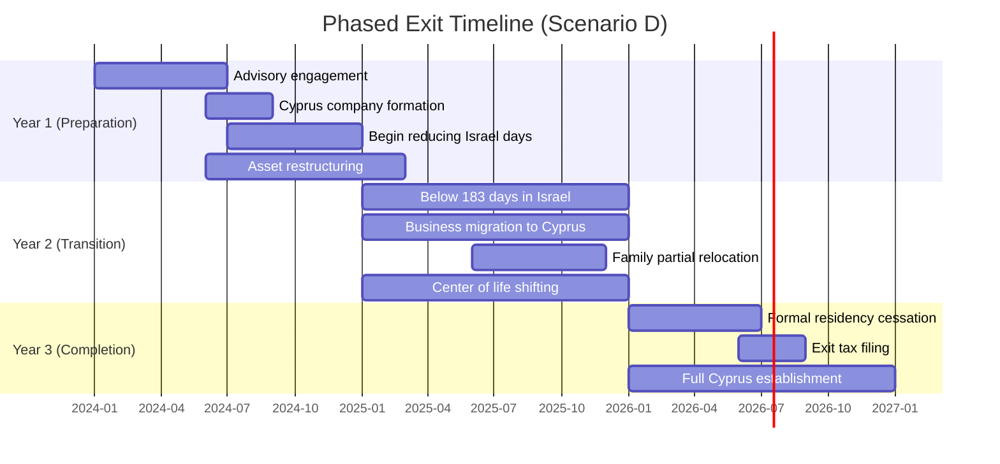
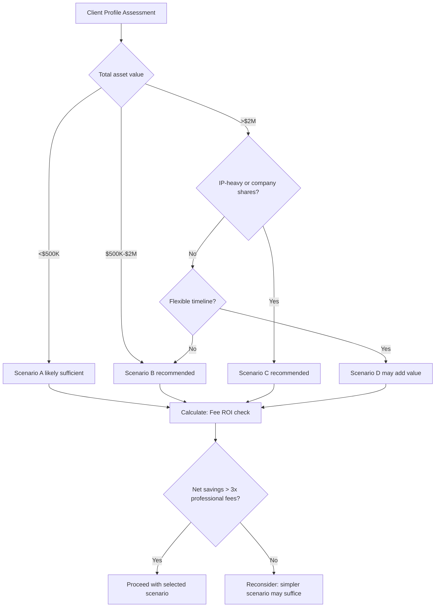

# Tax Optimization Scenario Comparisons

## Overview

This file presents **side-by-side comparisons** of different relocation strategies, ranging from a baseline "no planning" direct exit to increasingly sophisticated optimization approaches. The purpose is to quantify the financial impact of professional tax planning so that clients and advisors can make informed decisions about the level of planning investment.

> **Compliance Note:** All scenarios described in this file are designed to be **fully compliant** with Israeli and Cypriot tax law. No scenario involves tax evasion, aggressive avoidance, or misrepresentation. The differences between scenarios arise from legitimate timing choices, structural decisions, and treaty provisions. See `Professional_Disclaimer.md` for the complete legal disclaimer.

All figures are in **USD**. Each scenario references the income models (FA-01), exit tax calculations (FA-04), and relevant legal framework rules (LTF-xx-xxx).

---

## Scenario Summary

| Scenario ID | Description | Total Tax Liability | Professional Fees | Net Savings vs. Baseline | Timeline | Risk Level | Key Assumptions |
|-------------|-------------|---------------------|-------------------|--------------------------|----------|------------|-----------------|
| FA-05-001 | Scenario A: Direct exit (no planning) | [PLACEHOLDER] | $5K-10K (minimal) | Baseline ($0) | Immediate | Low (simple) but high tax | No restructuring; assets taxed at full rates; no treaty optimization |
| FA-05-002 | Scenario B: Pre-exit restructuring + optimized timing | [PLACEHOLDER] | $50K-100K | [PLACEHOLDER] | 12-18 months preparation | Medium | Asset restructuring 12+ months before exit; timing to minimize gain recognition |
| FA-05-003 | Scenario C: Treaty-optimized exit with Cyprus entity | [PLACEHOLDER] | $80K-150K | [PLACEHOLDER] | 18-24 months preparation | Medium-High | Cyprus entity established pre-exit; treaty provisions leveraged; IP migration considered |
| FA-05-004 | Scenario D: Phased exit over 2-3 years | [PLACEHOLDER] | $100K-200K | [PLACEHOLDER] | 24-36 months | Medium | Gradual residency severance; staged asset realization; multi-year income spreading |
| FA-05-005 | Comparison matrix | — | — | — | — | — | See Section 6 |

<!-- EXPERT INPUT REQUIRED: Populate total tax liability for each scenario using a representative client profile. Suggested: tech entrepreneur with $2M in private company shares, $500K in securities, $300K in Israeli RE, $200K annual income. Professional fee estimates should reflect top-tier Israeli tax advisory and Cyprus corporate structuring firms. -->

---

## 1. FA-05-001: Scenario A -- Direct Exit (No Planning)

### Description

The **baseline scenario**. The client decides to relocate and executes immediately with minimal professional guidance. No pre-exit restructuring, no Cyprus entity established in advance, no treaty optimization.

### Characteristics

| Aspect | Detail | Reference |
|--------|--------|-----------|
| Preparation time | 1-3 months | Minimal planning |
| Exit tax approach | Full deemed liquidation at current FMV; lump sum or default installment | FA-04-005 |
| Income structure | No change pre-exit; post-exit income taxed as non-resident in Israel | FA-01 (current rates) |
| Cyprus entity | Established after arrival | Delay in accessing corporate tax benefits |
| Treaty benefits | Limited -- may not qualify for treaty residence in year of exit | LTF-05-001 |
| Professional fees | Basic tax filing + immigration lawyer only | $5K-10K |
| Risk profile | Low complexity but **highest tax liability** | Simple to execute |

### Tax Calculation

| Component | Amount | Rate | Tax | Notes |
|-----------|--------|------|-----|-------|
| Exit tax: publicly traded securities | [PLACEHOLDER] | 25% + surtax | [PLACEHOLDER] | FA-04-001 |
| Exit tax: private company shares | [PLACEHOLDER] | 30% + surtax | [PLACEHOLDER] | FA-04-002 |
| Exit tax: real estate | [PLACEHOLDER] | 25% | [PLACEHOLDER] | FA-04-003 |
| Exit tax: IP/intangibles | [PLACEHOLDER] | 25-30% | [PLACEHOLDER] | FA-04-004 |
| Year-of-exit income tax (Israel) | [PLACEHOLDER] | Marginal rates | [PLACEHOLDER] | FA-01-001/002 |
| National Insurance (final year) | [PLACEHOLDER] | Standard rates | [PLACEHOLDER] | LTF-08 |
| **Total Tax Liability (Scenario A)** | | | **[PLACEHOLDER]** | **Baseline** |

### Post-Exit Ongoing Tax (Annual)

| Item | Annual Amount | Rate | Annual Tax | Notes |
|------|--------------|------|------------|-------|
| Israeli rental income | [PLACEHOLDER] | 10% flat or marginal | [PLACEHOLDER] | No treaty optimization |
| Dividends from Israeli company | [PLACEHOLDER] | 25-30% WHT (no treaty reduction) | [PLACEHOLDER] | Treaty benefit not claimed |
| Cyprus personal income | [PLACEHOLDER] | Progressive (no 50% exemption if not structured) | [PLACEHOLDER] | No advance employment arrangement |

---

## 2. FA-05-002: Scenario B -- Pre-Exit Restructuring + Optimized Timing

### Description

The client engages professional advisors **12-18 months before the planned exit** to restructure holdings and optimize the timing of the residency cessation.

### Planning Steps

| Step | Action | Timing | Benefit | Risk | Reference |
|------|--------|--------|---------|------|-----------|
| 1 | Engage Israeli tax attorney | Month -18 | Professional guidance on all steps | Fee investment | |
| 2 | Asset valuation (baseline) | Month -15 | Establish current FMV for planning | Valuation may shift | FA-04 |
| 3 | Dividend distribution (pre-exit) | Month -12 | Reduce company value before deemed liquidation | May trigger tax at current rates | LTF-02-008 |
| 4 | Loss harvesting (securities) | Month -12 to -6 | Realize losses to offset exit gains | Transaction costs | FA-04-001 |
| 5 | Exit timing optimization | Month -6 | Select exit date to minimize gain (e.g., after market dip or before next funding round) | Market unpredictability | FA-04 |
| 6 | Installment plan election | Month 0 | Spread tax over 10 years | Interest cost | FA-04-006 |
| 7 | Cyprus company formation | Month -3 | Ready to operate immediately post-exit | Must not trigger Israeli PE | LTF-03-001 |

### Tax Calculation

| Component | Scenario A Amount | Scenario B Amount | Savings | How |
|-----------|------------------|-------------------|---------|-----|
| Exit tax: securities | [PLACEHOLDER] | [PLACEHOLDER] | [PLACEHOLDER] | Loss harvesting offsets gains |
| Exit tax: private shares | [PLACEHOLDER] | [PLACEHOLDER] | [PLACEHOLDER] | Pre-exit dividend reduces FMV |
| Exit tax: RE | [PLACEHOLDER] | [PLACEHOLDER] | [PLACEHOLDER] | Limited optimization available |
| Exit tax: IP | [PLACEHOLDER] | [PLACEHOLDER] | [PLACEHOLDER] | Timing of valuation |
| Surtax | [PLACEHOLDER] | [PLACEHOLDER] | [PLACEHOLDER] | Income spreading reduces surtax |
| **Total Exit Tax** | **[PLACEHOLDER]** | **[PLACEHOLDER]** | **[PLACEHOLDER]** | |
| Professional fees | $5K-10K | $50K-100K | (-$40K-90K) | Investment in planning |
| Installment plan interest | N/A | [PLACEHOLDER] | (+cost) | 10-year deferral cost |
| **Net Benefit vs. Baseline** | — | — | **[PLACEHOLDER]** | After professional fees |

<!-- EXPERT INPUT REQUIRED: Validate the legality and effectiveness of pre-exit dividend distribution as a strategy to reduce FMV for exit tax purposes. The ITA may apply anti-avoidance provisions (Section 86) if distributions are viewed as artificially reducing value. Confirm the "safe" timeframe and magnitude of pre-exit distributions. -->

### Risk Indicators

- **RC-01-007**: Anti-avoidance risk on pre-exit distributions (Section 86, Section 100A(f)).
- **RC-02-001**: Aggressive timing may be challenged if ITA views exit date as artificial.
- **RC-01-002**: Valuation timing disputes.

---

## 3. FA-05-003: Scenario C -- Treaty-Optimized Exit with Cyprus Entity

### Description

The most sophisticated single-exit scenario. The client establishes a **Cyprus entity 18-24 months before exit**, migrates business operations progressively, and leverages **Israel-Cyprus tax treaty provisions** to optimize both the exit tax and ongoing taxation.

### Planning Steps

| Step | Action | Timing | Benefit | Risk | Reference |
|------|--------|--------|---------|------|-----------|
| 1 | Full advisory team engaged | Month -24 | Israeli tax, Cyprus corporate, international tax | Highest fee investment | |
| 2 | Cyprus company incorporated | Month -18 | Begins building substance | Must avoid Israeli PE | LTF-03-001, RC-03-001 |
| 3 | IP licensing arrangement | Month -15 | Shifts future IP income to Cyprus (arm's length) | Transfer pricing risk | LTF-05-007, RC-02-006 |
| 4 | Client contracts migrated | Month -12 | Revenue flows through Cyprus entity | Client consent needed | |
| 5 | Office + employee in Cyprus | Month -12 | Substance requirements met | Ongoing cost | LTF-03-010, LTF-03-011 |
| 6 | Board meetings in Cyprus | Month -12+ | Decision-making in Cyprus | Must be genuine | LTF-03-012 |
| 7 | Pre-exit restructuring (per Scenario B) | Month -12 to -6 | All Scenario B benefits | Same risks | FA-05-002 |
| 8 | Treaty residence established | Month 0 | Treaty tie-breaker resolves to Cyprus | Must satisfy Art. 4 | LTF-05-001 |
| 9 | Post-exit treaty claims | Month +1+ | Reduced WHT on dividends, interest, royalties | ITA may challenge | LTF-05 |

### Tax Calculation

| Component | Scenario A | Scenario C | Savings | How |
|-----------|-----------|-----------|---------|-----|
| Exit tax total | [PLACEHOLDER] | [PLACEHOLDER] | [PLACEHOLDER] | All Scenario B optimizations + entity value shift |
| Ongoing WHT (dividends) | 25-30% | 15% (treaty) or 10% (substantial) | [PLACEHOLDER]/year | Treaty Art. 10 |
| Ongoing WHT (interest) | 15-25% | 10% (treaty) | [PLACEHOLDER]/year | Treaty Art. 11 |
| Ongoing WHT (royalties) | Marginal | 5% (treaty) | [PLACEHOLDER]/year | Treaty Art. 12 |
| Cyprus corporate tax | N/A (no Cyprus co.) | 12.5% (or 2.5% IP box) | [PLACEHOLDER]/year | LTF-03-005 |
| Dividend SDC | N/A | 0% (non-dom) | [PLACEHOLDER]/year | Non-dom benefit |
| **Total 5-Year Tax (Scenario C)** | **[PLACEHOLDER]** | **[PLACEHOLDER]** | **[PLACEHOLDER]** | Exit tax + 5 years ongoing |
| Professional fees (total) | $5K-10K | $80K-150K | (-$75K-140K) | |
| **Net 5-Year Benefit** | — | — | **[PLACEHOLDER]** | |

<!-- EXPERT INPUT REQUIRED: The treaty-optimized approach is the most impactful but also the most legally sensitive. Confirm: (1) whether establishing a Cyprus entity pre-exit while still Israeli resident creates any PE risk, (2) minimum substance thresholds for treaty benefits, (3) ITA's track record of challenging treaty claims by recent emigrants. -->

### Risk Indicators

- **RC-02-006**: Transfer pricing risk on IP licensing.
- **RC-03-001**: Substance deficiency risk if Cyprus operations are pro-forma.
- **RC-02-001**: Treaty shopping / abuse of treaty risk if ITA views the arrangement as lacking commercial substance.
- **RC-01-007**: Anti-avoidance risk on pre-exit value shifting.

---

## 4. FA-05-004: Scenario D -- Phased Exit Over 2-3 Years

### Description

Rather than a single exit date, the client executes a **gradual residency severance** over 2-3 years. This approach spreads income recognition, reduces day counts progressively, and allows a phased transition of business operations.

### Phased Timeline



### Planning Steps

| Step | Action | Year | Benefit | Risk | Reference |
|------|--------|------|---------|------|-----------|
| 1 | Reduce Israeli days to < 183 | Year 1 | Weaken day-count presumption | Must genuinely reduce ties | LTF-01-001 |
| 2 | Establish Cyprus as center of life | Year 1-2 | Build residence evidence | Gradual; may not be sufficient initially | LTF-01-003 |
| 3 | Migrate employment/business | Year 1-2 | Income shifts to Cyprus entity | Must be genuine transition | LTF-01-004 |
| 4 | Family relocation | Year 2 | Strongest center-of-life factor | School year considerations | LTF-01-003 |
| 5 | Formal exit declaration | Year 3 | Triggers Section 100A | May use a lower FMV if timed well | FA-04 |
| 6 | Multi-year income spreading | Year 1-3 | Distributes income across 2-3 tax years | Reduces surtax impact | Section 121B |
| 7 | Progressive asset realization | Year 1-3 | Realize some gains as resident (different treatment) | Must be genuine dispositions | LTF-02 |

### Tax Calculation

| Component | Scenario A | Scenario D | Savings | How |
|-----------|-----------|-----------|---------|-----|
| Exit tax | [PLACEHOLDER] | [PLACEHOLDER] | [PLACEHOLDER] | Lower FMV at later exit date (if market cooperates) + pre-exit realizations |
| Year 1 Israeli tax | [PLACEHOLDER] | [PLACEHOLDER] | [PLACEHOLDER] | Still full resident; some restructuring savings |
| Year 2 Israeli tax | [PLACEHOLDER] | [PLACEHOLDER] | [PLACEHOLDER] | Reduced income if business migrating |
| Year 3 Israeli tax | [PLACEHOLDER] | [PLACEHOLDER] | [PLACEHOLDER] | Partial-year resident; post-exit savings begin |
| Year 3+ ongoing Cyprus tax | N/A | [PLACEHOLDER] | [PLACEHOLDER] | Full optimization from Year 3+ |
| Surtax savings | [PLACEHOLDER] | [PLACEHOLDER] | [PLACEHOLDER] | Income spreading across multiple years |
| **Total 5-Year Tax** | **[PLACEHOLDER]** | **[PLACEHOLDER]** | **[PLACEHOLDER]** | |
| Professional fees | $5K-10K | $100K-200K | (-$95K-190K) | Extended engagement |
| **Net 5-Year Benefit** | — | — | **[PLACEHOLDER]** | |

### Risk Indicators

- **RC-02-001**: The ITA may challenge the phased exit as an artificial arrangement.
- **RC-01-010**: Dual residency risk during the transition period (both Israel and Cyprus may claim residence).
- **RC-02-002**: Inconsistent reporting across jurisdictions during transition.
- **RC-04-005**: Extended timeline exposes client to market, legislative, and personal risk changes.

<!-- EXPERT INPUT REQUIRED: The phased exit strategy is legally nuanced. Confirm: (1) ITA's approach to "gradual" residency cessation -- is there a definitive exit date or can it be ambiguous? (2) Risk of dual taxation during the transition years. (3) Whether the treaty tie-breaker can apply during the transition period when center of life is shifting. -->

---

## 5. Risk-Adjusted Scenario Comparison

### Risk Scoring

Each scenario carries different implementation risks. This table applies the risk scoring methodology from `04-risk-classification/05-scoring-methodology.md`:

| Risk Category | Scenario A | Scenario B | Scenario C | Scenario D |
|--------------|-----------|-----------|-----------|-----------|
| Tax risk (RC-01) | Low | Medium | Medium-High | Medium |
| Compliance risk (RC-02) | Low | Low-Medium | Medium | Medium-High |
| Structural risk (RC-03) | Low | Low | Medium-High | Medium |
| Financial exposure (RC-04) | **High** (highest tax) | Medium | Medium | Medium |
| **Overall risk score** | **Medium** | **Medium** | **Medium-High** | **Medium** |
| **Risk-adjusted net benefit** | **Baseline** | **[PLACEHOLDER]** | **[PLACEHOLDER]** | **[PLACEHOLDER]** |

### Risk Adjustment Formula

```
Risk_Adjusted_Benefit = Net_Savings x (1 - Risk_Discount)

Where:
  Risk_Discount = Probability_of_Challenge x Expected_Cost_if_Challenged / Net_Savings

For each scenario:
  Probability_of_Challenge = [PLACEHOLDER]% (expert estimate)
  Expected_Cost_if_Challenged = Legal defense + potential additional tax + penalties + interest
```

<!-- EXPERT INPUT REQUIRED: Provide estimated probabilities of ITA challenge for each scenario based on current enforcement patterns. Also estimate the typical cost of defending against an ITA challenge (legal fees + potential additional tax exposure). -->

---

## 6. FA-05-005: Scenario Comparison Matrix

### Summary Dashboard

| Metric | A: Direct Exit | B: Restructured | C: Treaty-Optimized | D: Phased |
|--------|---------------|-----------------|---------------------|-----------|
| **Preparation time** | 1-3 months | 12-18 months | 18-24 months | 24-36 months |
| **Professional fees** | $5K-10K | $50K-100K | $80K-150K | $100K-200K |
| **Exit tax liability** | [PLACEHOLDER] | [PLACEHOLDER] | [PLACEHOLDER] | [PLACEHOLDER] |
| **Annual ongoing tax** | [PLACEHOLDER] | [PLACEHOLDER] | [PLACEHOLDER] | [PLACEHOLDER] |
| **5-year total tax** | [PLACEHOLDER] | [PLACEHOLDER] | [PLACEHOLDER] | [PLACEHOLDER] |
| **10-year total tax** | [PLACEHOLDER] | [PLACEHOLDER] | [PLACEHOLDER] | [PLACEHOLDER] |
| **Net savings vs. A (5yr)** | $0 | [PLACEHOLDER] | [PLACEHOLDER] | [PLACEHOLDER] |
| **Net savings vs. A (10yr)** | $0 | [PLACEHOLDER] | [PLACEHOLDER] | [PLACEHOLDER] |
| **Risk level** | Low (execution) / High (tax) | Medium | Medium-High | Medium |
| **Complexity** | Simple | Moderate | High | High |
| **Best for** | Urgent exit; small asset base | Most clients; good ROI on planning | High-asset clients; IP-heavy | Gradual transition; dual-life period |

### Decision Framework



### ROI on Professional Fees

| Scenario | Professional Fees | Tax Savings | ROI (Savings / Fees) | Recommendation |
|----------|-------------------|-------------|----------------------|----------------|
| B vs. A | $50K-100K | [PLACEHOLDER] | [PLACEHOLDER]x | Proceed if ROI > 3x |
| C vs. A | $80K-150K | [PLACEHOLDER] | [PLACEHOLDER]x | Proceed if ROI > 3x |
| D vs. A | $100K-200K | [PLACEHOLDER] | [PLACEHOLDER]x | Proceed if ROI > 3x |
| C vs. B | $30K-50K (incremental) | [PLACEHOLDER] | [PLACEHOLDER]x | Marginal benefit of upgrading |
| D vs. C | $20K-50K (incremental) | [PLACEHOLDER] | [PLACEHOLDER]x | Marginal benefit of phasing |

---

## Open Items for Expert Review

- [ ] Populate all tax calculations with representative client profile
- [ ] Validate professional fee estimates against current market rates
- [ ] Confirm legality of pre-exit dividend distribution strategy (Scenario B)
- [ ] Validate substance thresholds for treaty benefit claims (Scenario C)
- [ ] Confirm ITA approach to phased residency cessation (Scenario D)
- [ ] Provide ITA challenge probability estimates for each scenario
- [ ] Validate risk-adjusted benefit formula and discount rates
- [ ] Confirm all scenarios comply with anti-avoidance provisions
- [ ] Review decision framework thresholds ($500K, $2M) for appropriateness
