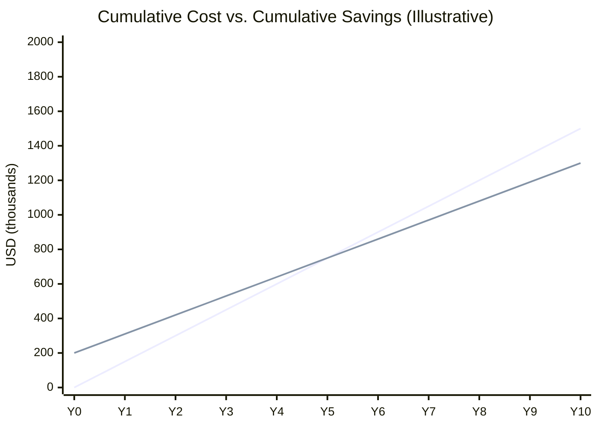

# Cost-Benefit Analysis: Cyprus Relocation

## Overview

This file provides the **comprehensive cost-benefit analysis** for an Israel-to-Cyprus relocation. It aggregates all costs (one-time and recurring) against projected tax savings to produce:

- **Break-even analysis**: How long until cumulative savings exceed cumulative costs
- **NPV analysis**: Net present value of the relocation decision over 5-year and 10-year horizons
- **Sensitivity analysis**: How changes in key variables affect the outcome

This is the **capstone model** of the financial analysis section. It consumes outputs from all preceding files:

| Input Source | What It Provides |
|-------------|------------------|
| FA-01 (Income Structure) | Annual tax savings by income type |
| FA-02 (Cash Flow) | Timing and magnitude of costs by phase |
| FA-03 (Mortgage) | Property acquisition costs and currency risk |
| FA-04 (Exit Tax) | One-time exit tax liability |
| FA-05 (Optimization) | Scenario-specific savings and fees |

All figures are in **USD** unless otherwise noted.

---

## 1. FA-06-001: One-Time Costs

### Description

All costs incurred **once** during the relocation process. These are the upfront investments required to execute the move and establish the Cyprus structure.

### One-Time Cost Table

| Item ID | Cost Category | Low Estimate (USD) | High Estimate (USD) | Typical (USD) | Data Fields | Assumptions |
|---------|--------------|--------------------|--------------------|---------------|-------------|-------------|
| FA-06-001-A | Israeli tax attorney (exit planning) | $30,000 | $100,000 | $60,000 | DR-05-001 | 12-18 month engagement; complexity-dependent |
| FA-06-001-B | Cyprus legal advisor (corporate) | $5,000 | $15,000 | $8,000 | DR-08-003 | Company formation + initial structuring |
| FA-06-001-C | Cyprus company formation fees | €3,000 ($3,200) | €5,000 ($5,400) | €4,000 ($4,300) | DR-08-003 | Registration, Memorandum & Articles, initial filings |
| FA-06-001-D | Asset valuations (exit tax) | $5,000 | $30,000 | $15,000 | DR-04-011, DR-04-012 | Per asset class; private company valuations are expensive |
| FA-06-001-E | Cyprus bank account opening | €500 ($540) | €2,000 ($2,160) | €1,000 ($1,080) | DR-08-004 | Due diligence and compliance fees |
| FA-06-001-F | Exit tax payment (or first installment) | [PLACEHOLDER] | [PLACEHOLDER] | [PLACEHOLDER] | DR-04-011 | Per FA-04-005/FA-04-006; client-specific |
| FA-06-001-G | Relocation costs (shipping, flights) | $5,000 | $20,000 | $10,000 | | Family size and volume dependent |
| FA-06-001-H | Housing deposit (Cyprus) | €5,000 ($5,400) | €15,000 ($16,200) | €8,000 ($8,640) | | 2-3 months rental deposit |
| FA-06-001-I | School registration / deposits | €2,000 ($2,160) | €10,000 ($10,800) | €5,000 ($5,400) | | Per child; international schools require deposits |
| FA-06-001-J | Work/residence permit fees | €500 ($540) | €3,000 ($3,240) | €1,500 ($1,620) | DR-08-001 | If not EU citizen; includes agent fees |
| FA-06-001-K | Financial advisor / CPA (planning) | $10,000 | $30,000 | $15,000 | | International tax structuring advice |
| FA-06-001-L | Insurance setup (health, life) | $2,000 | $5,000 | $3,000 | | Initial premiums + enrollment |
| FA-06-001-M | Vehicle (purchase or initial lease deposit) | $5,000 | $15,000 | $8,000 | | If purchasing; lease deposit is lower |
| FA-06-001-N | Miscellaneous / contingency (10%) | $7,000 | $25,000 | $14,000 | | Buffer for unexpected costs |
| | **TOTAL ONE-TIME COSTS (excl. exit tax)** | **$80,000** | **$277,000** | **$153,000** | | |
| | **TOTAL ONE-TIME COSTS (incl. exit tax)** | **[PLACEHOLDER]** | **[PLACEHOLDER]** | **[PLACEHOLDER]** | | Exit tax is the dominant cost |

<!-- EXPERT INPUT REQUIRED: Validate fee ranges, particularly (a) Israeli tax attorney fees for complex exit planning (top-tier firms may charge $150K+), (b) Cyprus company formation costs (confirm whether €3K-5K includes all government fees or just legal fees), (c) international school deposit ranges for Limassol (Heritage, Pascal, Foley's, etc.). -->

---

## 2. FA-06-002: Recurring Annual Costs

### Description

All costs incurred **annually** to maintain the Cyprus structure and lifestyle. These are the ongoing operating costs of the relocation.

### Recurring Annual Cost Table

| Item ID | Cost Category | Low Estimate (USD/yr) | High Estimate (USD/yr) | Typical (USD/yr) | Data Fields | Assumptions |
|---------|--------------|----------------------|----------------------|-----------------|-------------|-------------|
| FA-06-002-A | Annual statutory audit | $3,000 | $8,000 | $5,000 | DR-06-005 | Cyprus company requirement; complexity-dependent |
| FA-06-002-B | Accounting / bookkeeping | $2,000 | $5,000 | $3,500 | DR-06-005 | Monthly bookkeeping + annual tax return |
| FA-06-002-C | Tax compliance (Cyprus) | $1,500 | $4,000 | $2,500 | | Personal + corporate tax filings |
| FA-06-002-D | Tax compliance (Israel, post-exit) | $2,000 | $5,000 | $3,000 | | Non-resident filings; rental income reporting |
| FA-06-002-E | Office rental (substance) | €500/mo ($6,500/yr) | €2,000/mo ($26,000/yr) | €1,000/mo ($13,000/yr) | DR-08-003 | Economic substance requirement; see LTF-03-010 |
| FA-06-002-F | Employee salary (substance) | €18,000/yr ($19,400) | €42,000/yr ($45,400) | €30,000/yr ($32,400) | DR-08-003 | At least one qualified local employee; see LTF-03-011 |
| FA-06-002-G | Director fees (if external) | $2,000 | $5,000 | $3,000 | | Third-party Cyprus director for governance |
| FA-06-002-H | Legal retainer (Cyprus) | $3,000 | $8,000 | $5,000 | | Ongoing corporate advisory and compliance |
| FA-06-002-I | Bank charges | $500 | $2,000 | $1,000 | DR-08-004 | Monthly fees, transaction fees, FX charges |
| FA-06-002-J | Company secretary / registered office | $1,000 | $3,000 | $2,000 | | Statutory requirement in Cyprus |
| FA-06-002-K | Travel to/from Israel | $12,000 | $36,000 | $20,000 | | Quarterly+ trips for family of 4 |
| FA-06-002-L | Health insurance / GESY | $4,000 | $12,000 | $7,000 | | Private insurance + GESY contributions |
| FA-06-002-M | Exit tax annual installment | [PLACEHOLDER] | [PLACEHOLDER] | [PLACEHOLDER] | | Per FA-04-006 (if installment elected) |
| FA-06-002-N | Housing (net of Israel equivalent) | [PLACEHOLDER] | [PLACEHOLDER] | [PLACEHOLDER] | | Incremental housing cost vs. Israel |
| FA-06-002-O | School fees (net of Israel equivalent) | [PLACEHOLDER] | [PLACEHOLDER] | [PLACEHOLDER] | | Incremental school cost vs. Israel |
| FA-06-002-P | Insurance (life, property, liability) | $2,000 | $5,000 | $3,000 | | Standard coverage |
| | **TOTAL RECURRING COSTS (business)** | **$52,000** | **$149,000** | **$78,000** | | Items A-J |
| | **TOTAL RECURRING COSTS (lifestyle)** | **$18,000** | **$53,000** | **$30,000** | | Items K-P (excl. housing/school) |
| | **GRAND TOTAL RECURRING** | **$70,000+** | **$202,000+** | **$108,000+** | | Plus housing, school, exit tax installment |

<!-- EXPERT INPUT REQUIRED: (1) Validate annual audit cost ranges -- complexity of the company and number of transactions significantly affects this. (2) Confirm employee salary ranges for a qualified substance employee in Limassol (e.g., administrative manager or junior accountant). (3) Confirm whether travel costs to Israel are tax-deductible in Cyprus if business-related. -->

---

## 3. FA-06-003: Tax Savings Projection

### Description

Projects the annual and cumulative tax savings from the relocation over 5-year and 10-year horizons. Savings are computed as the difference between the Israeli tax liability (if the client had remained) and the Cyprus tax liability.

### Annual Tax Savings Model

| Savings Component | Annual Amount (USD) | Source Model | Notes |
|-------------------|---------------------|-------------|-------|
| Employment / self-employment tax differential | [PLACEHOLDER] | FA-01-001, FA-01-002 | Difference in effective rates |
| Dividend SDC savings (non-dom) | [PLACEHOLDER] | FA-01-004 | 17% SDC waived |
| Capital gains exemption | [PLACEHOLDER] | FA-01-005 | 25%+ savings on securities gains |
| Interest/royalty savings | [PLACEHOLDER] | FA-01-008 | Non-dom + IP box benefits |
| Corporate tax differential (12.5% vs. Israeli rates) | [PLACEHOLDER] | FA-01-007 | If operating through Cyprus company |
| NI / social insurance savings | [PLACEHOLDER] | LTF-08 | Israeli NI is significantly higher |
| **Total Annual Tax Savings** | **[PLACEHOLDER]** | | |

### Cumulative Savings Projection

| Year | Annual Tax Savings | Cumulative Savings | Cumulative Costs (One-Time + Recurring) | Net Cumulative Position |
|------|-------------------|--------------------|-----------------------------------------|------------------------|
| 0 (Exit year) | [PLACEHOLDER] (partial year) | [PLACEHOLDER] | [PLACEHOLDER] (one-time costs) | [PLACEHOLDER] (negative) |
| 1 | [PLACEHOLDER] | [PLACEHOLDER] | [PLACEHOLDER] | [PLACEHOLDER] |
| 2 | [PLACEHOLDER] | [PLACEHOLDER] | [PLACEHOLDER] | [PLACEHOLDER] |
| 3 | [PLACEHOLDER] | [PLACEHOLDER] | [PLACEHOLDER] | [PLACEHOLDER] |
| 4 | [PLACEHOLDER] | [PLACEHOLDER] | [PLACEHOLDER] | [PLACEHOLDER] |
| 5 | [PLACEHOLDER] | [PLACEHOLDER] | [PLACEHOLDER] | [PLACEHOLDER] |
| 6 | [PLACEHOLDER] | [PLACEHOLDER] | [PLACEHOLDER] | [PLACEHOLDER] |
| 7 | [PLACEHOLDER] | [PLACEHOLDER] | [PLACEHOLDER] | [PLACEHOLDER] |
| 8 | [PLACEHOLDER] | [PLACEHOLDER] | [PLACEHOLDER] | [PLACEHOLDER] |
| 9 | [PLACEHOLDER] | [PLACEHOLDER] | [PLACEHOLDER] | [PLACEHOLDER] |
| 10 | [PLACEHOLDER] | [PLACEHOLDER] | [PLACEHOLDER] | [PLACEHOLDER] |

### Savings Visualization



*Note: The chart above is illustrative. Expert must populate actual projections for representative client profiles.*

<!-- EXPERT INPUT REQUIRED: Populate with at least two representative client profiles: (1) mid-range ($300K-500K annual income, $1M-2M assets), (2) high-range ($500K+ annual income, $3M+ assets). Show how savings scale with income and asset levels. -->

---

## 4. FA-06-004: Break-Even Analysis

### Description

Determines the **break-even point** -- the year in which cumulative tax savings surpass cumulative relocation costs (one-time + recurring).

### Break-Even Formula

```
Break-Even Year = Year where:
  Cumulative_Tax_Savings >= Cumulative_One_Time_Costs + Cumulative_Recurring_Costs

Simplified (if annual savings and recurring costs are constant):
  Break-Even ≈ One_Time_Costs / (Annual_Tax_Savings - Annual_Recurring_Costs)

Example:
  One-time costs: $153,000 (typical, excl. exit tax)
  Annual tax savings: $150,000
  Annual recurring costs: $108,000
  Net annual benefit: $42,000
  Break-even: $153,000 / $42,000 ≈ 3.6 years

With exit tax (installment):
  Additional annual cost: $X/year for 10 years
  Adjusted net annual benefit: $42,000 - $X
  Break-even extends accordingly
```

### Break-Even Sensitivity by Client Profile

| Client Profile | Annual Income | Asset Value | Annual Savings | Annual Costs | Net Annual | Break-Even (Years) |
|---------------|--------------|-------------|----------------|--------------|------------|-------------------|
| Small / simple | $200K | $500K | [PLACEHOLDER] | [PLACEHOLDER] | [PLACEHOLDER] | [PLACEHOLDER] |
| Mid-range | $400K | $2M | [PLACEHOLDER] | [PLACEHOLDER] | [PLACEHOLDER] | [PLACEHOLDER] |
| High-range | $700K | $5M | [PLACEHOLDER] | [PLACEHOLDER] | [PLACEHOLDER] | [PLACEHOLDER] |
| Ultra-high | $1M+ | $10M+ | [PLACEHOLDER] | [PLACEHOLDER] | [PLACEHOLDER] | [PLACEHOLDER] |

### Critical Insight

> **Not every client benefits from relocation.** If the net annual benefit (savings minus recurring costs) is low or the one-time costs are high relative to income, the break-even period may exceed the client's willingness to commit. The advisory obligation is to identify clients for whom relocation is **not** financially justified and communicate this clearly.

<!-- EXPERT INPUT REQUIRED: Provide estimated break-even periods for each client profile. For the "small/simple" profile, assess whether relocation is financially viable at all -- the substance and compliance costs may consume most or all of the tax savings. Define the minimum income/asset threshold below which relocation should be discouraged. -->

---

## 5. FA-06-005: Risk-Adjusted NPV Analysis

### Description

Computes the **Net Present Value (NPV)** of the relocation decision, discounting future cash flows (savings minus costs) to present value. Includes a risk adjustment to account for uncertainty.

### NPV Formula

```
NPV = -One_Time_Costs + Sum over t=1 to N of [(Annual_Savings_t - Annual_Costs_t) / (1 + r)^t]

Where:
  r = Discount rate (client's required rate of return / opportunity cost of capital)
  N = Analysis horizon (5 years or 10 years)
  Annual_Savings_t = Tax savings in year t (may vary if income changes)
  Annual_Costs_t = Recurring costs in year t (may vary as they stabilize)
```

### Risk-Adjusted NPV

```
Risk_Adjusted_NPV = NPV x (1 - Risk_Discount)

Where:
  Risk_Discount = Weighted probability of adverse outcomes

Adverse outcomes include:
  - ITA challenges the exit (probability: [PLACEHOLDER]%; cost: [PLACEHOLDER])
  - Cyprus regime changes (probability: [PLACEHOLDER]%; cost: [PLACEHOLDER])
  - Currency adverse move (probability: [PLACEHOLDER]%; cost: [PLACEHOLDER])
  - Substance challenge (probability: [PLACEHOLDER]%; cost: [PLACEHOLDER])
```

### NPV Calculation Table

| Horizon | Discount Rate | Gross NPV | Risk Discount | Risk-Adjusted NPV |
|---------|--------------|-----------|---------------|-------------------|
| 5 years | 5% | [PLACEHOLDER] | [PLACEHOLDER]% | [PLACEHOLDER] |
| 5 years | 8% | [PLACEHOLDER] | [PLACEHOLDER]% | [PLACEHOLDER] |
| 5 years | 10% | [PLACEHOLDER] | [PLACEHOLDER]% | [PLACEHOLDER] |
| 10 years | 5% | [PLACEHOLDER] | [PLACEHOLDER]% | [PLACEHOLDER] |
| 10 years | 8% | [PLACEHOLDER] | [PLACEHOLDER]% | [PLACEHOLDER] |
| 10 years | 10% | [PLACEHOLDER] | [PLACEHOLDER]% | [PLACEHOLDER] |

<!-- EXPERT INPUT REQUIRED: (1) Recommend appropriate discount rates for this analysis. Typical range: 5-10% depending on client's investment opportunity cost. (2) Provide risk probability estimates for each adverse outcome. (3) Populate NPV calculations for at least two client profiles. -->

---

## 6. Sensitivity Analysis Framework

### Description

Tests how changes in key input variables affect the overall cost-benefit outcome. This helps advisors and clients understand which assumptions are most critical.

### Key Variables for Sensitivity Testing

| Variable | Base Case | Low Case | High Case | Impact on NPV |
|----------|-----------|----------|-----------|---------------|
| Annual income | [PLACEHOLDER] | -20% | +20% | Directly proportional to savings |
| Israeli tax rates | Current rates | Rate cut (reform) | Rate increase | Lower Israel rates reduce benefit |
| Cyprus corporate tax rate | 12.5% | 15% (EU pressure) | 10% (unlikely) | Higher Cyprus rate reduces benefit |
| Non-dom regime | Available | Abolished (worst case) | Extended | Abolition eliminates SDC savings |
| Exchange rate (USD/EUR) | Current | -15% | +15% | Affects EUR-denominated costs |
| Substance costs | $78K/yr typical | -30% (shared office) | +50% (full office) | Direct cost impact |
| Exit tax amount | Per FA-04-005 | -30% (favorable valuation) | +30% (ITA challenge) | Major one-time impact |
| Discount rate | 8% | 5% | 12% | Higher rate reduces NPV |
| ITA challenge probability | [PLACEHOLDER]% | 5% | 30% | Higher probability reduces risk-adjusted NPV |

### Sensitivity Matrix (Tornado Diagram Data)

| Variable | NPV if Low Case | NPV if Base Case | NPV if High Case | Swing (High - Low) |
|----------|-----------------|-------------------|-------------------|--------------------|
| Non-dom regime abolished | [PLACEHOLDER] | [PLACEHOLDER] | [PLACEHOLDER] | [PLACEHOLDER] |
| Cyprus corporate tax rate | [PLACEHOLDER] | [PLACEHOLDER] | [PLACEHOLDER] | [PLACEHOLDER] |
| Annual income change | [PLACEHOLDER] | [PLACEHOLDER] | [PLACEHOLDER] | [PLACEHOLDER] |
| Exit tax amount | [PLACEHOLDER] | [PLACEHOLDER] | [PLACEHOLDER] | [PLACEHOLDER] |
| Exchange rate | [PLACEHOLDER] | [PLACEHOLDER] | [PLACEHOLDER] | [PLACEHOLDER] |
| Substance costs | [PLACEHOLDER] | [PLACEHOLDER] | [PLACEHOLDER] | [PLACEHOLDER] |
| Discount rate | [PLACEHOLDER] | [PLACEHOLDER] | [PLACEHOLDER] | [PLACEHOLDER] |

### Scenario: Cyprus Non-Dom Regime Abolition

The highest-impact risk is the potential abolition or modification of the Cyprus non-dom regime. This would eliminate the SDC exemption on dividends and interest.

| Metric | With Non-Dom | Without Non-Dom | Impact |
|--------|-------------|----------------|--------|
| SDC on dividends | 0% | 17% | Significant increase in effective tax on distributions |
| SDC on interest | 0% | 30% | Major increase for interest-heavy portfolios |
| GHS on dividends | 2.65% | 2.65% | Unchanged |
| Annual savings reduction | — | [PLACEHOLDER] | Quantify the loss of non-dom benefit |
| Break-even impact | — | [PLACEHOLDER] years longer | May make relocation unviable for some profiles |

<!-- EXPERT INPUT REQUIRED: Assess the realistic probability and timeline for non-dom regime modification. EU/OECD pressure has been noted. Confirm whether any transitional provisions (grandfathering) have been discussed for existing non-dom holders. This is the single most important sensitivity variable. -->

---

## 7. Cost-Benefit Summary Dashboard

### For a Representative Client (to be populated by expert)

```
Client Profile: [PLACEHOLDER - e.g., Tech entrepreneur, age 40, family of 4]
Annual Income: [PLACEHOLDER]
Asset Value: [PLACEHOLDER]
Exit Tax: [PLACEHOLDER]

One-Time Costs (excl. exit tax):  $[PLACEHOLDER]
Annual Recurring Costs:            $[PLACEHOLDER]/year
Annual Tax Savings:                $[PLACEHOLDER]/year
Net Annual Benefit:                $[PLACEHOLDER]/year

Break-Even:                        [PLACEHOLDER] years
5-Year NPV (8% discount):         $[PLACEHOLDER]
10-Year NPV (8% discount):        $[PLACEHOLDER]
Risk-Adjusted 10-Year NPV:        $[PLACEHOLDER]

Recommendation: [PLACEHOLDER - Proceed / Proceed with caution / Not recommended]
```

### Decision Criteria

| NPV Outcome | Recommendation | Rationale |
|-------------|----------------|-----------|
| Risk-adjusted NPV > $500K | **Strongly recommend** | Clear financial benefit justifies complexity and risk |
| Risk-adjusted NPV $100K-$500K | **Recommend with caveats** | Benefit exists but sensitive to assumptions; monitor key variables |
| Risk-adjusted NPV $0-$100K | **Marginal -- proceed with caution** | Small benefit may not justify lifestyle disruption and ongoing complexity |
| Risk-adjusted NPV < $0 | **Do not recommend on financial grounds** | Costs exceed benefits; relocation only justified by non-financial reasons |

---

## 8. Non-Financial Considerations

While this file focuses on financial cost-benefit, the relocation decision also involves significant non-financial factors that should be communicated to the client:

| Factor | Consideration | Impact |
|--------|--------------|--------|
| Quality of life | Cyprus climate, lifestyle, safety | Positive for many families |
| Family disruption | Children's schooling, social networks, elderly parents | Significant negative |
| Business relationships | Proximity to Israeli business ecosystem | May be negative for some industries |
| Healthcare | Cyprus GESY vs. Israeli HMO system | Mixed -- specialist care may require travel |
| Language / culture | Greek/English vs. Hebrew environment | Adjustment period |
| Career opportunities | Cyprus job market smaller than Israel | Relevant for spouses |
| EU access | Freedom of movement within EU (if Cyprus residency) | Significant positive |
| Geopolitical | Diversification away from Israel-specific risks | Positive for risk-averse clients |

> These factors are not quantified in the financial model but should be part of the advisory conversation. See `Professional_Disclaimer.md` for guidance on the advisory boundary.

---

## Open Items for Expert Review

- [ ] Validate all cost ranges against current market rates (2025/2026)
- [ ] Populate tax savings projections for representative client profiles
- [ ] Calculate break-even periods for small, mid, high, and ultra-high profiles
- [ ] Provide NPV calculations with appropriate discount rates
- [ ] Estimate risk probabilities for adverse outcomes
- [ ] Assess non-dom regime abolition probability and impact
- [ ] Confirm minimum income/asset threshold for viable relocation
- [ ] Validate sensitivity analysis variables and ranges
- [ ] Review non-financial considerations for completeness
- [ ] Confirm whether travel costs are deductible in Cyprus
