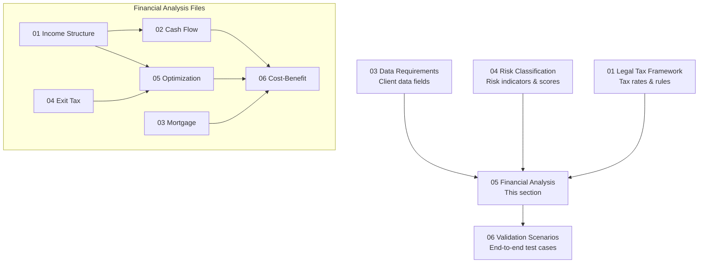

# 05 -- Financial Analysis

## Section Overview

This section contains **financial modeling templates** for the Israel-to-Cyprus relocation advisory system. Each file provides structured calculation frameworks that domain experts (financial analysts, tax advisors, CPAs) will validate, calibrate, and populate with current market data before the models are integrated into the platform.

These are **templates, not financial advice**. All models require expert validation before use with real client data. See `Professional_Disclaimer.md` for full legal boundary language.

---

## Purpose

1. **Model** the financial dimensions of an Israel-to-Cyprus exit: income restructuring, cash flow timing, mortgage qualification, exit tax liability, optimization scenarios, and overall cost-benefit.
2. **Link every model variable** to a specific data field (`DR-xx-xxx`) in the Data Requirements section, ensuring that client questionnaire inputs flow directly into financial calculations.
3. **Integrate risk awareness** by referencing risk indicators (`RC-xx-xxx`) from the Risk Classification section, so that financial projections carry embedded risk context.
4. **Support expert calibration** -- models contain `<!-- EXPERT INPUT REQUIRED -->` markers and `[PLACEHOLDER]` tags wherever current market rates, fee ranges, or regulatory thresholds need professional validation.

---

## Model Types

| # | File | Model Domain | Model ID Range |
|---|------|-------------|----------------|
| 1 | `01-income-structure-templates.md` | Income sources: employment, self-employment, rental, dividends, capital gains, Cyprus income | FA-01-001 -- FA-01-008 |
| 2 | `02-cash-flow-scenarios.md` | Cash flow projections across four phases of the relocation lifecycle | FA-02-001 -- FA-02-004 |
| 3 | `03-mortgage-feasibility.md` | Cyprus mortgage qualification: residential, investment, commercial | FA-03-001 -- FA-03-003 |
| 4 | `04-exit-tax-calculation.md` | Section 100A exit tax: by asset class, installment plans, linear allocation | FA-04-001 -- FA-04-007 |
| 5 | `05-tax-optimization-scenarios.md` | Scenario comparisons: direct exit vs. restructured/treaty-optimized/phased exit | FA-05-001 -- FA-05-005 |
| 6 | `06-cost-benefit-analysis.md` | Overall relocation cost-benefit: one-time costs, recurring costs, NPV, break-even | FA-06-001 -- FA-06-005 |

---

## ID Convention

- **Prefix:** `FA` (Financial Analysis)
- **Format:** `FA-{FILE_NUMBER}-{ITEM_NUMBER}`
- Example: `FA-04-003` refers to the third model in file `04-exit-tax-calculation.md` (Real estate assets model)

---

## Currency Conventions

All financial models use the following currency framework:

| Role | Currency | Symbol | Usage |
|------|----------|--------|-------|
| **Primary** | US Dollar | USD ($) | All base calculations, comparison amounts, and summary outputs |
| **Secondary** | Israeli New Shekel | NIS (₪) | Israeli-source income, Israeli tax liabilities, Israeli asset values |
| **Secondary** | Euro | EUR (€) | Cyprus-side costs, mortgage amounts, company expenses, EU transactions |

### Conversion Rules

- Exchange rates are **snapshots** at the time of model calibration and must be updated by the expert before client use.
- Each model table includes a `Currency` column or footnote indicating the denomination of each figure.
- Where a model computes savings or net differences, the comparison is always presented in **USD** with NIS and EUR equivalents in parentheses.
- Currency risk is addressed explicitly in `03-mortgage-feasibility.md` and `06-cost-benefit-analysis.md`.

<!-- EXPERT INPUT REQUIRED: Confirm baseline exchange rates for model calibration. Suggested: use Bank of Israel representative rate for NIS/USD and ECB reference rate for EUR/USD as of model date. -->

---

## How Models Link to Data Fields and Risk Indicators

### Data Field References (DR-xx-xxx)

Every input variable in a financial model maps to a data field defined in `03-data-requirements/`. This ensures:

- Client questionnaire responses flow directly into calculations
- No model variable exists without a defined collection point
- Changes to data field definitions propagate to affected models

**Reference format in tables:** The `Data Fields` column in each model row lists the `DR-xx-xxx` IDs consumed by that model.

### Risk Indicator References (RC-xx-xxx)

Financial models incorporate risk awareness by cross-referencing risk indicators from `04-risk-classification/`:

- Exit tax models reference `RC-01-xxx` (tax risk indicators) for audit probability
- Cash flow models reference `RC-04-xxx` (financial exposure risks) for liquidity stress scenarios
- Optimization models reference `RC-02-xxx` (legal compliance risks) to flag aggressive positions

### Legal Rule References (LTF-xx-xxx)

Tax rates, thresholds, and statutory rules referenced in calculations trace back to `01-legal-tax-framework/`:

- Exit tax rates reference `LTF-02-xxx` (Section 100A rules)
- Treaty benefits reference `LTF-05-xxx` (treaty provisions)
- Corporate tax rates reference `LTF-03-xxx` (Cyprus corporate framework)

---

## Dependencies

---

## Disclaimer

> **These financial models are structured templates for expert calibration. They do not constitute financial, tax, or legal advice.** All outputs are illustrative and must be validated by qualified professionals before being presented to clients. See `Professional_Disclaimer.md` for the complete legal disclaimer governing the use of these templates.
>
> No model output should be relied upon without:
> 1. Expert validation of all tax rates, fee ranges, and market parameters
> 2. Client-specific data populating the `DR-xx-xxx` input fields
> 3. Review by a licensed Israeli tax attorney and Cyprus corporate advisor

---

## Status Legend

| Status | Meaning |
|--------|---------|
| `draft` | Initial content seeded; awaiting expert review |
| `expert_review` | Expert has filled in content, pending peer review |
| `verified` | Reviewed and approved by at least two domain experts |
| `locked` | Finalized -- changes require formal change request |

---

## How to Contribute

1. Locate the relevant `<!-- EXPERT INPUT REQUIRED -->` marker.
2. Replace `[PLACEHOLDER]` text with validated, sourced content.
3. Update the `status` field in the YAML front matter to `expert_review`.
4. Bump the `version` field (e.g., `"1.0"` to `"1.1"`).
5. Update `last_updated` to the current date.
6. Ensure all currency figures include denomination and source date.
