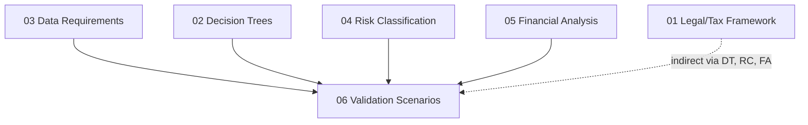

# 06 -- Validation Scenarios

## Purpose

This section contains **end-to-end test cases** that validate the full advisory rule chain -- from client data intake (`DR-xx-xxx`) through decision tree traversal (`DT-xx-xxx`), risk scoring (`RC-xx-xxx`), and financial analysis (`FA-xx-xxx`). Each validation scenario represents a fictional but realistic client profile, complete with specific data field values, expected decision tree paths, expected risk scores, and expected financial outputs.

Validation scenarios serve three critical functions:

1. **Correctness verification** -- Confirm that the decision trees, risk engine, and financial models produce the expected outputs for known inputs.
2. **Regression detection** -- When any upstream rule changes (new legal threshold, revised risk weight, updated financial model), re-running scenarios immediately reveals unintended consequences.
3. **Expert calibration** -- Domain experts review scenarios to confirm that the system's outputs match their professional judgment for realistic client situations.

---

## How to Run a Scenario Manually

Until the platform's automated test runner is built (Phase 3+), validation scenarios are executed manually by tracing through each component:

### Step 1: Populate Input Data

1. Open the scenario file and locate the **Input Data** section.
2. Map each listed value to its `DR-xx-xxx` field ID.
3. Confirm all required fields for the relevant decision trees are present.

### Step 2: Trace Decision Trees

1. Start at the first decision tree referenced in the scenario (typically `DT-01` for eligibility).
2. At each decision node, use the scenario's input data to determine the YES/NO path.
3. Record the path taken: list each `DT-xx-xxx` node visited and the branch chosen.
4. Compare against the **Expected Decision Tree Paths** in the scenario.
5. If the actual path diverges from the expected path, flag it as a discrepancy.

### Step 3: Evaluate Risk Scores

1. For each risk indicator listed in the **Expected Risk Scores** section, check whether the scenario's input data triggers the indicator's condition (as defined in `04-risk-classification/`).
2. Record the severity score for each triggered indicator.
3. Calculate the aggregated category scores and overall risk score using the methodology in `04-risk-classification/05-scoring-methodology.md`.
4. Compare against the scenario's expected risk tier (Green / Yellow / Orange / Red).

### Step 4: Verify Financial Outputs

1. Using the scenario's input data, run through each referenced financial model (`FA-xx-xxx`).
2. Compare calculated values (exit tax, monthly costs, cash flow projections) against the **Expected Financial Outputs** in the scenario.
3. Acceptable tolerance: within 5% of expected values for tax calculations, within 10% for cost projections (to account for exchange rate variability).

### Step 5: Record Results

For each scenario, document:

| Check | Result | Notes |
|-------|--------|-------|
| Decision tree path matches | PASS / FAIL | List divergent nodes |
| Risk indicators triggered correctly | PASS / FAIL | List missing or extra triggers |
| Risk tier matches | PASS / FAIL | Expected vs. actual tier |
| Financial outputs within tolerance | PASS / FAIL | List out-of-range values |
| Edge cases handled | PASS / FAIL | Per scenario edge case list |

---

## What "Pass" Means

A scenario **passes** when ALL of the following are true:

1. **Decision tree path** -- The actual traversal matches the expected path exactly. Every node visited and every branch taken must align.
2. **Risk indicators** -- All expected risk indicators are triggered, no unexpected indicators fire, and severity scores match.
3. **Risk tier** -- The aggregated risk tier (Green / Yellow / Orange / Red) matches the expected classification.
4. **Financial outputs** -- All calculated financial values fall within the defined tolerance range of expected values.
5. **Edge cases** -- Each listed edge case has been evaluated and behaves as documented.

A scenario **fails** if any of the above conditions are not met. Failures must be investigated to determine whether the issue is in the scenario definition (update the scenario) or in the upstream rules (fix the rule).

Note: Some scenarios are intentionally designed to produce negative outcomes (e.g., `VS-07` is a "fail" scenario where substance requirements are not met). These scenarios pass when they correctly produce the expected negative result.

---

## How to Add New Scenarios

### 1. Choose the Next ID

Use the format `VS-{NUMBER}` with zero-padded two-digit numbering. Check the current highest ID in this directory and increment by one.

### 2. Create the File

Create a new Markdown file following the naming convention: `{NUMBER}-{short-descriptive-name}.md`

### 3. Required Sections

Every scenario file must include these sections:

| Section | Purpose |
|---------|---------|
| **YAML Front Matter** | ID, version, status, dependencies |
| **Client Profile** | Fictional but realistic persona with demographic details |
| **Input Data** | Specific values for `DR-xx-xxx` fields in a structured table |
| **Expected Decision Tree Paths** | Which `DT-xx-xxx` nodes are traversed, which branches taken, expected terminal |
| **Expected Risk Scores** | Which `RC-xx-xxx` indicators trigger, expected severity, expected tier |
| **Expected Financial Outputs** | Key `FA-xx-xxx` model results with specific numerical values |
| **Validation Criteria** | Explicit pass/fail conditions for this scenario |
| **Edge Cases** | What could go wrong; boundary conditions to test |

### 4. Ensure Realism

- Use realistic Israeli names and demographic details.
- Asset values should be plausible for the client profile.
- Day counts and dates should be internally consistent.
- Cross-references must resolve to valid IDs in other sections.

### 5. Peer Review

Before a new scenario is accepted:

1. At least one Israeli tax expert must confirm the expected decision tree paths.
2. At least one financial analyst must verify the expected financial outputs.
3. The scenario must be traced end-to-end at least once to confirm it is self-consistent.

---

## File Inventory

| # | File | Scenario ID | Client Archetype | Complexity | Expected Outcome |
|---|------|-------------|------------------|------------|------------------|
| 1 | `01-tech-entrepreneur-exit.md` | VS-01 | Tech founder, $15M exit, family relocation | High | ELIGIBLE-COMPLEX |
| 2 | `02-real-estate-investor.md` | VS-02 | RE investor, 8 properties, borderline day count | High | NEEDS-REVIEW (weighted formula) |
| 3 | `03-dual-family-relocation.md` | VS-03 | Young family, moderate net worth, full relocation | Medium | ELIGIBLE-STANDARD |
| 4 | `04-retroactive-rectification.md` | VS-04 | Consultant, improper prior severance, rectification needed | High | Retroactive assessment required |
| 5 | `05-corporate-executive-exit.md` | VS-05 | CFO, stock options, spouse remains in Israel | High | ELIGIBLE-COMPLEX |
| 6 | `06-edge-case-183-day-boundary.md` | VS-06 | Digital nomad, 182 days, crypto assets | Medium | BORDERLINE / NEEDS-REVIEW |
| 7 | `07-cyprus-substance-defense.md` | VS-07 | IP company, no real substance in Cyprus | Critical | FAIL (substance insufficient) |

---

## ID Convention

- **Prefix:** `VS` (Validation Scenario)
- **Format:** `VS-{FILE_NUMBER}` (zero-padded two-digit)
- Example: `VS-03` refers to file `03-dual-family-relocation.md`

Note: Unlike other sections, validation scenarios use a single-level ID (no item sub-numbers) because each file represents one complete scenario rather than a collection of discrete items.

---

## Cross-References

Validation scenarios reference all four upstream namespaces:

| Namespace | Purpose in Scenarios | Source Section |
|-----------|---------------------|----------------|
| `DR-xx-xxx` | Input data field values | `03-data-requirements/` |
| `DT-xx-xxx` | Expected decision tree traversal paths | `02-decision-trees/` |
| `RC-xx-xxx` | Expected risk indicator triggers and scores | `04-risk-classification/` |
| `FA-xx-xxx` | Expected financial model outputs | `05-financial-analysis/` |
| `LTF-xx-xxx` | Legal rules governing expected behavior | `01-legal-tax-framework/` |

---

## Dependencies

Validation scenarios sit at the **bottom of the dependency chain** -- they consume outputs from every other section. This means:

- Any change to an upstream section may invalidate one or more scenarios.
- Scenarios should be re-run whenever upstream files are updated.
- Scenario failures after upstream changes indicate either a legitimate rule change (update the scenario) or an unintended regression (fix the upstream rule).

---

## Status Legend

| Status | Meaning |
|--------|---------|
| `draft` | Initial scenario seeded; awaiting expert review |
| `expert_review` | Expert has validated expected outputs; pending peer review |
| `verified` | Reviewed and approved by at least two domain experts |
| `locked` | Finalized -- changes require formal change request |

---

## How to Contribute

1. Locate `<!-- EXPERT INPUT REQUIRED -->` markers in each scenario file.
2. Replace `[PLACEHOLDER]` text with validated content.
3. Trace the scenario end-to-end to confirm expected outputs.
4. Update the `status` field in YAML front matter to `expert_review`.
5. Bump the `version` field (e.g., `"1.0"` to `"1.1"`).
6. Update `last_updated` to the current date.
