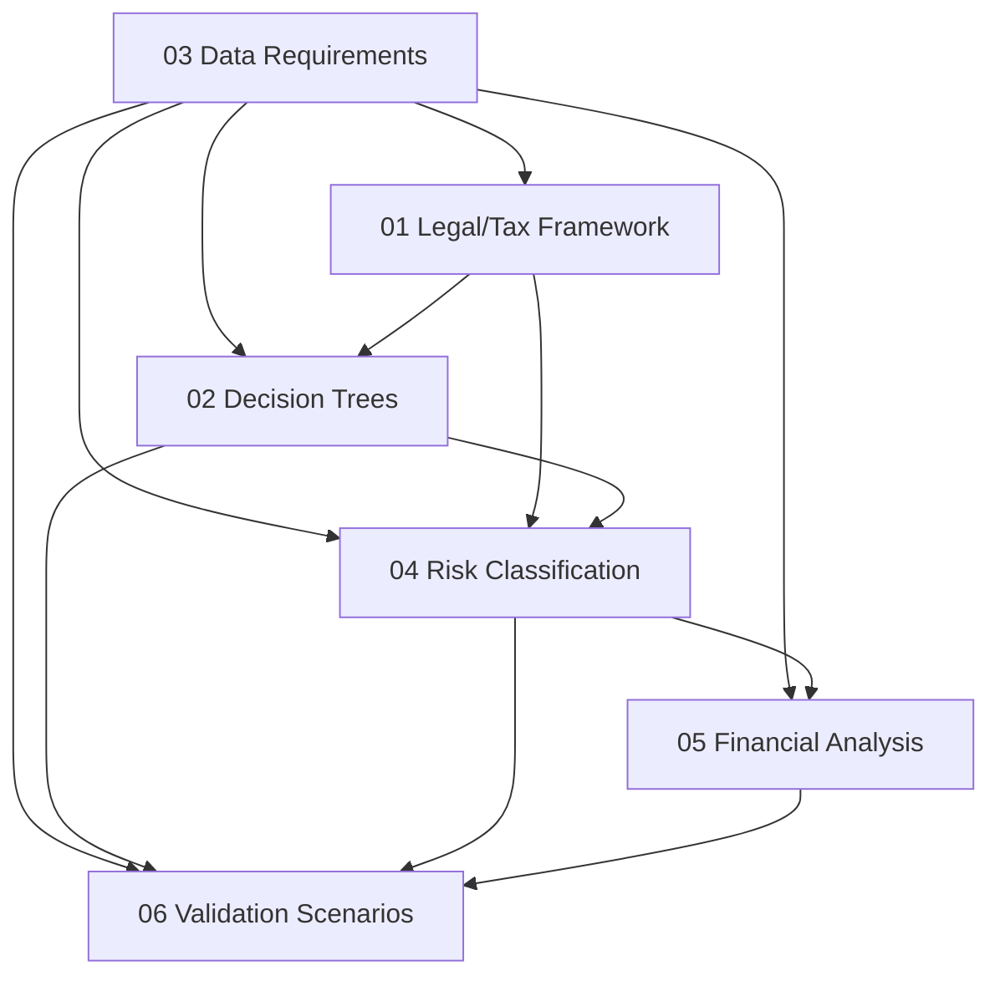

# Phase 1: Expert Team Formation and Discovery

## Deliverable Templates for Domain Expert Validation

This directory contains **structured, fillable templates** for Phase 1 of the L.T.A Advisory regulatory platform. Domain experts (Israeli tax attorneys, Cyprus corporate specialists, financial analysts) will populate these templates before any platform development begins.

---

## Purpose

These templates are designed to be:

- **Human-readable** — Markdown with Mermaid diagrams for expert review
- **Machine-parseable** — YAML front matter, structured tables with unique IDs for rule engines, questionnaire logic, and risk scoring in Phases 2–5

---

## Directory Structure

| Directory | Contents | File Count |
|-----------|----------|------------|
| `01-legal-tax-framework/` | Israeli tax law, Cyprus corporate law, treaties, case law | 9 (8 + README) |
| `02-decision-trees/` | Logic flows for residency, exit tax, company setup | 8 (7 + README) |
| `03-data-requirements/` | Client data catalog — the spine everything references | 10 (9 + README) |
| `04-risk-classification/` | Risk indicators, scoring methodology, thresholds | 7 (6 + README) |
| `05-financial-analysis/` | Income structures, cash flow, mortgage, exit tax models | 7 (6 + README) |
| `06-validation-scenarios/` | End-to-end test cases validating the full chain | 8 (7 + README) |

**Total: 44 files** (6 section READMEs + 1 master README + 37 template files)

---

## ID Namespace Convention

Every item in these templates has a unique cross-reference ID:

| Prefix | Domain | Example |
|--------|--------|---------|
| `LTF`  | Legal/Tax Framework | `LTF-01-003` |
| `DT`   | Decision Tree | `DT-02-015` |
| `DR`   | Data Requirement | `DR-04-007` |
| `RC`   | Risk Classification | `RC-01-002` |
| `FA`   | Financial Analysis | `FA-04-001` |
| `VS`   | Validation Scenario | `VS-03` |

**Format:** `{PREFIX}-{FILE_NUMBER}-{ITEM_NUMBER}`

---

## Status Workflow

Each file progresses through these stages:

```
Draft --> Expert Review --> Verified --> Locked
```

| Status | Meaning |
|--------|---------|
| `draft` | Template created, awaiting expert input |
| `expert_review` | Expert has filled in content, pending peer review |
| `verified` | Reviewed and approved by at least two domain experts |
| `locked` | Finalized — changes require formal change request |

---

## Contributor Guide

### For Domain Experts

1. **Find your assigned files** — Check the YAML front matter `assigned_expert` field
2. **Fill in `[PLACEHOLDER]` markers** — Replace with validated content
3. **Address `<!-- EXPERT INPUT REQUIRED -->` comments** — These mark sections needing specialist knowledge
4. **Preserve the table structure** — Add rows, but do not change column headers
5. **Use cross-reference IDs** — When referencing other files, use the ID namespace (e.g., `DR-01-001`)
6. **Update the status** — Change `status: draft` to `status: expert_review` when complete

### For Reviewers

1. Verify legal citations against current statute text
2. Check cross-references resolve to valid IDs
3. Validate Mermaid diagrams match node tables
4. Confirm Hebrew terminology is correct
5. Update status to `verified` when approved

---

## Glossary of Key Terms

| Term (English) | Term (Hebrew) | Definition |
|----------------|---------------|------------|
| Center of Life Test | מבחן מרכז החיים (Merkaz HaChayim) | Primary test for Israeli tax residency based on personal, economic, and social ties |
| Day Count Test | מבחן ספירת הימים | Quantitative test: 183+ days in Israel = presumed resident |
| Exit Tax | מס יציאה (Mas Yetzia) | Tax on deemed liquidation of assets upon residency severance (Section 100A) |
| Deemed Liquidation | מכירה רעיונית (Mechira Ra'ayonit) | Legal fiction treating assets as sold at fair market value on exit date |
| National Insurance | ביטוח לאומי (Bituach Leumi) | Israeli social security; severance has separate rules |
| Non-Dom Status | סטטוס נון-דום | Cyprus regime: no SDC on foreign dividends/interest for qualifying individuals |
| Special Defence Contribution (SDC) | — | Cyprus tax on dividends, interest, and rents |
| IP Box | — | Cyprus regime for reduced tax on qualifying IP income |
| Economic Substance | — | Requirement for genuine business activity in Cyprus (office, employees, decisions) |
| 60-Day Rule | כלל 60 הימים | Cyprus residency through 60+ days + conditions (not 183 days in any other country) |
| Section 100A | סעיף 100א | Israeli Income Tax Ordinance provision on exit tax for substantial shareholders |
| Israel Tax Authority (ITA) | רשות המסים (Rashut HaMasim) | Israeli government body administering tax law |
| CRS | — | Common Reporting Standard — automatic exchange of financial account info |
| FATCA | — | Foreign Account Tax Compliance Act (US) — may apply to dual citizens |
| Irrebuttable Presumption | חזקה שאינה ניתנת לסתירה | Post-2025: certain conditions conclusively establish residency |
| Rebuttable Presumption | חזקה הניתנת לסתירה | Pre-2025: taxpayer could argue against presumed residency |

---

## Status Dashboard

| # | File | Section | Status | Assigned Expert |
|---|------|---------|--------|-----------------|
| 1 | `README.md` | Root | draft | — |
| 2 | `01-legal-tax-framework/README.md` | Legal/Tax | draft | — |
| 3 | `01-legal-tax-framework/01-israeli-tax-residency.md` | Legal/Tax | draft | [PLACEHOLDER] |
| 4 | `01-legal-tax-framework/02-exit-tax-section-100a.md` | Legal/Tax | draft | [PLACEHOLDER] |
| 5 | `01-legal-tax-framework/03-cyprus-corporate-framework.md` | Legal/Tax | draft | [PLACEHOLDER] |
| 6 | `01-legal-tax-framework/04-cyprus-banking-mortgage.md` | Legal/Tax | draft | [PLACEHOLDER] |
| 7 | `01-legal-tax-framework/05-tax-treaties-israel-cyprus.md` | Legal/Tax | draft | [PLACEHOLDER] |
| 8 | `01-legal-tax-framework/06-reporting-obligations.md` | Legal/Tax | draft | [PLACEHOLDER] |
| 9 | `01-legal-tax-framework/07-case-law-references.md` | Legal/Tax | draft | [PLACEHOLDER] |
| 10 | `01-legal-tax-framework/08-national-insurance.md` | Legal/Tax | draft | [PLACEHOLDER] |
| 11 | `02-decision-trees/README.md` | Decision Trees | draft | — |
| 12 | `02-decision-trees/01-residency-severance-eligibility.md` | Decision Trees | draft | [PLACEHOLDER] |
| 13 | `02-decision-trees/02-residency-severance-process.md` | Decision Trees | draft | [PLACEHOLDER] |
| 14 | `02-decision-trees/03-exit-tax-assessment.md` | Decision Trees | draft | [PLACEHOLDER] |
| 15 | `02-decision-trees/04-cyprus-company-establishment.md` | Decision Trees | draft | [PLACEHOLDER] |
| 16 | `02-decision-trees/05-cyprus-bank-account.md` | Decision Trees | draft | [PLACEHOLDER] |
| 17 | `02-decision-trees/06-mortgage-financing.md` | Decision Trees | draft | [PLACEHOLDER] |
| 18 | `02-decision-trees/07-retroactive-rectification.md` | Decision Trees | draft | [PLACEHOLDER] |
| 19 | `03-data-requirements/README.md` | Data Requirements | draft | — |
| 20 | `03-data-requirements/01-personal-identity.md` | Data Requirements | draft | [PLACEHOLDER] |
| 21 | `03-data-requirements/02-family-household.md` | Data Requirements | draft | [PLACEHOLDER] |
| 22 | `03-data-requirements/03-residence-presence.md` | Data Requirements | draft | [PLACEHOLDER] |
| 23 | `03-data-requirements/04-financial-assets.md` | Data Requirements | draft | [PLACEHOLDER] |
| 24 | `03-data-requirements/05-employment-income.md` | Data Requirements | draft | [PLACEHOLDER] |
| 25 | `03-data-requirements/06-corporate-structure.md` | Data Requirements | draft | [PLACEHOLDER] |
| 26 | `03-data-requirements/07-insurance-pension.md` | Data Requirements | draft | [PLACEHOLDER] |
| 27 | `03-data-requirements/08-cyprus-specific.md` | Data Requirements | draft | [PLACEHOLDER] |
| 28 | `03-data-requirements/09-cross-reference-matrix.md` | Data Requirements | draft | [PLACEHOLDER] |
| 29 | `04-risk-classification/README.md` | Risk Classification | draft | — |
| 30 | `04-risk-classification/01-tax-risk-indicators.md` | Risk Classification | draft | [PLACEHOLDER] |
| 31 | `04-risk-classification/02-legal-compliance-risks.md` | Risk Classification | draft | [PLACEHOLDER] |
| 32 | `04-risk-classification/03-structural-risks.md` | Risk Classification | draft | [PLACEHOLDER] |
| 33 | `04-risk-classification/04-financial-exposure-risks.md` | Risk Classification | draft | [PLACEHOLDER] |
| 34 | `04-risk-classification/05-scoring-methodology.md` | Risk Classification | draft | [PLACEHOLDER] |
| 35 | `04-risk-classification/06-risk-threshold-matrix.md` | Risk Classification | draft | [PLACEHOLDER] |
| 36 | `05-financial-analysis/README.md` | Financial Analysis | draft | — |
| 37 | `05-financial-analysis/01-income-structure-templates.md` | Financial Analysis | draft | [PLACEHOLDER] |
| 38 | `05-financial-analysis/02-cash-flow-scenarios.md` | Financial Analysis | draft | [PLACEHOLDER] |
| 39 | `05-financial-analysis/03-mortgage-feasibility.md` | Financial Analysis | draft | [PLACEHOLDER] |
| 40 | `05-financial-analysis/04-exit-tax-calculation.md` | Financial Analysis | draft | [PLACEHOLDER] |
| 41 | `05-financial-analysis/05-tax-optimization-scenarios.md` | Financial Analysis | draft | [PLACEHOLDER] |
| 42 | `05-financial-analysis/06-cost-benefit-analysis.md` | Financial Analysis | draft | [PLACEHOLDER] |
| 43 | `06-validation-scenarios/README.md` | Validation Scenarios | draft | — |
| 44 | `06-validation-scenarios/01-tech-entrepreneur-exit.md` | Validation Scenarios | draft | [PLACEHOLDER] |
| 45 | `06-validation-scenarios/02-real-estate-investor.md` | Validation Scenarios | draft | [PLACEHOLDER] |
| 46 | `06-validation-scenarios/03-dual-family-relocation.md` | Validation Scenarios | draft | [PLACEHOLDER] |
| 47 | `06-validation-scenarios/04-retroactive-rectification.md` | Validation Scenarios | draft | [PLACEHOLDER] |
| 48 | `06-validation-scenarios/05-corporate-executive-exit.md` | Validation Scenarios | draft | [PLACEHOLDER] |
| 49 | `06-validation-scenarios/06-edge-case-183-day-boundary.md` | Validation Scenarios | draft | [PLACEHOLDER] |
| 50 | `06-validation-scenarios/07-cyprus-substance-defense.md` | Validation Scenarios | draft | [PLACEHOLDER] |

---

## Reference Documents

These existing files contain domain knowledge used to seed the templates:

| Document | Location | Content |
|----------|----------|---------|
| Master Guide | `LTA_Antigravity_Master_Guide.md` | Service tracks, Cyprus reform details, client profiles |
| Instructions | `docs/antigravity_instructions_complete_FINAL.md` | Three service tracks with feature lists |
| Disclaimer | `Professional_Disclaimer.md` | Legal boundary language for risk templates |
| Privacy Policy | `Privacy_Policy.md` | Data sensitivity baseline for data requirements |

---

## Dependencies Between Sections



Data Requirements is the **spine** — all other sections reference it.
